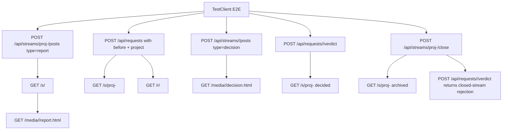

# feat: Add Portal phase-1 E2E proof and docs

## Summary

Add the final Portal phase-1 release proof: one public-route `TestClient` flow that crosses reports, stream pages, before/after decisions, verdicts, and archived read-only state; a committed evidence bundle with rendered HTML and command results; and a README Portal section grounded in the current CLI help surface. The implementation must stay inside the card's scope fence and must stop instead of changing product code if this proof exposes a bug.

---

## Problem Frame

Portal phase 1 now has DB, API, CLI, stream web, media, and before/after slices, but the release gate needs durable end-to-end proof and user-facing documentation. Prior slices have focused tests and evidence, yet the final card specifically requires a single flow that proves the pieces work together and leaves named artifacts future reviewers can inspect.

---

## Assumptions

*This plan was authored in pipeline mode without synchronous user confirmation. The items below are agent inferences that fill gaps in the input and should be reviewed before implementation proceeds.*

- All other Portal phase-1 dependency cards have landed before implementation starts. In this worktree, stream/post APIs, stream pages, report inline media policy, before/after request UI, and Portal CLI commands are already present.
- The implementation pass should not patch `gallery/` product code even for small fixes. A failing E2E that identifies a product bug should become a failed/blocking handoff item for a follow-up fix card, not a partial phase-1 proof.
- The committed HTML evidence can be captured from `TestClient` responses, because the card asks for rendered HTML artifacts and the prior stream-web evidence already separately covered browser/runtime constraints. Header assertions in the E2E are the TestClient-visible proxy for real-browser report rendering.
- README command descriptions should be checked against live argparse help during implementation, not copied from this plan.

---

## Requirements

### E2E Proof

- R1. Add one new `tests/test_e2e_portal.py` test that drives a realistic Portal phase-1 flow through public HTTP routes using FastAPI `TestClient`.
- R2. The E2E flow must choose one project-backed stream slug, create a report post in that stream, prove the stream is auto-created, and prove the report is visible at `/s/<slug>`.
- R3. The E2E must assert stream-page report iframe markup includes `sandbox="allow-same-origin"` and does not grant scripts.
- R4. The E2E must assert report HTML media is served inline: no `Content-Disposition: attachment`, `text/html`, `X-Content-Type-Options: nosniff`, and report HTML CSP sandbox.
- R5. The E2E must create a decision request with a before image and the project that maps to the same `proj-<project-slug>` stream used for the report, prove it appears in that stream, and prove the request page exposes before/after markup.
- R6. The E2E must post a verdict, then prove the request stream shows decided state.
- R7. The E2E must close the shared project stream and prove archived/read-only behavior with stream archive markup and a post-close verdict revision attempt rejected by the public route.
- R8. The E2E must assert request-variant HTML media is served as an attachment.
- R9. The E2E must assert a decision post whose body includes a `files` list is never served inline; its HTML media must remain attachment-only.

### Evidence And Documentation

- R10. Add `docs/evidence/2026-07-08-portal-phase1/evidence.md` plus committed rendered HTML, header, and command-output artifacts that name every command run and every saved artifact.
- R11. Update `README.md` with a Portal section covering permanent `/s/<slug>` stream URLs, stream auto-create behavior, Portal CLI verbs, `post --before`, the `gallery` alias note, the 200 MB soft cap, and phase-2/3 pointers to `docs/portal-spec.md`.

### Scope And Verification

- R12. Keep the implementation scope to `tests/test_e2e_portal.py`, `docs/evidence/2026-07-08-portal-phase1/**`, and `README.md`.
- R13. Do not change product code on this card. If the proof exposes a product bug, stop and report it rather than widening the diff.
- R14. Verify the final branch with the full suite. In this board's sandbox, prefer `UV_CACHE_DIR=/private/tmp/uv-cache uv run --extra dev pytest -q` and record the exact command used in evidence.
- R15. Do not open or create pull requests; the twf conductor owns merge/PR handling and the worker handoff is the durable exit path.

---

## Card Acceptance Criteria Trace

| Card acceptance criterion | Requirements | Units | Test scenario anchor |
|---|---|---|---|
| E2E test green in the full suite | R1-R9, R14 | U1 | U1 public-route E2E plus full-suite verification |
| Evidence names every artifact and command; rendered HTML artifacts committed | R10, R14 | U2 | U2 evidence artifact checklist |
| README Portal section accurate against shipped CLI | R11 | U3 | U3 CLI help capture and README review |
| Addenda media/header regressions covered | R3, R4, R8, R9 | U1, U2 | U1 header assertions and U2 saved header artifacts |
| No product-code changes | R12, R13 | U1-U3 | Scope review before handoff |

---

## Scope Boundaries

- No changes to `gallery/server.py`, `gallery/db.py`, `gallery/cli.py`, `gallery/client.py`, templates, static assets, config, deployment files, or package metadata.
- No new API behavior, media policy changes, schema changes, CLI command changes, or product bug fixes.
- No Playwright/browser automation requirement for this final card. Any browser evidence beyond the `TestClient` proof needs explicit conductor direction.
- No phase-2 `ask`/`pull`, stream note boxes, message table, public auth, per-stream tokens, or Trello/TWF Portal integration.
- No evidence-folder crawling behavior; reports remain explicitly pushed into Portal, per `docs/portal-spec.md`.
- No pull request creation or merge action from the implementation worker.

### Deferred to Follow-Up Work

- Any product bug revealed by the E2E should become a separate fix card outside this scope fence.
- Phase-2 and phase-3 Portal work remains documented in `docs/portal-spec.md`, not implemented or promised by README examples.

---

## Context & Research

### Relevant Code and Patterns

- `docs/portal-spec.md` is the phase-1 contract for streams, report posts, decision posts, before images, CLI verbs, push-only producers, permanent stream URLs, and deferred phase-2/3 work.
- `gallery/server.py` currently owns `/api/streams`, `/api/streams/{slug}/posts`, `/media/{id}/{filename}`, `/s/{slug}`, `/r/{req_id}`, and the media inline/attachment gate.
- `gallery/templates/stream.html` renders report iframes with `sandbox="allow-same-origin"` and no script allowance.
- `gallery/templates/request.html` renders before/after request markup and read-only archived state.
- `gallery/cli.py` is the source of truth for README command names and flags: `stream new`, `stream close`, `report`, `post --stream`, `post --before`, `wait`, `status`, `list`, and `serve`.
- `tests/conftest.py` isolates `GALLERY_DATA_DIR`, initializes config, resets the DB connection, and exposes a `TestClient` fixture safe for E2E-style tests.
- `tests/test_web_streams.py` already covers the individual media/header addenda; `tests/test_e2e_portal.py` should tie the same guarantees into the final cross-feature flow.
- `docs/evidence/2026-07-08-stream-web-pages/evidence.md` is the closest evidence template: frontmatter, verdict, evidence table, gaps, next action, and assets under `assets/`.

### Institutional Learnings

- No `docs/solutions/` directory or critical-patterns file exists in this worktree.
- Board guidance says sandboxed verification should use `UV_CACHE_DIR=/private/tmp/uv-cache uv run --extra dev pytest -q` because writes to the default uv cache may fail.
- Prior stream-web evidence captured both focused tests and full-suite results, plus saved HTML/header artifacts. Mirror that level of naming discipline for this final proof.

### External References

- External research is not needed. The card is a repository-local proof/docs task over already-landed FastAPI, Jinja, argparse, and pytest surfaces.

---

## Key Technical Decisions

- Use a single high-level `TestClient` test instead of several slice tests: the card asks for one flow that asserts every hop, while existing unit/integration tests already cover individual surfaces.
- Exercise public API and web routes rather than writing DB rows directly. The decision-post `files` attachment check is reachable through the public stream-post route and should stay in that route-level flow.
- Treat media headers as first-class E2E assertions, not incidental checks. The two-layer report-blanking regression is only visible to `TestClient` through iframe sandbox markup and `Content-Disposition`/CSP headers.
- Capture evidence assets from the exact E2E objects when possible so `evidence.md` can name the stream page, request page, media headers, and command outputs without relying on prose claims alone.
- Update README from checkout-bound CLI help. The implementation should run or capture the relevant `uv run --extra dev portal ... --help` and `uv run --extra dev gallery --help` surfaces before finalizing docs, so global stale binaries cannot shape the documentation.
- Keep README phase-2/3 wording clearly referential: point to `docs/portal-spec.md` for later ask/pull, messages, coworker/Trello, and auth expansion rather than documenting them as shipped commands.

---

## Open Questions

### Resolved During Planning

- Should this planned-stage pass implement the E2E/docs work? No. `twf status` for the current column requires a plan artifact only; implementation belongs to the next pipeline stage.
- Should the final implementation use product-code fixes if the E2E fails? No. The card explicitly forbids product-code changes and requires stopping/reporting.
- Should README rename the whole project from Gallery to Portal? No. The package/data directory remain `gallery`; README should explain Portal as the current product surface and `gallery` as the compatibility CLI alias.
- Should phase-2 `ask`/`pull` be documented as available commands? No. They remain phase-2 pointers to `docs/portal-spec.md`.

### Deferred to Implementation

- Exact E2E helper names and body setup details: choose small local helpers in `tests/test_e2e_portal.py` only if they keep the one-flow test readable.
- Exact evidence asset filenames: keep them stable and descriptive under `docs/evidence/2026-07-08-portal-phase1/assets/`.
- Exact README wording: derive it from actual `--help` output and existing README tone during implementation.

---

## High-Level Technical Design

> *This illustrates the intended approach and is directional guidance for review, not implementation specification. The implementing agent should treat it as context, not code to reproduce.*

The test should set up realistic uploads with small inline HTML/PNG bytes, follow the public route chain, and assert both user-visible HTML and media/security headers. The evidence step should save representative HTML and header outputs from the same behavior so reviewers can inspect what the passing test proved.

---

## Implementation Units

- U1. **Add the Portal phase-1 E2E flow**

**Goal:** Add one public-route `TestClient` flow that proves phase-1 Portal behavior across report posts, stream pages, before/after decisions, verdicts, media policies, and archived state.

**Requirements:** R1, R2, R3, R4, R5, R6, R7, R8, R9, R12, R13, R14

**Dependencies:** Prior Portal phase-1 implementation cards merged

**Files:**
- Create: `tests/test_e2e_portal.py`

**Approach:**
- Use the existing `client` and `token` fixtures from `tests/conftest.py`.
- Choose a project such as `portal/phase1-e2e`, derive its expected legacy stream slug, and use that same slug for the initial report post so the report and later decision live in one stream.
- Create a report post through `POST /api/streams/<slug>/posts` with `type=report`, an HTML file, and normal bearer auth. Let the route auto-create the stream.
- Request `/s/<slug>?token=<token>` and assert the report title/link/iframe are present, `sandbox="allow-same-origin"` is present, and script allowances are absent.
- Fetch the report HTML media and assert the inline report contract: status 200, `text/html`, `nosniff`, CSP `sandbox allow-same-origin`, and no attachment disposition.
- Create a decision request through `POST /api/requests` with `kind=before-after`, `project`, one `before` image, at least one normal image candidate, and one HTML candidate to prove request-variant HTML attachment behavior.
- Assert `/r/<req_id>?token=<token>` contains before/after request markup and selectable candidates still use real variant indices.
- Assert `/s/<slug>` contains the decision request and pending state through the legacy project stream dual-write.
- Fetch the HTML variant media and assert it is served as an attachment, with no report CSP.
- Create an explicit decision post through the public stream-post route that includes a body `files` list and an uploaded HTML file, then assert that file is also served as an attachment because only report-post HTML is inline.
- Post a verdict for the request and assert the project stream now shows decided state.
- Close the shared project stream, assert the stream page shows archived state, and assert a verdict revision against the same request is rejected because the stream is closed.
- Keep any helper functions local to the new test file and do not write DB rows directly.

**Execution note:** Treat this as test-first proof. If the first run fails because product behavior is wrong, do not patch product code on this card; stop and report the failing assertion.

**Patterns to follow:**
- `tests/test_web_streams.py` for report iframe, media header, attachment, archived stream, and stream page assertions.
- `tests/test_before_after.py` for before image upload, before/after markup, variant index, and closed-stream read-only assertions.
- `tests/test_streams_api.py` for stream/report API setup and small media upload bytes.

**Test scenarios:**
- Integration: report post to unknown stream auto-creates the stream and appears on `/s/<slug>`.
- Integration: stream page report iframe has `sandbox="allow-same-origin"` and no script allowance.
- Integration: report HTML media is inline and sandboxed by headers, not forced attachment.
- Integration: before/after decision request with project appears in `/s/proj-<project-slug>` and `/r/<req_id>` includes before/after markup.
- Integration: request-variant HTML media is attachment-only.
- Integration: decision-post HTML from a body `files` list is attachment-only.
- Integration: verdict changes stream-visible status from pending to decided.
- Integration: closing the shared project stream produces archived stream state and rejects a post-close verdict revision.

**Verification:**
- `tests/test_e2e_portal.py` passes by itself.
- The full suite passes without changes outside the scope fence.

---

- U2. **Commit the phase-1 evidence bundle**

**Goal:** Create durable evidence that names the E2E proof, commands, results, and saved rendered artifacts.

**Requirements:** R10, R12, R13, R14

**Dependencies:** U1

**Files:**
- Create: `docs/evidence/2026-07-08-portal-phase1/evidence.md`
- Create: `docs/evidence/2026-07-08-portal-phase1/assets/stream-page.html`
- Create: `docs/evidence/2026-07-08-portal-phase1/assets/request-page.html`
- Create: `docs/evidence/2026-07-08-portal-phase1/assets/report-media-headers.txt`
- Create: `docs/evidence/2026-07-08-portal-phase1/assets/request-variant-media-headers.txt`
- Create: `docs/evidence/2026-07-08-portal-phase1/assets/decision-post-media-headers.txt`
- Create: `docs/evidence/2026-07-08-portal-phase1/assets/e2e-pytest-output.txt`
- Create: `docs/evidence/2026-07-08-portal-phase1/assets/full-pytest-output.txt`
- Create: `docs/evidence/2026-07-08-portal-phase1/assets/portal-help-output.txt`
- Create: `docs/evidence/2026-07-08-portal-phase1/assets/gallery-help-output.txt`

**Approach:**
- Mirror the structure of `docs/evidence/2026-07-08-stream-web-pages/evidence.md`: status frontmatter, verdict, what changed/proved, evidence table, reviewer assessments if any, gaps, next action, and optional JSON summary.
- Run the focused E2E and the full suite, using the board-safe uv cache override when needed, and record the exact commands and short result excerpts.
- Save representative rendered HTML from the stream page and request page. The request-page artifact should include before/after markup; if a before/after after-state is represented separately, name that artifact explicitly.
- Save header artifacts for report HTML inline media, request-variant HTML attachment, and decision-post HTML attachment.
- Keep artifacts small, deterministic, and scrubbed of bearer tokens. Evidence should not commit `.env`, real user data, or private tokens.
- Verify the generated test token is absent from every committed evidence asset before handoff.
- If a product bug blocks the E2E, do not write a passing evidence artifact or continue into README polish. Capture a failed evidence artifact only if it clearly names the failing command/assertion and then stop for twf failure/blocking handoff.

**Patterns to follow:**
- `docs/evidence/2026-07-08-stream-web-pages/evidence.md`
- `docs/evidence/2026-07-08-stream-web-pages/assets/`
- `tests/test_web_streams.py` header names and expected values.

**Test scenarios:**
- Test expectation: none beyond U1 and final verification -- this unit records evidence artifacts and does not add runtime behavior.

**Verification:**
- `evidence.md` names every command and every committed asset.
- Asset paths referenced in `evidence.md` exist in the evidence directory.
- Evidence verdict matches actual command outcomes.
- The generated test token does not appear in any committed evidence asset.

---

- U3. **Update README with the shipped Portal surface**

**Goal:** Add a concise Portal section that teaches agents and operators the shipped phase-1 stream/report/decision workflow without documenting deferred phase-2/3 behavior as available.

**Requirements:** R11, R12, R13

**Dependencies:** U1 can run independently, but final wording should account for any E2E findings

**Files:**
- Modify: `README.md`
- Evidence capture from commands: `docs/evidence/2026-07-08-portal-phase1/assets/*help*.txt`

**Approach:**
- Run and capture checkout-bound CLI help for the relevant surfaces before writing or finalizing the section, using `uv run --extra dev` rather than relying on globally installed `portal` or `gallery` binaries.
- Keep existing Gallery install/config/service information intact unless a narrow wording adjustment is needed to explain Portal identity.
- Add a Portal section near CLI/API usage that covers:
  - permanent stream URLs at `/s/<slug>`;
  - report and decision posts as explicit pushes, not crawled imports;
  - auto-create behavior for `portal report --stream <slug>` and `portal post --stream <slug>`;
  - `portal stream new`, `portal stream close`, `portal report`, `portal post`, `portal wait`, `portal status`, and `portal list`;
  - `portal post --before ` and `kind=before-after` as before/after review support;
  - `gallery` remains a compatibility alias for the same CLI entry point;
  - report uploads over the 200 MB soft cap warn but are not rejected solely for size;
  - phase-2/3 pointers to `docs/portal-spec.md` for ask/pull, message inbox, coworker/Trello, and auth expansion.
- Avoid claiming `portal ask`, `portal pull`, public sharing, stream tokens, or Trello/TWF posting are shipped phase-1 commands.
- Keep README examples accurate to argparse syntax, especially positional `report.html [assets...]`, required `--stream`, required `--title`, and `post` kind choices.

**Patterns to follow:**
- Existing `README.md` concise command examples and operator notes.
- `gallery/cli.py` parser names and option spelling.
- `docs/portal-spec.md` sections 5, 11, 12, and 13 for CLI, phases, deferred work, stream auto-create, soft cap, and alias decisions.

**Test scenarios:**
- Docs verification: `UV_CACHE_DIR=/private/tmp/uv-cache uv run --extra dev portal --help` and `UV_CACHE_DIR=/private/tmp/uv-cache uv run --extra dev gallery --help` both list the Portal verbs described in README.
- Docs verification: checkout-bound `portal post --help` includes `--stream`, `--before`, and `before-after`.
- Docs verification: checkout-bound `portal report --help` and `portal stream --help` match README syntax.
- Docs verification: README does not mention deferred `ask`/`pull` as shipped commands.

**Verification:**
- README Portal section is accurate against captured CLI help outputs.
- README points readers to `docs/portal-spec.md` for phase-2/3 work rather than expanding the current scope.

---

## System-Wide Impact

- **Interaction graph:** The final proof crosses `gallery/cli.py` documentation surfaces, FastAPI API routes, Jinja web pages, media serving, SQLite-backed streams/requests/posts, and pytest fixtures. The implementation diff itself should only add tests, docs, and evidence.
- **Error propagation:** Any E2E failure in product behavior should stop the card and be reported through SURPRISES/handoff; no product error path should be patched here.
- **State lifecycle risks:** The E2E will create streams, posts, requests, media files, verdicts, and a closed stream inside the pytest temp `GALLERY_DATA_DIR`; fixtures should cleanly isolate that state.
- **API surface parity:** README must present `portal` as the preferred CLI and `gallery` as an alias without changing the package/import/data-dir names.
- **Integration coverage:** The new test should cover the cross-layer chain that slice tests cannot prove in one place: post upload, stream render, media headers, request render, verdict, and archived read-only state.
- **Unchanged invariants:** Variant indices stay 1-based; before images are not selectable variants; report HTML is the only inline HTML media; non-report HTML remains attachment-only; closed streams are read-only.

---

## Risks & Dependencies

| Risk | Mitigation |
|------|------------|
| The E2E exposes a product bug, tempting an in-scope "quick fix" | Honor the card constraint: do not patch product code, do not claim phase-1 proof passed, capture only failed evidence if it helps diagnose the issue, and report the failing behavior in SURPRISES for a fix card. |
| README drifts from actual CLI flags | Capture current `--help` outputs and use them as evidence for the docs update. |
| Evidence claims pass without durable artifacts | Require `evidence.md` to link every saved HTML/header/output artifact by path. |
| Token or private local data leaks into committed artifacts | Use pytest temp data, scrub tokens from saved HTML/headers, and avoid real operator config. |
| Full-suite command differs from board-safe invocation | Record the exact command run. Prefer the board-learned cache override while acknowledging the card's generic `uv run pytest -q` verification target. |
| Existing slice tests already cover addenda, leading to weak E2E assertions | Repeat the critical iframe/header assertions in the new E2E so the final proof catches integration regressions directly. |

---

## Documentation / Operational Notes

- The evidence bundle should be treated as the durable release proof for Portal phase 1.
- README should remain useful to agents using the CLI and to the Mac mini operator maintaining the service.
- No deployment or service restart is part of this card.

---

## Sources & References

- **Trello card:** [zKUB2Tnl](https://trello.com/c/zKUB2Tnl)
- **Portal spec:** [docs/portal-spec.md](docs/portal-spec.md)
- Related plan: [docs/plans/2026-07-08-001-feat-db-migration-portal-schema-plan.md](docs/plans/2026-07-08-001-feat-db-migration-portal-schema-plan.md)
- Related plan: [docs/plans/2026-07-08-002-feat-streams-posts-http-api-plan.md](docs/plans/2026-07-08-002-feat-streams-posts-http-api-plan.md)
- Related plan: [docs/plans/2026-07-08-003-feat-stream-web-pages-plan.md](docs/plans/2026-07-08-003-feat-stream-web-pages-plan.md)
- Related plan: [docs/plans/2026-07-08-003-feat-portal-cli-commands-plan.md](docs/plans/2026-07-08-003-feat-portal-cli-commands-plan.md)
- Related plan: [docs/plans/2026-07-08-004-feat-before-after-request-views-plan.md](docs/plans/2026-07-08-004-feat-before-after-request-views-plan.md)
- Evidence pattern: [docs/evidence/2026-07-08-stream-web-pages/evidence.md](docs/evidence/2026-07-08-stream-web-pages/evidence.md)
- Related tests: `tests/test_web_streams.py`, `tests/test_before_after.py`, `tests/test_streams_api.py`, `tests/test_cli.py`
- Related code: `gallery/server.py`, `gallery/templates/stream.html`, `gallery/templates/request.html`, `gallery/cli.py`
