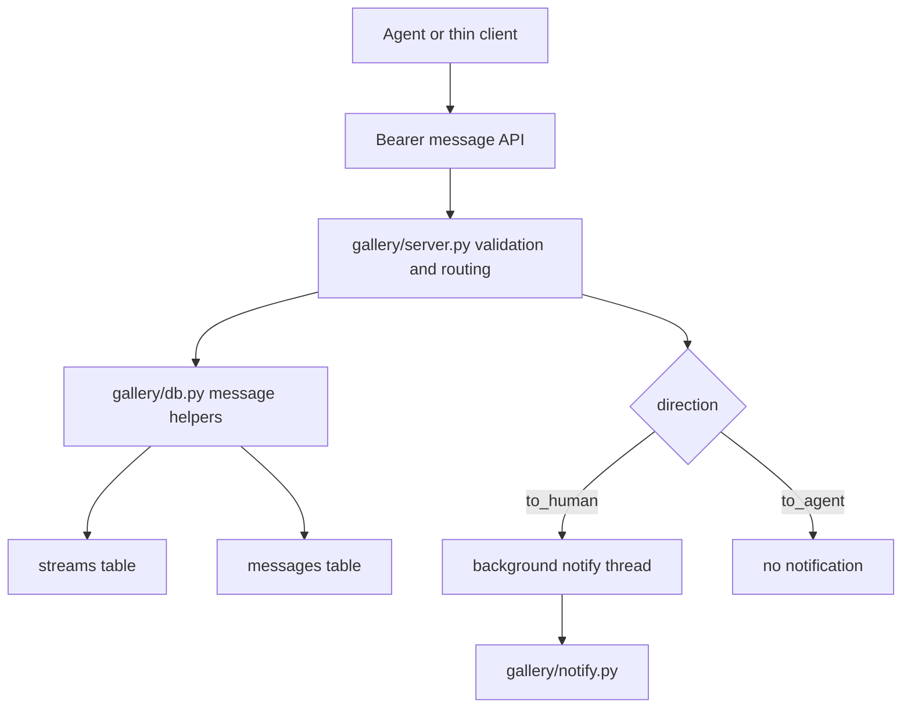

# feat: Add Portal messages table and API

## Summary

Add the phase-2 Portal inbox slice: a schema v2 `messages` table, DB helpers for message creation/listing/consumption, bearer-token message API routes, Telegram notification for `to_human` questions, and thin `gallery/client.py` helpers. The plan keeps UI note/answer routes, `portal ask`, and `portal pull` out of this card while preserving the no-server-long-polling constraint.

---

## Problem Frame

Portal phase 1 shipped streams, posts, stream pages, report uploads, before/after decisions, and CLI helpers, but the steering/questions inbox is still absent. `docs/portal-spec.md` sections 4, 5, 7, and 8 reserve `messages` for phase 2 so agents can receive human steering at turn boundaries and can ask humans questions without reviving the old filesystem queue.

---

## Assumptions

*This plan was authored in pipeline mode without synchronous user confirmation. The items below are agent inferences that fill gaps in the input and should be reviewed before implementation proceeds.*

- The Trello shortlink for frontmatter is `https://trello.com/c/TmbwBUm2`; this twf context exposed the short id but not a richer card URL.
- This planned-stage pass should only produce the plan artifact. The next pipeline stage owns implementation.
- The card's scope fence is authoritative over the broader spec phase: browser twins (`/s/{slug}/note`, `/s/{slug}/answer`) and CLI `portal ask`/`portal pull` are follow-up work, not part of this card.
- Posting a message to an unknown stream auto-creates a `kind='session'` stream for both `to_agent` and `to_human`, because the card explicitly rejects an unknown-slug 404.
- `GET /api/streams/{slug}/messages` should still return 404 for an unknown stream; only message creation auto-creates.
- Consuming an already-consumed message should be a no-op that preserves the original `consumed_at` timestamp and returns the message. This is safer for retried pulls than making duplicate consume attempts fail.
- Message creation and consumption should respect the existing closed-stream read-only archive invariant by rejecting mutations for closed streams.
- `since` should behave as a created-at cursor: list messages created after the supplied timestamp, not messages at the exact same timestamp.
- `unconsumed=1` should be the only accepted true value. Omitted `unconsumed` leaves the filter off, and any other supplied value should return a 400-class validation error.
- The "document consume semantics" requirement can be satisfied inside code-level helper docstrings or concise route/helper comments, without adding a README update outside the card's scope fence.
- This slice should store messages only in the `messages` table. It should not dual-write `posts` rows of type `message` until a later stream-page/UI card has a concrete renderer.
- The API response shape should be simple and stable for client helper tests: POST create returns one message object, GET list returns a list of message objects, and POST consume returns one message object.

---

## Requirements

- R1. Append schema migration v2 in `gallery/db.py` without editing migration v1.
- R2. Migration v2 creates `messages(id, stream_id, direction, text, created_at, consumed_at)` with `stream_id` referencing `streams(id)`, `direction` constrained to `to_agent` or `to_human`, and `consumed_at` nullable; v2 schema validation verifies the columns, stream foreign key, and direction constraint rather than accepting any table with matching column names.
- R3. Fresh database initialization reaches `PRAGMA user_version == 2` and includes the v1 Portal schema plus `messages`.
- R4. A database already at v1 upgrades to v2 without mutating existing `requests`, `variants`, `verdicts`, `streams`, or `posts` rows.
- R5. Reconnecting an already-v2 database is a no-op with no duplicate table/index errors and no row mutation.
- R6. Add DB helpers for creating a message, listing messages by stream with optional `since`, `direction`, and unconsumed filters, and consuming a message.
- R7. Make `consume_message` transactional under the existing DB lock and idempotent for already-consumed rows by preserving the first `consumed_at`.
- R8. Add bearer-token API routes: `POST /api/streams/{slug}/messages`, `GET /api/streams/{slug}/messages`, and `POST /api/messages/{id}/consume`.
- R9. Validate API inputs: stream slug format, JSON object bodies, direction enum, non-empty bounded text, parseable `since`, and supported `unconsumed` query values.
- R10. Posting a message to an unknown stream auto-creates the stream as `kind='session'`.
- R11. Listing messages supports both directions, `since`, `direction`, and `unconsumed=1`, with stable oldest-first ordering for pull-style consumption.
- R12. Consuming a message marks `consumed_at` and causes it to disappear from `unconsumed=1` results.
- R13. Creating a `to_human` message starts the Telegram notify path in a fire-and-forget thread, with text linking to the stream URL.
- R14. Creating a `to_agent` message is silent and must not start the notify path.
- R15. Notification failure or missing Telegram config must never fail message creation.
- R16. Add thin stdlib-only `gallery/client.py` helpers for all three message endpoints, following existing URL quoting and JSON helper conventions.
- R17. Do not add server-side sleeps, server-side long polling, or handlers that wait for humans or agents while holding the SQLite lock.
- R18. Keep the existing 94-test baseline green while adding focused acceptance tests for the messages feature.

---

## Card Acceptance Criteria Trace

| Card acceptance criterion | Requirements | Units | Test scenario anchor |
|---|---|---|---|
| v1->v2 upgrade and fresh DB both yield `messages`; reconnect is no-op | R1-R5 | U1 | U1 fresh, v1 upgrade, schema-shape, and reconnect migration tests |
| Message API routes exist and validate inputs | R8, R9 | U2 | U2 auth, invalid body, invalid direction, invalid text, invalid filter tests |
| Message round-trip both directions, filters, and consume behavior | R6, R7, R11, R12 | U1, U2 | U1 helper tests and U2 API round-trip tests |
| `to_human` triggers notify; `to_agent` does not | R13-R15 | U2 | U2 monkeypatched notify/thread tests |
| Unknown slug message post auto-creates `kind=session` stream | R10 | U2 | U2 unknown-stream POST test |
| Client helpers for all three endpoints | R16 | U3 | U3 monkeypatched `_request` path/payload tests |
| No server long-polling | R17 | U2, U3 | U2 route shape and U3 client-side-only helper scope |
| Existing tests stay green with new focused coverage | R18 | U1-U3 | Focused tests plus full-suite verification |

---

## Scope Boundaries

- No browser note box, answer form, cookie-authenticated `/s/{slug}/note`, or cookie-authenticated `/s/{slug}/answer` route.
- No `portal ask`, `portal pull`, CLI polling loop, timeout behavior, or Stop/turn hook.
- No server-side long-poll, sleep, blocking wait, websocket, SSE, or presence/chat system.
- No template, static JS/CSS, README, deployment, launchd, or config schema changes.
- No notification policy matrix in `config.json`; this card implements the default `to_human` message ring described by the card.
- No message rendering inside stream pages beyond what the existing posts stream already shows.
- No `posts` dual-write for messages on this card.
- No public auth, per-stream tokens, Cloudflare/Tailscale access, or multi-user identity work.
- No historical backfill from older queues or existing external ccbot filesystem data.

### Deferred to Follow-Up Work

- Browser note/answer twins from `docs/portal-spec.md` section 5.
- `portal ask` and `portal pull` CLI commands, including client-side polling and timeout handling.
- Automatic turn-boundary pull hooks for Claude Code or other runtimes.
- Stream page message UI, unread badges, or answer forms.
- Configurable per-type/per-stream notification policy.

---

## Context & Research

### Relevant Code and Patterns

- `gallery/db.py` owns SQLite schema, `PRAGMA user_version` migrations, a module-level connection, and the shared `_lock`. Current `MIGRATIONS` contains v1, which creates `streams`/`posts` and request Portal columns; `messages` is absent today.
- `gallery/db.py` already separates public helpers that lock/commit from transaction-local internals such as `_ensure_stream` and `_create_post`.
- `gallery/server.py` owns FastAPI routes. Existing `/api/*` handlers call `require_api_token`, validate inputs with local helpers, call DB helpers, and translate DB/validation errors to `HTTPException`.
- `gallery/server.py` already fires Telegram notifications in a background `threading.Thread` after successful request creation.
- `gallery/notify.py` sends Telegram messages through stdlib `urllib`, reads credentials through `config.telegram_creds`, uses a fixed timeout, and logs failures instead of raising.
- `gallery/client.py` is stdlib-only and exposes thin `get_json`, `post_json`, and `post_multipart` wrappers. Existing stream helpers quote path segments and delegate to those wrappers.
- `tests/conftest.py` isolates tests through `GALLERY_DATA_DIR`, `config.init_config(force=True)`, `db.reset_connection()`, and FastAPI `TestClient`.
- `tests/test_db_migrations.py`, `tests/test_streams_api.py`, and `tests/test_api.py` show current migration, API auth, multipart, stream, and client-helper test patterns.

### Institutional Learnings

- No `docs/solutions/` directory or critical-patterns file exists in this worktree.
- Prior Portal plans consistently keep phase slices narrow and route deferred message/UI/CLI work to follow-up cards.
- Board guidance says verification in this sandbox should use `UV_CACHE_DIR=/private/tmp/uv-cache uv run --extra dev pytest -q`.

### External References

- External research is not needed for this plan. The feature follows repository-local SQLite migration, FastAPI route, stdlib client, and Telegram notify patterns already present in the codebase.

---

## Key Technical Decisions

- Append v2 to `MIGRATIONS` and extend schema validation for v2; do not edit v1 migration body or rely on `SCHEMA` alone for the new table.
- Use a message id prefix consistent with existing opaque ids, then return message rows as plain dicts matching the current DB helper style.
- Keep message helpers in `gallery/db.py` rather than writing raw message SQL in `gallery/server.py`, so filtering and consumption semantics are testable below HTTP.
- Use the existing `_ensure_stream` path for message creation so unknown stream slugs follow the same auto-create behavior as report/post creation.
- Do not auto-create streams on message listing or consuming. Listing an unknown stream is a read and should surface a not-found response.
- Choose idempotent no-op consumption for already-consumed messages, preserving the original `consumed_at` value and documenting that behavior near the helper.
- Apply the existing closed-stream read-only invariant to message creation and consumption. Listing remains allowed because archives are readable.
- Treat `since` as a strict created-at cursor and combine it with direction/unconsumed filters at the DB query layer. Because `now_iso()` has second precision, `since` is useful for display/incremental scans but `unconsumed=1` remains the reliable inbox delivery filter.
- Allow consume for both message directions; the endpoint consumes delivery state, not only agent-pull steering state.
- Parse `unconsumed` explicitly: `unconsumed=1` enables the filter, absence leaves it off, and any other supplied value returns a 400-class validation error.
- Keep messages out of the `posts` table in this slice. The spec's envelope names `message` as a future stream post type, but this card's accepted surface is the separate messages table and HTTP API.
- Add a small generic Telegram text sender in `gallery/notify.py` if needed, and keep `send_doorbell` behavior intact for existing decision requests.
- Start the notification thread only after `db.create_message` has committed successfully, so Telegram never points at a message that failed to persist.
- Build the to-human notification link with the configured base URL and tokened stream URL, mirroring the existing request doorbell pattern.
- Keep client helpers low-level and non-blocking. They should create/list/consume messages, not implement `ask` timeout or `pull` polling loops.

---

## Open Questions

### Resolved During Planning

- Should this card implement the browser note/answer twins? No. The card scope fence names `gallery/server.py`, `gallery/client.py`, `gallery/notify.py`, and tests for bearer API behavior only.
- Should this card implement `portal ask` and `portal pull`? No. The card asks for client helpers, not CLI verbs or polling loops.
- Should unknown stream message creation return 404? No. The card explicitly says to auto-create streams like posts.
- Should unknown stream message listing auto-create? No. The auto-create rule is tied to POST creation; reads should not create state.
- Should already-consumed messages error? No. This plan chooses a no-op to make retries safe and easy to reason about.
- Should `to_agent` messages ring Telegram? No. They represent human steering queued for agents and are silent by acceptance criteria.
- Should message creation also create a `posts` row? No. This lower-level slice stores messages in `messages`; stream-page rendering belongs to follow-up UI work.
- Should `consume_message` allow both directions? Yes. It marks delivery state for a message row regardless of whether the eventual consumer is an agent pull loop or a future browser answer flow.
- What should `unconsumed` accept? Only `unconsumed=1` enables the filter; any other supplied value should be rejected.

### Deferred to Implementation

- Exact maximum text length: reuse the nearest existing bounded-text convention in `gallery/server.py` unless implementation finds a project constant intended for message bodies.
- Exact notify helper name: pick the smallest `gallery/notify.py` addition that avoids overloading the decision-specific `send_doorbell`.
- Exact DB index names: add only indexes needed for listing by stream/created_at and unconsumed pull-style filtering; avoid speculative indexing.

---

## High-Level Technical Design

> *This illustrates the intended approach and is directional guidance for review, not implementation specification. The implementing agent should treat it as context, not code to reproduce.*

Message creation authenticates and validates the request, ensures the stream exists, persists the message under the DB lock, commits, and only then starts optional notification for `to_human`. Listing is a read-only query over one stream with filters. Consumption is a locked update that sets `consumed_at` once and returns stable results on duplicate consume attempts.

---

## Implementation Units

- U1. **Add migration v2 and message DB helpers**

**Goal:** Add durable message storage and helper behavior behind the existing SQLite migration and lock model.

**Requirements:** R1-R7, R11, R12, R18

**Dependencies:** Existing v1 stream/post schema

**Files:**
- Modify: `gallery/db.py`
- Modify: `tests/test_db_migrations.py`
- Create: `tests/test_messages_api.py`

**Approach:**
- Add a v2 migration function that creates the `messages` table and any minimal indexes needed for stream-ordered listing and unconsumed filtering.
- Extend schema validation so `user_version >= 2` requires the `messages` shape, the `stream_id` foreign key to `streams`, and the direction constraint, while preserving existing v1 validation for version 1.
- Keep fresh DBs flowing through the same migration path as upgrades: base `SCHEMA`, v1, then v2.
- Add public message helpers that use `connect()`, `_lock`, and explicit commit/rollback in the same style as stream/post helpers.
- Use transaction-local stream lookup/ensure helpers for create behavior so unknown stream POSTs can auto-create in the same transaction as the message insert.
- Implement list filters in the DB layer: stream id, optional strict `since`, optional direction, optional `consumed_at IS NULL`, ordered by creation time and row tie-breaker.
- Implement consume as a locked update/read sequence that sets `consumed_at` only when currently null, preserves the first timestamp on repeats, and returns a clear not-found signal for unknown ids.
- Reject message creation and consumption for closed streams to preserve the existing read-only archive invariant.
- Do not create stream `posts` rows for messages in this unit.
- Add a concise docstring or comment documenting that duplicate consume calls are no-ops.

**Execution note:** Add migration/helper tests before editing `gallery/db.py`; the current tests assert `messages` is absent and `user_version == 1`, so the intended failure is explicit.

**Patterns to follow:**
- `gallery/db.py` `_migrate_v1`, `_validate_schema_version`, `_ensure_stream`, `create_post_for_stream`, `record_verdict`.
- `tests/test_db_migrations.py` fresh DB, legacy upgrade, reconnect no-op, partial schema, and failed validation patterns.

**Test scenarios:**
- Happy path: fresh DB connects with `user_version == 2`, v1 tables/columns present, `messages` present, and `PRAGMA foreign_key_check` clean.
- Happy path: hand-built v1 DB upgrades to v2 and preserves existing streams, posts, requests, variants, and verdicts.
- Edge case: reconnecting an already-v2 DB after `db.reset_connection()` preserves row counts and does not rerun inserts or fail on duplicate objects.
- Edge case: malformed existing `messages` schema at `user_version == 2` fails visibly and leaves `_conn` uncached, including a table with matching columns but a missing stream foreign key.
- Edge case: direction constraint is verified by schema inspection or by an invalid-direction insert failing in a rolled-back validation probe/test.
- Happy path: create and list `to_agent` and `to_human` messages for one stream, ordered oldest-first.
- Happy path: list filters by `direction`, strict `since`, and `unconsumed=True` return only matching messages.
- Edge case: `since` excludes messages exactly at the cursor timestamp, and `unconsumed=True` is covered as the reliable delivery filter for same-second messages.
- Happy path: consume sets `consumed_at` and excludes the message from unconsumed listings.
- Edge case: consuming the same message twice preserves the original `consumed_at` and returns a stable message rather than failing.
- Edge case: unknown message id returns a not-found signal without inserting state.
- Edge case: message create and consume against a closed stream are rejected, while listing that stream's messages remains allowed.
- Integration: two concurrent consume attempts against the same message do not create conflicting timestamps or partial state.

**Verification:**
- DB-level tests prove migration v2, helper round trips, filter semantics, consume idempotence, and lock-safe state changes without HTTP routes.

---

- U2. **Add bearer message API routes and Telegram notification hook**

**Goal:** Expose the message helpers through the agent-facing HTTP API and trigger Telegram only for `to_human` messages.

**Requirements:** R8-R15, R17, R18

**Dependencies:** U1

**Files:**
- Modify: `gallery/server.py`
- Modify if needed: `gallery/notify.py`
- Modify: `tests/test_messages_api.py`

**Approach:**
- Add the three message routes under `/api`, all protected by `require_api_token`.
- Reuse `_validate_slug`, `_bounded_text`, and JSON response-safety validation where they fit; add a message text bound only if no existing constant fits.
- Parse message creation bodies as JSON objects with `direction` and `text`, reject invalid direction and empty/non-string text, and return intentional 4xx errors.
- For POST create, validate the slug, call the DB helper that auto-creates the stream as `session`, and return the created message object.
- For GET list, validate optional query parameters and return the DB helper's ordered list for the named existing stream.
- For consume, call the DB helper by id and translate unknown id or closed-stream mutation failures into clear HTTP errors.
- Return stable simple shapes: created message object, list of message objects, and consumed message object.
- Add a tiny notification helper in `notify.py` only if it avoids forcing the existing decision-specific `send_doorbell` shape onto message notifications.
- In `server.py`, start a daemon notification thread after successful `to_human` message creation. Build the notification text with a link to the configured stream URL and token, mirroring the request doorbell pattern.
- Do not notify for `to_agent`, and do not let notification exceptions affect the response.
- Keep all route handlers synchronous/non-waiting after DB work; no sleeps, no loops, no blocking poll.

**Execution note:** Add route tests that monkeypatch the notify/thread path before adding the notification branch, so silent `to_agent` behavior is protected.

**Patterns to follow:**
- `gallery/server.py` stream/post route validation and `HTTPException` mapping.
- `gallery/server.py` request creation's background `threading.Thread` notification.
- `gallery/notify.py` Telegram credential lookup, timeout, and failure logging.
- `tests/test_streams_api.py` auth and route-style tests.

**Test scenarios:**
- Error path: all message API routes reject missing or invalid bearer auth with 401.
- Happy path: POST to an unknown slug with `to_agent` auto-creates a `kind='session'` stream and returns the created message.
- Happy path: POST `to_human` to an existing stream returns the created message and starts exactly one notification thread targeting the notify helper.
- Happy path: POST `to_agent` returns the created message and does not start the notify path.
- Error path: invalid slug, non-object JSON, invalid direction, missing text, empty text, and unsafe text return 400-class errors.
- Happy path: GET list returns both directions oldest-first when no filters are supplied.
- Happy path: GET list with `direction=to_agent`, `since=<created_at>`, and `unconsumed=1` narrows the result set as expected.
- Error path: unsupported `unconsumed` values return a 400-class validation error.
- Error path: GET list for an unknown stream returns 404 and does not create a stream.
- Happy path: POST consume sets `consumed_at`; a later `unconsumed=1` list excludes the message.
- Edge case: POST consume twice returns success both times and preserves the first `consumed_at`.
- Error path: consume unknown id returns 404.
- Integration: monkeypatched notify helper raising an exception does not fail `to_human` message creation.
- Integration: no test observes a sleep, timeout loop, or server-side polling behavior in route handlers.

**Verification:**
- API tests prove the bearer contract, auto-create behavior, filter semantics, consume semantics, and notification policy.

---

- U3. **Add client helpers for message endpoints**

**Goal:** Provide low-level stdlib client functions for creating, listing, and consuming messages without adding CLI polling behavior.

**Requirements:** R16-R18

**Dependencies:** U2 route contract

**Files:**
- Modify: `gallery/client.py`
- Modify: `tests/test_messages_api.py`

**Approach:**
- Add one helper for POST message creation, one for GET message listing with optional filters, and one for POST consume.
- Quote stream slugs and message ids the same way existing stream helpers quote path segments.
- Use `post_json` for message creation and consumption, and `get_json` for listing.
- Encode only supplied list filters, using `unconsumed=1` when the caller asks for unconsumed messages.
- Keep helpers non-blocking and one-request-per-call; do not implement `ask`, `pull`, retries, or sleeps in this card.

**Execution note:** Test helper URL/payload behavior by monkeypatching `gallery.client._request`, matching the current stream-helper test style.

**Patterns to follow:**
- `gallery/client.py` `create_stream`, `close_stream`, `get_stream`, `create_stream_post`, and `get_stream_post`.
- `tests/test_streams_api.py` `test_client_stream_helpers_call_expected_methods_paths_and_payloads`.

**Test scenarios:**
- Happy path: create-message helper POSTs to `/api/streams/<quoted-slug>/messages` with bearer auth, JSON content type, direction, and text.
- Happy path: list-message helper GETs `/api/streams/<quoted-slug>/messages` with no query string when no filters are set.
- Happy path: list-message helper includes correctly encoded `since`, `direction`, and `unconsumed=1` query params when supplied.
- Happy path: consume helper POSTs to `/api/messages/<quoted-id>/consume` with bearer auth.
- Edge case: slugs and ids needing URL quoting are encoded in path segments rather than concatenated raw.

**Verification:**
- Client helper tests prove all three endpoint paths and payload/query shapes without making network calls.

---

## System-Wide Impact

- **Interaction graph:** Message creation crosses `server.py` validation, `db.py` stream/message writes, optional `notify.py` Telegram delivery, and `client.py` helper calls. Listing and consuming stay DB/API/client only.
- **Error propagation:** Expected validation and DB state errors should become 4xx API responses. Telegram failures are logged/swallowed by the notify layer and must not propagate into message creation.
- **State lifecycle risks:** The main partial-write risk is notifying before DB commit; the plan avoids this by starting notification after the message helper returns. Consume must be locked so duplicate or concurrent calls preserve one `consumed_at`.
- **API surface parity:** This card adds bearer API and client helpers only. Browser twins and CLI verbs remain deferred but should be able to reuse the same DB/API semantics later.
- **Integration coverage:** Tests need both DB helper coverage and route-level coverage because notification and auth only exist at the server layer.
- **Unchanged invariants:** Existing request, verdict, stream, report, media, before/after, CLI, and web page behavior remains unchanged; `send_doorbell` for decision requests remains compatible.

---

## Risks & Dependencies

| Risk | Mitigation |
|------|------------|
| Migration v2 accidentally changes v1 behavior or existing rows | Append a new migration, leave v1 body untouched, and extend fresh/v1/reconnect migration tests. |
| Consume semantics become ambiguous across retries | Choose no-op idempotence, document it in code, and assert preserved `consumed_at` in tests. |
| Telegram sends for messages that failed to persist | Start notification only after DB helper commit returns successfully. |
| `to_agent` steering becomes noisy | Test that `to_agent` creation does not create/start the notify thread. |
| Server handler drifts toward long-poll behavior | Keep routes one-shot and place polling/timeout behavior in deferred CLI follow-up scope. |
| Timestamp-only `since` cursor misses same-second messages | Document `since` as a strict scan cursor and rely on `unconsumed=1` for delivery-style polling. |
| Browser note/answer work leaks into this card | Keep templates/static/CLI out of active units and name those surfaces in Scope Boundaries. |
| Closed-stream behavior diverges from phase-1 read-only archive invariant | Plan and test create/consume rejection while allowing read-only listing. |

---

## Documentation / Operational Notes

- Document the chosen consume idempotence in the DB helper or nearby code comment rather than adding a user-facing README section.
- Do not change launchd, deployment, config, or README for this lower-level API slice.
- The implementation worker should verify with `UV_CACHE_DIR=/private/tmp/uv-cache uv run --extra dev pytest -q` and note the known Starlette/httpx warning separately if it appears.

---

## Sources & References

- Trello card: `TmbwBUm2` (`https://trello.com/c/TmbwBUm2`)
- Spec: `docs/portal-spec.md`
- Prior DB plan: `docs/plans/2026-07-08-001-feat-db-migration-portal-schema-plan.md`
- Prior streams/posts API plan: `docs/plans/2026-07-08-002-feat-streams-posts-http-api-plan.md`
- Prior CLI plan: `docs/plans/2026-07-08-003-feat-portal-cli-commands-plan.md`
- Prior phase-1 proof plan: `docs/plans/2026-07-08-005-feat-portal-phase1-e2e-proof-plan.md`
- Related code: `gallery/db.py`
- Related code: `gallery/server.py`
- Related code: `gallery/client.py`
- Related code: `gallery/notify.py`
- Related tests: `tests/test_db_migrations.py`
- Related tests: `tests/test_streams_api.py`
- Related tests: `tests/test_api.py`
