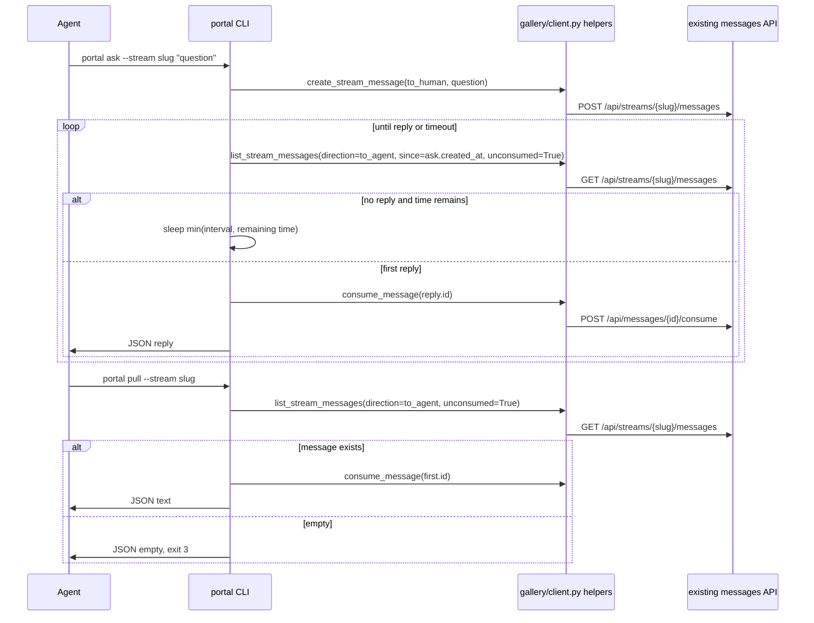

# feat: Add Portal ask/pull CLI verbs

## Summary

Add the phase-2 `portal ask` and `portal pull` CLI verbs as thin client-side polling wrappers over the already-landed messages API helpers. The implementation should stay inside the CLI/client test surface, preserve existing verbs, document machine-readable exit contracts in `--help`, and avoid any server-side blocking or `gallery/server.py` changes.

---

## Problem Frame

Portal phase 1 shipped streams, reports, decisions, and the `portal` CLI alias, and the dependency card shipped the `messages` table, bearer API, and `gallery/client.py` message helpers. Agents still lack the two spec-defined interaction verbs: asking a human a blocking question and pulling queued human steering at turn boundaries.

---

## Assumptions

*This plan was authored in pipeline mode without synchronous user confirmation. The items below are agent inferences that fill gaps in the input and should be reviewed before implementation proceeds.*

- The Trello shortlink for frontmatter is `https://trello.com/c/tHvZgqWB`; this twf context exposed the short id but not a richer card URL.
- This planned-stage pass should only produce the plan artifact. The next pipeline stage owns implementation.
- `gallery/client.py` already has the needed helpers: `create_stream_message`, `list_stream_messages`, and `consume_message`. Implementation should not edit `gallery/client.py` unless a helper gap appears while writing tests.
- This card ships CLI behavior over the existing bearer API only. Browser answer/note routes and stream-page UI are not in scope, so tests may seed replies through monkeypatched client helpers rather than claiming a complete phone-page round trip.
- The current messages schema has no reply correlation id. `portal ask` should treat the first unconsumed `to_agent` message returned after the ask cursor as the reply.
- The card explicitly calls for `since=<ask ts>`. Because the backend cursor is strict and timestamps have second precision, same-second replies may be missed until a later schema/API correlation improvement; this card should follow the card contract and cover the chosen client behavior with deterministic tests.
- `portal pull --timeout N` with no message after polling should use the same empty branch as non-blocking pull: exit `3` and print `{"empty": true}`. Exit `2` remains the card-defined `ask` timeout code, but argparse usage errors also exit `2`; agent loops must distinguish the timeout branch by the machine-readable stdout JSON object.
- A missing stream during `pull` should remain a client/API error, not the empty branch. The current API returns 404 for message listing on an unknown stream, and existing CLI convention maps `GalleryClientError` to stderr plus exit `1`.
- Timeout and interval bounds should be enforced by argparse-level validation: timeout must be non-negative, and interval must be positive.
- Polling commands should make an immediate poll attempt before sleeping. `--timeout 0` means one immediate poll and no sleep. For positive timeouts, sleep duration should be bounded by remaining time so `--timeout 1 --interval 15` does not block for about 15 seconds.

---

## Requirements

- R1. Add `portal ask --stream <slug> "question" [--timeout 1800] [--interval 15]` without changing existing CLI verbs.
- R2. `portal ask` posts one `to_human` message through the existing client helper before polling.
- R3. `portal ask` polls client-side with plain GET helper calls for unconsumed `to_agent` messages using the posted ask message's `created_at` as the `since` cursor.
- R4. `portal ask` polls immediately, sleeps between empty polls only while time remains, clips each sleep to the remaining timeout budget, and never asks the server to block.
- R5. `portal ask` consumes the first returned reply message, then prints JSON containing `reply`, `message_id`, and numeric `elapsed_s` to stdout.
- R6. `portal ask` exits `2` on timeout after parse succeeds, prints exactly `{"timeout": true}` to stdout, writes no timeout prose to stderr, and does not consume any message when no reply was returned.
- R7. Add `portal pull --stream <slug> [--timeout 0] [--interval 15]` without changing existing CLI verbs.
- R8. `portal pull` fetches the oldest unconsumed `to_agent` message through the existing client helper and consumes it before printing.
- R9. `portal pull` prints JSON containing `text` and `message_id` on success.
- R10. `portal pull` defaults to non-blocking mode; when no message exists with `--timeout 0`, it exits `3` and prints `{"empty": true}` to stdout without sleeping.
- R11. `portal pull --timeout N` polls immediately, sleeps between empty polls only while time remains, clips each sleep to the remaining timeout budget, then exits `3` and prints exactly `{"empty": true}` if no message arrives.
- R12. Both command help texts document the client-side polling model, exact stdout JSON branch shapes, and full exit contract: success `0`, client/API error `1`, ask timeout `2` with timeout JSON, pull empty `3`, and argparse usage errors `2` with no branch JSON.
- R13. Existing `GalleryClientError` behavior remains consistent with current commands: write the error to stderr, print no success/timeout/empty JSON to stdout, and exit `1`.
- R14. Parser validation rejects invalid stream slugs, negative timeouts, and non-positive intervals before invoking client helpers; these argparse usage errors may exit `2` but must not be treated as ask timeouts because they do not print `{"timeout": true}`.
- R15. Focused CLI tests cover ask success, ask timeout, pull empty, pull success, oldest-message consumption, and interval sleep behavior.
- R16. The full test suite stays green, and both `uv run portal ask --help` and `uv run portal pull --help` exit 0.

---

## Card Acceptance Criteria Trace

The card's acceptance text is snapshotted here for auditability: tested ask round-trip that seeds a reply and asserts consume plus output shape; ask timeout path with a tiny timeout; pull empty with exit `3`; pull success consuming exactly the oldest message; `--interval` respected via monkeypatched sleep; and final verification with the full pytest command plus ask/pull help commands.

| Card acceptance criterion | Requirements | Units | Test scenario anchor |
|---|---|---|---|
| `ask` round-trip seeds a reply, consumes it, and prints output shape | R1-R5, R15 | U2 | U2 ask success test |
| `ask` timeout path with tiny timeout | R6, R15 | U2 | U2 ask timeout test |
| `pull` empty returns exit 3 and JSON empty branch | R7, R10, R11, R15 | U3 | U3 pull empty tests |
| `pull` success consumes exactly the oldest message | R8, R9, R15 | U3 | U3 oldest-message success test |
| `--interval` respected via monkeypatched sleep | R4, R11, R15 | U2, U3 | U2/U3 polling sleep tests |
| Ask/pull semantics and exit codes documented in help | R12, R16 | U1 | U1 help text tests and command verification |
| Existing CLI verbs unchanged | R1, R7, R13, R16 | U1-U3 | Existing `tests/test_cli.py` coverage plus full suite |

---

## Scope Boundaries

- No `gallery/server.py` changes.
- No browser note box, answer form, cookie-authenticated `/s/{slug}/note`, or cookie-authenticated `/s/{slug}/answer` route.
- No stream-page message UI, unread badges, or phone answer workflow.
- No server-side long polling, sleeps, websockets, SSE, background wait handlers, or routes that block while a human answers.
- No schema changes, reply correlation id, exact-once consume endpoint, or atomic fetch-and-consume API.
- No README, deployment, launchd, config schema, or notification policy changes.
- No broad CLI framework migration; keep the existing `argparse` style.
- No new HTTP dependency; continue using the existing stdlib client helpers.

### Deferred to Follow-Up Work

- Browser note/answer twins from `docs/portal-spec.md` section 5.
- Stream page UI that lets a human answer `to_human` questions directly from the phone page.
- A correlation-aware ask/reply protocol if seeded steering notes and ask answers need to be distinguished later.
- Atomic fetch-and-consume API semantics if multiple concurrent agents need exact-once pull delivery.
- Automatic Stop/turn hooks that invoke `portal pull` for specific agent runtimes.

---

## Context & Research

### Relevant Code and Patterns

- `gallery/cli.py` uses plain `argparse`, one `cmd_*` function per verb, `config.client_config()` for URL/token, `_exit_client_error()` for `GalleryClientError`, JSON to stdout, and `sys.exit(...)` for command exit codes.
- `gallery/cli.py` `cmd_wait` is the local polling precedent: compute a deadline with `time.time()`, issue repeated plain GETs, and call `time.sleep(args.interval)` between empty polls.
- `gallery/cli.py` already validates stream slugs with `_stream_slug`; ask/pull should reuse that parser type.
- `gallery/client.py` is stdlib-only and already exposes `create_stream_message`, `list_stream_messages`, and `consume_message`, including URL quoting and `unconsumed=1` query construction.
- `gallery/server.py` and `gallery/db.py` already provide the messages API and DB behavior, including oldest-first message listing via `ORDER BY created_at, rowid`; this plan should not reopen that layer.
- `tests/test_cli.py` uses monkeypatched `sys.argv`, `cli.config.client_config`, `cli.client.*` helpers, `cli.time.sleep`, `capsys`, and `pytest.raises(SystemExit)` for fast CLI contract tests.
- `tests/test_messages_api.py` already covers message API creation, listing, filtering, idempotent consume, auth, notification, closed streams, and client helper paths.

### Institutional Learnings

- No `docs/solutions/` directory or critical-patterns file exists in this worktree.
- `docs/portal-spec.md` sections 5 and 7 define ask/pull as client-side polling verbs and explicitly reject server-side long polling for the SQLite-backed service.
- `docs/plans/2026-07-08-006-feat-portal-messages-api-plan.md` intentionally kept client helpers low-level and non-blocking, leaving timeout and polling behavior for this CLI card.
- Board guidance says verification in this sandbox should use `UV_CACHE_DIR=/private/tmp/uv-cache uv run --extra dev pytest -q`.

### External References

- External research is not needed. The work follows repository-local CLI, stdlib client, message API, and test patterns plus `docs/portal-spec.md`.

---

## Key Technical Decisions

- Keep the implementation in `gallery/cli.py` unless tests reveal a missing thin client helper. The dependency card already landed the message helper surface this CLI needs.
- Use the existing `cmd_wait` time/sleep style rather than adding async code, background threads, or server support.
- Use the created ask message's `created_at` field as the `since` cursor for `ask`, matching the card's requested `GET messages?direction=to_agent&since=<ask ts>&unconsumed=1` flow.
- Consume before printing success output for both verbs. The printed `message_id` should identify the message that was consumed.
- Treat expected branch outcomes as machine-readable stdout JSON: ask timeout is `{"timeout": true}`, pull empty is `{"empty": true}`, and success outputs are compact JSON objects. Client errors remain stderr plus exit `1` by existing convention.
- Keep `pull` empty semantics stable across non-blocking and blocking modes. A timed-out `pull --timeout N` still means "no steering note", not an ask-style timeout.
- Keep missing-stream `pull` as a client/API error. `empty` means an existing stream currently has no queued unconsumed `to_agent` message, not that the stream is unknown.
- Bound each polling sleep by the remaining timeout budget. This intentionally tightens the existing `cmd_wait` pattern for agent-facing timeout precision while keeping the same plain client-side polling shape.
- Add small parser type helpers only if needed for numeric bounds. Invalid numeric values should produce argparse exit `2` and should not call the network.
- Document the exit codes and stdout JSON branch shapes in subcommand help, because agent loops branch on them. Help should make clear that argparse usage errors can also exit `2` but are not the timeout branch because stdout does not contain the timeout object.

---

## Open Questions

### Resolved During Planning

- Should this card touch `gallery/server.py` to add browser answer routes? No. The card scope fence explicitly excludes `server.py`, and the dependency API is already present.
- Are `gallery/client.py` helpers missing? No. `create_stream_message`, `list_stream_messages`, and `consume_message` exist in the current worktree.
- Should `ask` add a correlation id? No. The current schema lacks one, and adding it would exceed the CLI-only scope.
- Should `ask` avoid the card's `since=<ask ts>` filter because same-second replies can be missed? No. Follow the card contract and make the limitation visible in the plan.
- Should `pull --timeout N` use exit `2` on no message? No. Exit `2` is the card-defined ask-timeout branch after parsing succeeds; pull's no-message branch is exit `3`.
- Should missing stream in `pull` be treated as empty? No. The existing API returns 404 for listing messages on an unknown stream, and this CLI should preserve that as a client error rather than hiding a stream setup problem.
- Should best-effort list-then-consume be replaced with atomic fetch-and-consume? No. That needs API/server work outside this card.

### Deferred to Implementation

- Exact factoring in `gallery/cli.py`: add a shared polling helper only if it keeps `ask` and `pull` clear without obscuring the simple flow.
- Exact numeric formatting for `elapsed_s`: emit a JSON number derived from CLI wall-clock time and make tests deterministic with monkeypatched `time.time`.
- Exact wording of argparse help: include the required behavior and exit-code facts without overloading help text with implementation internals.

---

## High-Level Technical Design

> *This illustrates the intended approach and is directional guidance for review, not implementation specification. The implementing agent should treat it as context, not code to reproduce.*

---

## CLI Output Contract

| Command branch | Exit | Stdout | Stderr | State mutation |
|---|---:|---|---|---|
| `ask` success | `0` | Exactly one JSON object with `reply` string, `message_id` string, and `elapsed_s` number | Empty under normal operation | Creates one `to_human` message, then consumes the returned `to_agent` reply |
| `ask` timeout after parse succeeds | `2` | Exactly `{"timeout": true}` | Empty under normal operation | Creates one `to_human` message; consumes nothing |
| `pull` success | `0` | Exactly one JSON object with `text` string and `message_id` string | Empty under normal operation | Consumes the returned `to_agent` message |
| `pull` empty on an existing stream | `3` | Exactly `{"empty": true}` | Empty under normal operation | No mutation |
| Client/API error for either command, including missing stream | `1` | Empty | Existing `error: ...` text | Only mutations that completed before the client error; no success/timeout/empty branch JSON |
| Argparse usage error for either command | `2` | Empty | Argparse usage/error text | No client calls and no mutation |

Tests should parse stdout with `json.loads(captured.out)` and compare exact objects where possible. They should also assert empty stdout for client/API and argparse error paths so agent loops can discriminate branch JSON from usage failures.

---

## Implementation Units

- U1. **Add ask/pull parser contracts and validation**

**Goal:** Expose the new command grammar, bounded numeric arguments, help text, and dispatch entries without changing old command behavior.

**Requirements:** R1, R7, R12, R14, R16

**Dependencies:** Existing `portal`/`gallery` console aliases and `argparse` CLI structure

**Files:**
- Modify: `gallery/cli.py`
- Test: `tests/test_cli.py`

**Approach:**
- Register `ask` and `pull` subcommands near the existing polling-oriented `wait` command.
- Reuse `_stream_slug` for `--stream` validation.
- Add local bounded integer parser helpers only if needed to enforce non-negative timeout and positive interval values.
- Put the exit-code and stdout JSON contracts in subcommand help text so autonomous agents can discover them from `--help`.
- Include concise branch examples or an epilog table for each subcommand; use `argparse.RawDescriptionHelpFormatter` if needed to keep the formatting readable.
- Add dispatch map entries for the new command handlers.
- Preserve existing parser identity, existing command registrations, and old argument shapes.

**Execution note:** Start with focused parser/help tests so invalid argument behavior and help contracts are locked before implementing command loops.

**Patterns to follow:**
- `gallery/cli.py` top-level parser and existing `wait` argument setup.
- `tests/test_cli.py` `test_help_aliases_list_portal_verbs`, parser validation tests, and monkeypatched `sys.argv` style.

**Test scenarios:**
- Happy path: `portal --help` and `gallery --help` include `ask` and `pull` alongside existing verbs.
- Happy path: `portal ask --help` exits 0 and documents success `0`, client error `1`, timeout `2` with JSON timeout output, argparse usage error `2` with no branch JSON, and client-side polling.
- Happy path: `portal pull --help` exits 0 and documents success `0`, client error `1`, empty `3` with JSON empty output, argparse usage error `2`, and default non-blocking behavior.
- Happy path: help includes a concise branch example or branch table label so the machine-readable contract is discoverable without reading the source.
- Error path: invalid `--stream` for `ask` and `pull` exits with argparse code `2` before client helpers are called.
- Error path: negative timeout or non-positive interval for either command exits with argparse code `2`, prints no branch JSON to stdout, and does not call client helpers.
- Compatibility: existing help and old command parser tests continue to pass without changes to old argument shapes.

**Verification:**
- The CLI command surface exposes the two new verbs and documents their machine-readable branch contracts.
- Invalid parser inputs fail locally and do not trigger network/client helper calls.

---

- U2. **Implement `portal ask` client-side polling**

**Goal:** Let an agent post a question, poll for the first reply using existing message helpers, consume that reply, and emit machine-readable output.

**Requirements:** R1-R6, R13, R15, R16

**Dependencies:** U1; existing `gallery/client.py` message helpers

**Files:**
- Modify: `gallery/cli.py`
- Test: `tests/test_cli.py`

**Approach:**
- In `cmd_ask`, load URL/token through `config.client_config()` like existing commands.
- Create a `to_human` message through `client.create_stream_message`; treat the returned `created_at` as the poll cursor.
- Poll immediately with `client.list_stream_messages(..., since=ask_created_at, direction="to_agent", unconsumed=True)` until a reply appears or the timeout boundary is reached.
- On the first returned message, call `client.consume_message` before printing success JSON.
- Compute `elapsed_s` from CLI wall-clock time, not server timestamps.
- On timeout, print `{"timeout": true}` to stdout and exit `2`.
- Route any `GalleryClientError` through `_exit_client_error()` so existing stderr/exit behavior remains consistent.
- Keep sleeping in the CLI loop only, using a sleep duration capped by the remaining timeout budget after empty polls that still have time remaining.
- Treat `--timeout 0` as one immediate poll after creating the ask message; if no reply is returned, emit the timeout JSON and exit `2` without sleeping.

**Patterns to follow:**
- `gallery/cli.py` `cmd_wait` polling loop and `_exit_client_error`.
- `gallery/client.py` `create_stream_message`, `list_stream_messages`, and `consume_message`.
- `tests/test_cli.py` monkeypatched client helper and `time.sleep` patterns.

**Test scenarios:**
- Happy path: `portal ask --stream alpha "Proceed?"` calls `create_stream_message` once with `direction="to_human"`, polls with `direction="to_agent"`, `since` equal to the ask message's `created_at`, and `unconsumed=True`, consumes the returned reply id, and prints JSON with `reply`, `message_id`, and `elapsed_s`.
- Happy path: when the first poll is empty and the second poll returns a reply, the command calls `time.sleep` exactly once with the provided interval before consuming.
- Error path: with no reply before a tiny timeout, the command prints exactly `{"timeout": true}`, exits `2`, leaves stderr empty under normal operation, and does not call `consume_message`.
- Error path: `--timeout 0` performs one immediate poll, does not sleep, then emits the timeout branch if no reply exists.
- Edge case: when `--timeout` is smaller than `--interval`, the sleep call is capped to the remaining timeout budget rather than the full interval.
- Error path: `GalleryClientError` from create, list, or consume exits `1` through the existing error path and does not print success JSON.
- Edge case: a reply list containing multiple messages consumes and prints only the first item returned by the API, even though it may be an uncorrelated post-cursor steering note under the current schema.
- Edge case: output uses the consumed message id and text, and tests control `time.time()` so `elapsed_s` is deterministic and numeric.

**Verification:**
- Ask behavior satisfies the card's create, poll, consume, output, timeout, and interval contracts without server changes.

---

- U3. **Implement `portal pull` non-blocking and blocking modes**

**Goal:** Let an agent fetch-and-consume the oldest queued steering note, or cheaply branch when no note is available.

**Requirements:** R7-R11, R13, R15, R16

**Dependencies:** U1; existing `gallery/client.py` message helpers

**Files:**
- Modify: `gallery/cli.py`
- Test: `tests/test_cli.py`

**Approach:**
- In `cmd_pull`, load URL/token through `config.client_config()`.
- Poll immediately with `client.list_stream_messages(..., direction="to_agent", unconsumed=True)` and no `since` cursor.
- Treat the first returned row as the oldest steering note because the existing API returns oldest-first.
- Call `client.consume_message` before printing success JSON.
- With default `--timeout 0`, perform one list attempt and return the empty branch immediately when no message exists.
- With positive timeout, repeat empty polls with sleeps capped by the remaining timeout budget until a message arrives or the timeout boundary is reached.
- On no message after the allowed polling window, print `{"empty": true}` and exit `3`.
- Route `GalleryClientError` through `_exit_client_error()` so missing-stream, closed-stream, or consume failures surface consistently as exit `1`.

**Patterns to follow:**
- `gallery/cli.py` `cmd_wait` for deadline/sleep mechanics.
- `gallery/client.py` `list_stream_messages` and `consume_message`.
- Existing CLI tests that assert JSON stdout and `SystemExit` codes.

**Test scenarios:**
- Happy path: `portal pull --stream alpha` lists unconsumed `to_agent` messages, consumes the first returned id, and prints JSON with `text` and `message_id`.
- Happy path: when multiple messages are returned, only the first/oldest returned message is consumed and printed.
- Happy path: `portal pull --stream alpha --timeout 10 --interval 2` sleeps between empty polls and succeeds when a later poll returns a message.
- Happy path: when `--timeout` is smaller than `--interval`, the sleep call is capped to the remaining timeout budget rather than the full interval.
- Empty path: default `--timeout 0` with no message prints exactly `{"empty": true}`, exits `3`, does not sleep, and does not consume.
- Empty path: positive timeout with no message eventually prints exactly `{"empty": true}` and exits `3`.
- Error path: missing stream or another `GalleryClientError` from list or consume exits `1` through the existing error path and prints no success/empty JSON.

**Verification:**
- Pull behavior satisfies the card's non-blocking branch, blocking poll branch, oldest-message consume behavior, output shape, and interval contracts.

---

## System-Wide Impact

- **Interaction graph:** `gallery/cli.py` calls existing `gallery/client.py` helpers, which call the already-landed messages API and DB layer. No server, schema, template, static asset, or deployment path changes should occur.
- **Error propagation:** Expected branch states use stdout JSON and documented exit codes (`ask` timeout `2`, `pull` empty `3`). Unexpected HTTP/client failures keep the established stderr plus exit `1` CLI convention.
- **State lifecycle risks:** `ask` creates a persistent `to_human` message even if the command later times out. `ask` and `pull` consume `to_agent` messages only after listing them; this is best-effort and not atomic under concurrent agents.
- **API surface parity:** Both `portal` and `gallery` aliases share `gallery.cli:main`; adding commands changes the shared help surface but should not alter existing command behavior.
- **Integration coverage:** Existing message API tests cover the server/DB chain. This card needs CLI-level tests for argument parsing, helper calls, polling, output, and exit codes.
- **Unchanged invariants:** The server never sleeps or blocks on human/agent waits; messages remain pulled through explicit client requests; existing `post`, `report`, `wait`, `status`, `list`, `stream`, `serve`, and `init` behavior remains unchanged.

---

## Risks & Dependencies

| Risk | Mitigation |
|------|------------|
| `ask` can consume an unrelated steering note because current messages have no reply correlation id. | Document the limitation in this plan and consume the first unconsumed `to_agent` after the ask cursor as the card specifies; defer correlation to follow-up work. |
| Same-second replies can be excluded by strict `since` filtering. | Follow the card's explicit `since=<ask ts>` contract, keep tests deterministic, and call out the precision limitation for later protocol work. |
| Two agents can list the same message before either consumes it. | Accept best-effort behavior inside this CLI-only card; exact-once delivery needs an atomic server endpoint outside scope. |
| Exit-code ambiguity can break agent loops. | Put exit codes in help text and cover timeout/empty branches in CLI tests. |
| Argparse and ask timeout both use exit `2`. | Require agent loops and tests to discriminate by stdout JSON: parse-success timeout prints exactly `{"timeout": true}`, while argparse usage errors print no branch JSON and make no client calls. |
| Polling tests can become flaky if they use real time. | Monkeypatch `time.time` and `time.sleep` in focused tests. |
| Implementation drifts into server/UI work to make a full human phone flow. | Keep `gallery/server.py`, templates, and static files out of the active file list; record browser twins as deferred follow-up work. |

---

## Documentation / Operational Notes

- Document ask/pull semantics and exit codes in `portal ask --help` and `portal pull --help`.
- Do not update README in this card unless implementation discovers the scope fence has changed; the card explicitly names CLI help as the documentation surface.
- Verification expected by the card: `UV_CACHE_DIR=/private/tmp/uv-cache uv run --extra dev pytest -q`, `uv run portal ask --help >/dev/null`, and `uv run portal pull --help >/dev/null`.

---

## Sources & References

- Trello card: `tHvZgqWB` (`https://trello.com/c/tHvZgqWB`)
- Spec: `docs/portal-spec.md`
- Prior dependency plan: `docs/plans/2026-07-08-006-feat-portal-messages-api-plan.md`
- Prior CLI plan: `docs/plans/2026-07-08-003-feat-portal-cli-commands-plan.md`
- Related code: `gallery/cli.py`
- Related code: `gallery/client.py`
- Related tests: `tests/test_cli.py`
- Related tests: `tests/test_messages_api.py`
