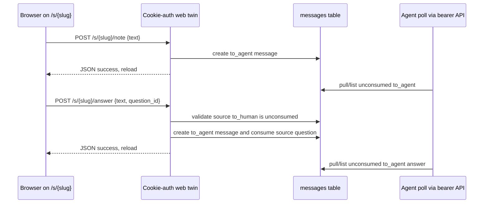

# feat: Add stream message note box and answer UI

## Summary

Add the human-side phase-2 message surface to existing stream pages: cookie-authenticated note and answer twin routes, a note box for open streams, an "Agent asks" section for `to_human` questions, and visible `to_agent` message state. The implementation should wrap the already-landed messages API/database helpers without changing `/api/*`, CLI files, or message storage.

---

## Problem Frame

Portal streams can now store messages through the bearer API, but the browser stream page still has no way for a human to steer an agent or answer a blocking agent question. `docs/portal-spec.md` sections 5 and 7 require browser twins because page JavaScript cannot send bearer headers, and they keep the product intentionally below full chat: turn-boundary notes and blocking answers only.

---

## Assumptions

*This plan was authored in pipeline mode without synchronous user confirmation. The items below are agent inferences that fill gaps in the input and should be reviewed before implementation proceeds.*

- The messages table/API dependency is present in this worktree: `gallery/db.py`, `gallery/server.py`, `gallery/client.py`, and `tests/test_messages_api.py` already include v2 message storage and bearer API behavior.
- This planned-stage pass should only produce the plan artifact. The next pipeline stage owns implementation.
- The card description and `docs/portal-spec.md` are the origin inputs; there is no upstream brainstorm document in `docs/brainstorms/`.
- The browser twins should require an existing stream and should not auto-create streams, even though the bearer message-create API auto-creates on POST. A browser twin is tied to a page the human can already load.
- Closed stream mutations should return `409` to match existing closed-stream write behavior; unauthenticated web calls should keep the existing `401` behavior.
- `POST /s/{slug}/answer` creates a `to_agent` message as the durable answer. The inline question UI should also submit the source `to_human` message id so the route can mark that question consumed via the existing `consumed_at` state; this does not introduce a separate answer table or reply model.
- The card's `{text}` shorthand is treated as the durable answer body, not the full browser form payload. Inline answer submissions use `question_id` as the required source-question key.
- Message rendering state should be based on existing fields only: direction and `consumed_at`. There is no durable thread/reply linkage beyond consuming the source question.
- The stream page can extend the globally loaded `gallery/static/app.js` behind a `.stream-detail` guard rather than adding a new asset pipeline.

---

## Requirements

- R1. Add cookie-authenticated browser twin routes `POST /s/{slug}/note` and `POST /s/{slug}/answer`, following the existing `/r/{req_id}/decide` web-auth pattern.
- R2. Both twin routes create `to_agent` messages in the existing messages table; the note route can use existing DB helpers, while the answer route uses one local transaction for first-answer-wins. Neither route sends bearer headers from browser JavaScript.
- R3. Both twin routes reject missing/invalid web tokens with the existing web `401` behavior.
- R4. Both twin routes reject closed streams with a visible 409-class failure and do not create messages.
- R5. The twin routes validate slug and bounded non-empty text using existing server validation conventions.
- R6. The inline answer twin validates a source `to_human` question id from the same stream, rejects stale/already-consumed questions, stores the answer as a `to_agent` message, and marks the source question consumed.
- R7. `GET /s/{slug}` includes message context from the existing `messages` table without changing `/api/*` routes.
- R8. Open streams render a note textarea and Send control; closed/archived streams render no note or answer forms.
- R9. Unconsumed `to_human` messages render as distinct "Agent asks" question blocks, newest first, each with an inline answer box.
- R10. Consumed `to_human` messages render collapsed or visually greyed with their consumed state.
- R11. `to_agent` notes and answers render in the stream page feed with consumed/unconsumed state so humans can see whether an agent picked them up.
- R12. Message text renders through Jinja autoescaping; do not use `|safe` for message content.
- R13. Static browser behavior uses vanilla JS in `gallery/static/`, posts JSON to the twin routes with same-origin credentials, handles failures visibly, then reloads after successful sends.
- R14. Controls remain phone-ergonomic and keyboard-accessible with native forms/buttons and at least 44px tap targets.
- R15. Do not edit `gallery/cli.py`, `tests/test_cli.py`, `/api/*` handler behavior, schema migrations, or the existing messages API/client contract.
- R16. Add focused `TestClient` coverage in `tests/test_web_messages.py` and keep the full test suite green with the board-specified command.

---

## Card Acceptance Criteria Trace

| Card acceptance criterion | Requirements | Units | Test scenario anchor |
|---|---|---|---|
| Note round-trip creates `to_agent` message visible via API | R1-R5, R11, R16 | U1, U3 | U1 note route and U3 API visibility tests |
| Answer on a question creates `to_agent` message | R1-R6, R9, R16 | U1, U2, U3 | U1 answer route and U3 inline question tests |
| Closed stream rejects note/answer | R4, R8, R16 | U1-U3 | U1 closed route test and U2 archived markup test |
| Unanswered question markup present for unconsumed `to_human` message | R7, R9, R16 | U1-U3 | U2/U3 Agent asks markup test |
| Answered/consumed questions and `to_agent` notes render with state | R10, R11, R16 | U2, U3 | U2/U3 consumed-question and to-agent pickup-state tests |
| Auth enforced without token | R3, R16 | U1, U3 | U1 unauthenticated twin-route tests |
| Message rendering escapes text | R12, R16 | U2, U3 | U3 HTML-escaping tests |

---

## Scope Boundaries

- No changes to bearer `/api/*` route behavior, request/response contracts, or client helper semantics.
- No schema migration, new table, reply/thread field, or message/post dual-write.
- No CLI `portal ask`, `portal pull`, polling loop, timeout behavior, or edits to `gallery/cli.py` or `tests/test_cli.py`.
- No server-side sleep, server-side long polling, websocket, SSE, presence indicator, or full chat UI.
- No notification policy changes. The human-created `to_agent` messages stay silent under the existing message API semantics.
- No public auth, per-stream tokens, Cloudflare/Tailscale access expansion, or multi-user identity work.
- No broad redesign of the stream page, media policy, report iframe behavior, or request decision UI.

### Deferred to Follow-Up Work

- CLI ask/pull behavior from the parallel card. Browser answer submit owns retiring the `to_human` question by setting `consumed_at`; future CLI work should treat that question as already retired and focus on polling/consuming the resulting `to_agent` answer plus timeout behavior.
- Automatic turn-boundary pull hooks for agent runtimes.
- Rich message threading, answer history, unread badges, filtering, or search.
- A durable `docs/solutions/` learning after this browser-twin UI pattern lands.

---

## Context & Research

### Relevant Code and Patterns

- `gallery/server.py` owns FastAPI routes, Jinja rendering, `web_token_ok`, `_maybe_set_cookie`, the existing `/s/{slug}` stream page, and the cookie-authenticated `/r/{req_id}/decide` twin.
- `gallery/server.py` already contains message validation helpers and bearer message routes: `_validate_message_direction`, `_json_object_body`, `_bounded_text`, `_message_mutation_status`, `POST /api/streams/{slug}/messages`, `GET /api/streams/{slug}/messages`, and `POST /api/messages/{message_id}/consume`.
- `gallery/db.py` already exposes `get_stream`, `get_stream_with_posts`, `create_message`, `create_message_for_stream`, `list_messages`, and idempotent `consume_message`.
- `gallery/templates/stream.html` currently renders stream metadata, archive state, reports, and decision links. It has no message context, note form, or answer form.
- `gallery/static/app.js` is vanilla JS with an early `.request-detail` guard. Stream behavior should be added behind its own stream-page guard rather than affecting request pages.
- `gallery/static/style.css` already has compact mobile-first primitives for cards, tags, `.comment-box`, `.btn`, `.archive-note`, and status badges.
- `tests/test_web_streams.py` covers stream web auth/cookie behavior, referrer policy, no token leaks, archived read-only pages, report rendering, and decision status badges.
- `tests/test_messages_api.py` covers message DB/API semantics, filters, closed-stream rejection, notification behavior, and client helper paths.

### Institutional Learnings

- No `docs/solutions/` directory exists in this worktree.
- Prior Portal plans consistently keep phase slices narrow: server-rendered web UI for browser actions, bearer API for agents, and CLI work in separate cards.
- Board guidance says full verification in this sandbox should use `UV_CACHE_DIR=/private/tmp/uv-cache uv run --extra dev pytest -q`.

### External References

- External research is not needed. The feature follows existing repo-local FastAPI, Jinja, SQLite helper, TestClient, and vanilla JS patterns.

---

## Key Technical Decisions

- Reuse the existing web-token flow for twin routes: accept cookie or query token, set the cookie on page loads when `?token=` is valid, and return `401` for unauthenticated mutation attempts.
- Keep twin routes in the web section of `gallery/server.py` and keep bearer `/api/*` handlers unchanged.
- Use `db.get_stream(slug)` before browser-twin mutation so web note/answer calls do not auto-create streams that the user could not have loaded.
- Use existing message storage for notes and answers so closed-stream rejection follows the open-stream invariant and `to_agent` messages stay silent. Notes can use the public message helper; inline answers require one server-local transaction so stale double-submits do not create duplicate answer messages.
- Build stream message view models in `server.py` from `db.list_messages(stream["id"])`, partitioned by direction and `consumed_at`, with newest-first presentation for human scanning.
- Treat `consumed_at` as the only persisted question state. Inline answer forms pass a question id so the route can reject stale submissions, create one `to_agent` answer, and consume the source `to_human` question; the answer itself remains a separate `to_agent` message.
- Treat answers as intentionally ordinary `to_agent` messages after creation. There is no machine-readable answer/thread correlation for agents; consuming the source question is only the stream-page retirement state.
- Return the created message object as the 200 JSON response for successful note and answer twins, matching the existing API habit of returning persisted objects.
- Use a simple answer error contract: malformed bodies/text/question ids return 400-class failures, missing or cross-stream questions return 404, and already-consumed questions or closed streams return 409.
- Keep message text plain and autoescaped in templates. The only existing `|safe` usage remains request context Markdown and should not be copied for messages.
- Add stream-page JavaScript in `gallery/static/app.js` behind an independent `.stream-detail` initializer, preserving current request decision behavior.
- Prefer small inline status/error regions over browser alerts for note/answer forms so keyboard and phone users get visible feedback before reload/failure.

---

## Open Questions

### Resolved During Planning

- Should this card implement CLI ask/pull? No. The card explicitly says this runs parallel with the ask/pull CLI card and must not touch `cli.py` or `tests/test_cli.py`.
- Should browser JS call the bearer API? No. The spec and card require cookie-authenticated twins because page JS cannot send bearer headers.
- Should messages become stream posts or use a separate answer table? No. The dependency card shipped a separate `messages` table, and this card says an answer is a `to_agent` message.
- Should closed streams show controls? No. Existing stream-page behavior treats archived streams as read-only.
- Should the web note route auto-create missing streams? No. Browser note/answer actions are tied to existing pages, unlike agent-facing POST endpoints.
- How should first-answer-wins be enforced? The answer twin should use a small server-local transaction in `gallery/server.py` that claims the source question only if it is same-stream, `to_human`, open, and unconsumed, then inserts the `to_agent` answer and commits once. It should not compose public helpers that each commit independently.

### Deferred to Implementation

- Exact CSS class names for collapsed/greyed message states: choose names that fit current `post-card`, `tag`, and status badge conventions.
- Exact form field/data attribute names other than the answer payload's required `question_id`: choose names that keep `stream.html` readable and `app.js` selectors stable.
- Exact helper/function names for the first-answer-wins path: the transaction shape is decided, but implementation can choose small local names that fit `gallery/server.py`.

---

## High-Level Technical Design

> *This illustrates the intended approach and is directional guidance for review, not implementation specification. The implementing agent should treat it as context, not code to reproduce.*

The stream page remains a server-rendered view. It receives stream/posts context plus a message view model: open note availability, unconsumed questions, consumed questions, and `to_agent` notes/answers with pickup state. Static JavaScript only serializes form input to the cookie-auth twins and reloads after success; it does not poll or hold server handlers open.

---

## Implementation Units

- U1. **Add web message context and cookie twin routes**

**Goal:** Add the server-side message view model and authenticated web mutations needed by the stream page.

**Requirements:** R1-R7, R15, R16

**Dependencies:** Landed messages API/table dependency

**Files:**
- Modify: `gallery/server.py`
- Test: `tests/test_web_messages.py`

**Approach:**
- Extend `web_stream_detail` context with messages from `db.list_messages(stream["id"])` after the stream lookup succeeds.
- Build simple dictionaries for template consumption: unconsumed `to_human` questions, consumed `to_human` questions, and `to_agent` messages with `consumed_at` state.
- Sort message presentation newest-first for web UI even though DB/API list helpers return oldest-first for pull-style delivery.
- Add `POST /s/{slug}/note` and `POST /s/{slug}/answer` near the existing web UI routes, using `web_token_ok` before parsing/mutating.
- Reuse `_validate_slug`, `_json_object_body`, `_bounded_text`, `MAX_MESSAGE_TEXT_LENGTH`, and `_message_mutation_status` where they fit.
- For browser twins, fetch `db.get_stream(slug)` first and return 404 for missing streams instead of using the auto-create helper.
- Reject closed streams with the existing closed-stream status convention and do not create partial messages.
- Have both routes create `to_agent` messages. The answer route validates the supplied source question id belongs to the same stream, is `to_human`, and is still unconsumed before creating the answer and consuming the source question.
- Make the inline answer transition first-answer-wins with one locked transaction in `server.py`: claim the question with a conditional same-stream/unconsumed transition, insert the `to_agent` answer, and commit once. Roll back on any error, and retry only message-id collisions before commit.
- Do not implement the answer route by composing public `db.create_message*()` and `db.consume_message()` calls, because those helpers commit independently and cannot enforce the duplicate-answer guard.
- Keep all new code out of `/api/*` handler behavior and do not introduce server-side waiting.

**Execution note:** Start with failing `TestClient` route tests for auth, note creation, answer creation, and closed-stream rejection before adding route bodies.

**Patterns to follow:**
- `gallery/server.py` `/r/{req_id}/decide` and `_apply_verdict` for cookie-auth twin shape.
- `gallery/server.py` message API validation helpers for body parsing and text bounds.
- `gallery/db.py` `create_message` for notes, `list_messages` for rendering, and existing connection/lock conventions for the answer transaction.
- `tests/test_web_streams.py` for token/cookie web-route setup and archived read-only assertions.
- `tests/test_messages_api.py` for API-visible message assertions.

**Test scenarios:**
- Happy path: after seeding a stream cookie via `GET /s/alpha?token=<token>`, `POST /s/alpha/note` with `{"text":"Steer here"}` returns success and `GET /api/streams/alpha/messages?direction=to_agent` shows the text.
- Happy path: `POST /s/alpha/answer` with `{"text":"Use option B","question_id":"m_question"}` for an unconsumed same-stream `to_human` question returns success, creates exactly one `to_agent` answer, and marks the source question consumed.
- Error path: missing or invalid token on both twin routes returns 401 and leaves the message list unchanged.
- Error path: note and answer on a closed stream return 409 and leave the message list unchanged.
- Error path: invalid slug, non-object JSON, missing text, blank text, and oversized text return 400-class failures without inserting messages.
- Error path: supplied `question_id` that is missing, belongs to another stream, is a `to_agent` message, or is already consumed is rejected without creating a `to_agent` answer, following the planned status contract.
- Error path: two sequential submissions for the same `question_id` create one answer at most; the stale second submit returns 409-class failure.
- Integration: twin-route-created messages are visible through the existing bearer API, proving the UI uses the same storage path as agents.

**Verification:**
- Web twin routes create only `to_agent` rows, enforce web auth and closed-stream state, and do not change existing `/api/*` behavior.

---

- U2. **Render note, question, and message UI on stream pages**

**Goal:** Make the stream page show the human inbox controls and message state clearly on phone and desktop without leaking tokens or rendering unsafe text.

**Requirements:** R8-R14, R16

**Dependencies:** U1

**Files:**
- Modify: `gallery/templates/stream.html`
- Modify: `gallery/static/style.css`
- Modify: `gallery/static/app.js`
- Test: `tests/test_web_messages.py`

**Approach:**
- Add a stable stream-page data attribute, such as the slug, for static JS route construction.
- Render a note form only when `stream.closed_at` is false. Use native `<form>`, `<textarea>`, and `<button>` controls so keyboard submission and focus behavior are natural.
- Render an "Agent asks" area above or near the message feed for unconsumed `to_human` messages, newest first, with an answer textarea/button per question.
- Render consumed `to_human` questions in a collapsed or subdued state with a visible consumed/picked-up label and no active answer form.
- Render `to_agent` messages in the stream feed with labels that distinguish queued/unconsumed from picked-up/consumed.
- Preserve the existing report/decision post list and archived stream note; do not regress closed-stream read-only behavior.
- Rely on Jinja autoescape for `message.text`, `post.title`, and related message fields. Do not add `|safe` to message content.
- Extend `app.js` with a stream-message initializer that no-ops when `.stream-detail` is absent, so request detail pages keep current behavior.
- Have JS submit JSON to `/s/{slug}/note` and `/s/{slug}/answer`, include `window.location.search` like `/r/{req_id}/decide` for first-load query-token compatibility, use `credentials: "same-origin"`, and reload on success.
- Add inline error/status handling with an accessible live region or equivalent visible feedback for failed sends.
- Add or reuse CSS so textareas/buttons meet the 44px target requirement and message states remain scannable on narrow screens.

**Execution note:** Keep the UI additive and template-local. Do not introduce a framework, polling loop, or chat timeline abstraction.

**Patterns to follow:**
- `gallery/templates/stream.html` current stream header, archive note, post cards, report iframe, and decision link structure.
- `gallery/templates/request.html` native textarea/button controls and read-only archived behavior.
- `gallery/static/app.js` existing same-origin fetch/reload pattern for web decisions.
- `gallery/static/style.css` `.comment-box`, `.btn`, `.post-card`, `.tag`, `.status-badge`, and mobile layout patterns.

**Test scenarios:**
- Happy path: an open stream page renders a note textarea and Send button.
- Happy path: a stream with an unconsumed `to_human` message renders an "Agent asks" block, the question text, and an inline answer control.
- Happy path: multiple unconsumed questions render newest first.
- Happy path: a consumed `to_human` message renders in a greyed/collapsed consumed state with no answer form for that consumed question.
- Happy path: `to_agent` notes render with queued/unconsumed state before consumption and picked-up/consumed state after `db.consume_message`.
- Edge case: a closed stream page renders no note form, no answer forms, and still shows existing archived copy.
- Edge case: message text containing HTML, script tags, quotes, and ampersands appears escaped in the response body; raw active markup is not present.
- Edge case: rendered forms and same-origin links do not include a long-lived `token=` value in HTML attributes.
- Accessibility/ergonomics: message textareas and buttons are native focusable controls, failure feedback has a visible status region, and CSS gives message buttons/form controls at least 44px tap height.
- Static behavior: `app.js` still no-ops safely on request pages and non-stream pages, and stream form markup exposes the selectors/data attributes it expects.

**Verification:**
- Stream pages show the expected message controls/state with safe escaped text, while closed streams remain read-only.

---

- U3. **Add focused web-message regression coverage**

**Goal:** Capture the card's acceptance criteria in a dedicated test file without broadening the implementation scope.

**Requirements:** R1-R16

**Dependencies:** U1, U2

**Files:**
- Create: `tests/test_web_messages.py`

**Approach:**
- Reuse `TestClient`, `auth_headers`, and direct `db` setup patterns from `tests/test_web_streams.py` and `tests/test_messages_api.py`.
- Keep tests focused on browser-twin behavior, stream-page markup, auth, closed streams, and API-visible persistence.
- Use direct DB setup for message state that is not the feature under test, such as consumed questions or existing `to_agent` pickup state.
- Assert absence as well as presence for scope-sensitive behavior: no forms on closed streams, no `token=` in rendered message controls, and no raw unescaped HTML. Let the full suite cover existing `/api/*`, CLI, and request-page contracts.
- Run the full suite with the board-specified `UV_CACHE_DIR` after focused tests pass.

**Patterns to follow:**
- `tests/test_web_streams.py` for web-cookie setup and HTML assertions.
- `tests/test_messages_api.py` for message DB/API setup and consume-state assertions.
- `tests/conftest.py` for isolated `GALLERY_DATA_DIR` and config setup.

**Test scenarios:**
- Acceptance: note twin route round-trip creates a `to_agent` message visible via `GET /api/streams/{slug}/messages`.
- Acceptance: answer twin route on a seeded `to_human` question creates one `to_agent` answer message visible via the API and marks the source question consumed.
- Acceptance: closed stream rejects both note and answer twins and renders no note/answer controls.
- Acceptance: unconsumed `to_human` message renders "Agent asks" markup with an answer box.
- Acceptance: missing token/cookie on both twins returns 401.
- Acceptance: malicious-looking message text is escaped in stream-page HTML.
- Regression: `to_agent` message state changes from queued to picked-up after consumption.
- Regression: consumed `to_human` questions render greyed/collapsed, do not offer an active answer form, and reject stale duplicate answer POSTs.
- Regression: request decision page behavior and `/r/{req_id}/decide` still pass existing tests through full-suite verification.

**Verification:**
- Focused tests cover every card acceptance criterion, and full-suite verification confirms existing Portal behavior remains intact.

---

## System-Wide Impact

- **Interaction graph:** Adds two web-only mutation entry points on `gallery/server.py`, one stream-page message context extension, and static form handlers in `gallery/static/app.js`.
- **Error propagation:** Web auth failures stay 401; validation failures stay 400-class; closed streams use 409; missing streams/messages use 404.
- **State lifecycle risks:** Notes and answers are `to_agent` messages until an agent consumes them through existing API/CLI behavior. `to_human` question state is only `consumed_at`, not a separate answered relation.
- **API surface parity:** Existing bearer APIs remain the agent surface. The twins wrap existing storage semantics for browser use only.
- **Integration coverage:** TestClient should prove browser-twin writes are visible via the bearer API so human UI and agent polling share one queue.
- **Unchanged invariants:** Closed streams are read-only archives, stream pages do not leak bearer tokens in HTML, and handlers do not wait for humans or agents.

---

## Risks & Dependencies

| Risk | Mitigation |
|------|------------|
| Answer state is ambiguous because the schema has no reply/thread field | Use `to_human.consumed_at` as the only persisted question state, require inline answers to identify the source question, and make stale/already-consumed submissions create no duplicate answer |
| Browser twin accidentally auto-creates streams unlike the stream page | Require `db.get_stream(slug)` before mutation and return 404 for missing streams |
| Static JS changes break existing request decision UI | Add stream behavior behind an independent guard and rely on the full existing test suite |
| Message text could render unsafe HTML | Keep Jinja autoescape and add explicit tests that raw tags are escaped |
| Closed archived streams could regain write controls | Test both route rejection and absence of forms/textareas on archived stream pages |
| Token leaks into rendered controls or links | Follow current stream-page no-token pattern and assert `token=` is absent from rendered message controls |

---

## Documentation / Operational Notes

- No README or operator documentation update is required for this slice; the card is an internal Portal phase-2 implementation step.
- The handoff should report any observed mismatch with the parallel ask/pull CLI card, especially around when `to_human` questions become consumed.

---

## Sources & References

- **Origin card:** [trello-card:oaxqoVgF](https://trello.com/c/oaxqoVgF)
- **Portal spec:** [docs/portal-spec.md](docs/portal-spec.md)
- Prior messages API plan: [docs/plans/2026-07-08-006-feat-portal-messages-api-plan.md](docs/plans/2026-07-08-006-feat-portal-messages-api-plan.md)
- Prior stream web plan: [docs/plans/2026-07-08-003-feat-stream-web-pages-plan.md](docs/plans/2026-07-08-003-feat-stream-web-pages-plan.md)
- Related server code: [gallery/server.py](gallery/server.py)
- Related DB code: [gallery/db.py](gallery/db.py)
- Related template: [gallery/templates/stream.html](gallery/templates/stream.html)
- Related static JS/CSS: [gallery/static/app.js](gallery/static/app.js), [gallery/static/style.css](gallery/static/style.css)
- Related tests: [tests/test_web_streams.py](tests/test_web_streams.py), [tests/test_messages_api.py](tests/test_messages_api.py)
