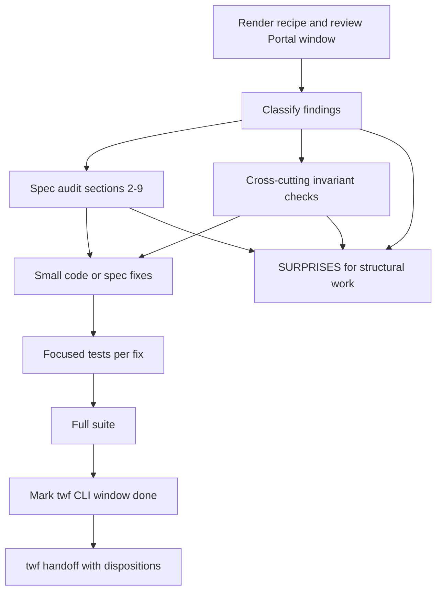
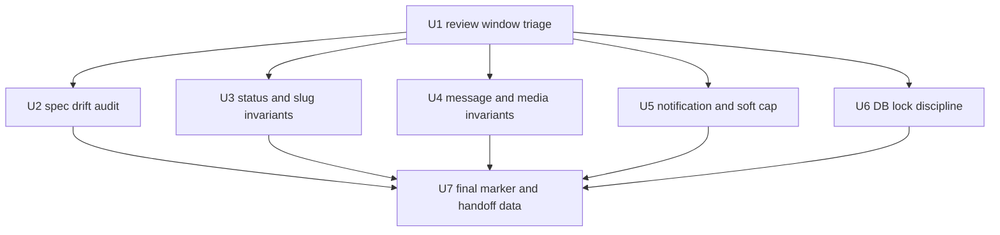
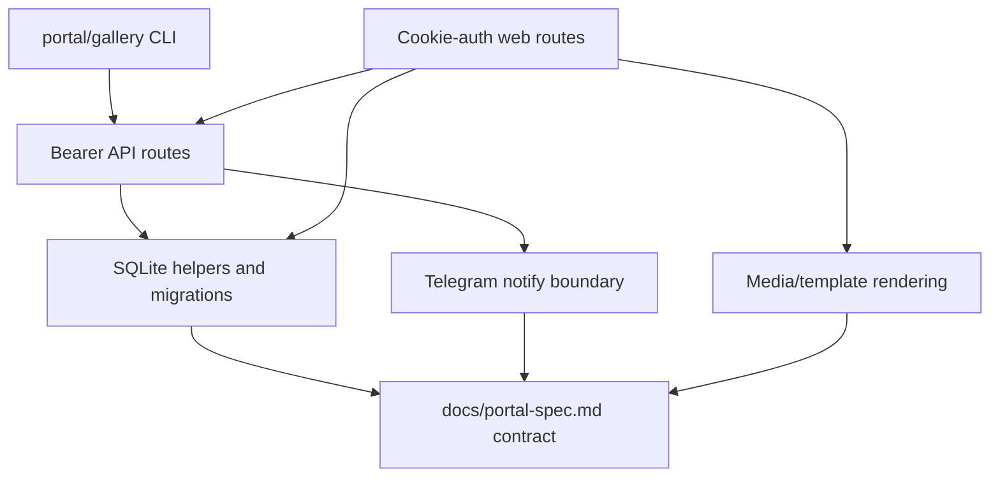

# fix: Review Portal integration and spec drift

## Summary

Run the accumulated Portal phase 1+2 integration review as a bounded hardening pass: classify the cross-cutting findings, fix only small P1/P2 defects inside the allowed surface, and reconcile `docs/portal-spec.md` sections 2-9 with the shipped code. The implementation should leave structural changes as SURPRISES entries and finish by marking the review window complete.

---

## Problem Frame

Portal phase 1 and phase 2 landed through nine separate cards, so per-card review has not checked the combined system behavior across API routes, web routes, CLI helpers, SQLite state, media handling, notifications, and the spec. The risk is not one missing feature; it is accumulated drift at the seams where independently correct cards can conflict.

---

## Assumptions

*This plan was authored in pipeline mode without synchronous user confirmation. The items below are unvalidated planning bets that should be reviewed before implementation proceeds.*

- This planned-stage worker should only create the plan artifact; the next worker owns review execution and fixes.
- The card description and `docs/portal-spec.md` are the origin inputs; there is no upstream brainstorm document in `docs/brainstorms/`.
- The installed `twf integration-review` command renders a generic read-only shared-surface recipe and marker flow. This card separately requires applying the four-lens review idea to the Portal accumulated window `64dff37..HEAD`. The next worker should not pretend the twf marker records the manual Portal audit; record the CLI/card scope mismatch in SURPRISES and keep the Portal findings in the handoff/spec audit record.
- The current single-token v1 access model has no shipped 403 state. If that remains intentional, document the absence in the spec Review log instead of inventing per-stream authorization.
- Existing hotspots from planning research are candidates for verification, not pre-decided findings: message storage versus post-envelope spec wording, notification policy drift, project-derived slug bounds, and legacy decision doorbell startup failure handling.
- README drift about phase-2 availability is likely real, but `README.md` is outside this card's scope fence. Record it as SURPRISES unless the conductor broadens scope.

---

## Requirements

- R1. Run the installed twf integration-review command for the pipeline recipe/marker flow, then run a separate manual four-lens Portal audit over the card's accumulated phase 1+2 window and classify every Portal finding by severity and disposition.
- R2. Fix small P1/P2 findings in place only when they fit the scope fence: `gallery/`, `docs/portal-spec.md`, and focused tests for each behavioral fix.
- R3. Route large refactors, new product surfaces, public auth, broad documentation cleanup, and out-of-scope file edits to SURPRISES instead of implementing them on this card.
- R4. Audit `docs/portal-spec.md` sections 2-9 against shipped code, and for every divergence either fix the code when the spec is right or update the spec plus its Review log dated 2026-07-08 when the implementation is deliberately better.
- R5. Verify consistent route semantics: missing or invalid API bearer/web token returns 401, missing resources return 404, conflicts or closed-stream writes return 409, and any 403 behavior is either deliberately absent or explicitly implemented and tested.
- R6. Verify stream slug validation anywhere slugs enter or are derived, including API route parameters, JSON bodies, CLI arguments, browser twin routes, and legacy project-to-stream mapping.
- R7. Verify message-era routes preserve the no-server-side-wait invariant and that answer/note/ask/pull flows do not sleep or long-poll inside FastAPI handlers.
- R8. Verify media disposition and sandbox invariants still hold after stream/message UI work: report HTML can render inline only with sandboxing, while non-report HTML remains attachment-only.
- R9. Verify notification failures never break request creation or message creation, including failures while starting background notification work.
- R10. Verify SQLite migration/helper lock discipline in new helpers and direct route-side DB access; keep any required code changes small and transactional.
- R11. Verify stream-post uploads over the 200 MB soft cap return a warning and are not rejected solely for size.
- R12. Run focused checks for each fix, run the board-specified full pytest command, update the spec Review log, mark the installed twf integration-review window done with its own numeric findings count, and hand off with the separate Portal findings/dispositions.

---

## Scope Boundaries

- No pull request, merge, default-branch work, or conductor duties.
- No feature expansion beyond review-driven small fixes.
- No schema redesign, message/post unification refactor, public/per-stream auth implementation, notification policy matrix, exact-once pull protocol, or broad media authorization rewrite.
- No `README.md`, deployment, launchd, external producer, Trello watcher, or Cloudflare/Tailscale tunnel edits unless the card is explicitly broadened.
- No server-side long polling, sleeps, websocket, SSE, or handler that waits for human input.
- No edits to migration v1; any migration change must append or validate through the existing `PRAGMA user_version` pattern.
- No untested behavioral fix. If a fix cannot reasonably be tested, the implementation handoff must state why.

### Deferred to Follow-Up Work

- README refresh for phase-2 ask/pull and stream message UI availability, if confirmed out of scope here.
- Per-stream/public authorization and any resulting 403 contract.
- Configurable per-type/per-stream notification policy from the future-facing spec text.
- Treating messages as first-class stream posts, if later product direction needs a unified envelope renderer.
- Correlation-aware ask/answer protocol or exact-once fetch-and-consume API.
- Any broad route/status audit that requires changing public contracts outside the small P1/P2 fixes found here.

---

## Context & Research

### Relevant Code and Patterns

- `gallery/server.py` owns FastAPI routes, bearer auth for `/api/*`, cookie/query-token web routes, upload handling, stream/message web routes, media headers, and notification thread startup.
- `gallery/db.py` owns SQLite migrations, stream/post/message/request helpers, the module-level connection, the shared lock, and legacy request dual-write into posts.
- `gallery/cli.py` and `gallery/client.py` own the `portal`/`gallery` command surface, slug parser, client-side ask/pull polling, URL quoting, and machine-readable CLI output contracts.
- `gallery/notify.py` is the Telegram boundary; callers should treat it as best-effort and must not let it break request handling.
- `gallery/templates/stream.html`, `gallery/templates/request.html`, `gallery/static/app.js`, and `gallery/static/style.css` are the web surfaces affected by phase 1+2 stream, before/after, note, and answer work.
- Tests are split by surface: `tests/test_streams_api.py`, `tests/test_messages_api.py`, `tests/test_web_messages.py`, `tests/test_web_streams.py`, `tests/test_before_after.py`, `tests/test_db_migrations.py`, `tests/test_cli.py`, `tests/test_api.py`, and `tests/test_e2e_portal.py`.
- Existing plans use `origin: "trello-card:..."`, a Trello shortlink, and `spec: docs/portal-spec.md` frontmatter for twf-sourced Portal work.

### Institutional Learnings

- No `docs/solutions/` directory exists in this worktree.
- Prior Portal plans consistently keep phase slices narrow: bearer API for agents, cookie-authenticated browser twins for web actions, CLI work as client-side polling, and future auth/config work deferred.
- Prior evidence shows phase 1 had a full-suite pass and rendered artifact/header proof. Planning research found no comparable evidence bundle for the phase-2 message/ask/pull/web-message slices.
- Board-specific verification uses `UV_CACHE_DIR=/private/tmp/uv-cache uv run --extra dev pytest -q`.

### External References

- External research is not needed. This pass is a repo-local integration/spec audit over already-shipped FastAPI, SQLite, CLI, and Jinja code.

---

## Key Technical Decisions

- Treat `docs/portal-spec.md` as the contract but not as immutable truth. When shipped code is intentionally narrower or better, update the spec and Review log rather than forcing a larger code refactor.
- Keep 403 absent unless the review proves a real forbidden state exists today. In the current v1 single-token model, token failure is authentication failure, not authorization denial.
- Do not auto-fix every drift candidate discovered during planning. First classify each as fixed-here, accepted/spec-updated, or SURPRISES/proposed-card.
- Prefer characterization tests before changing any cross-cutting behavior, especially status semantics, slug derivation, notification failure handling, DB lock paths, and media headers.
- Keep fixes mechanical and local. A finding that requires new schema, new auth model, broad route reshaping, or cross-repo producer changes is too large for this card.
- Use `twf integration-review --done` only after findings are classified, accepted fixes are implemented and tested, spec Review log entries are written, and the full suite is green.
- Treat the CLI's built-in read-only recipe scope as a tool limitation for this card. The manual Portal audit uses the card's requested `64dff37..HEAD` window, while the CLI marker records only the installed command's own integration-review window and findings count.

---

## Open Questions

### Resolved During Planning

- Should this planned-stage pass execute the review and fixes? No. The twf checklist for `planned` asks for a plan artifact; the next stage owns implementation.
- Is there an upstream brainstorm document to use as origin? No. The card description and `docs/portal-spec.md` are the source inputs.
- Should out-of-scope drift such as README availability wording be fixed here? No, not under the card's scope fence. Record as SURPRISES unless a later worker is redirected.
- Should structural findings from integration review be implemented here? No. Large changes become SURPRISES entries proposing follow-up cards.

### Deferred to Implementation

- Exact findings count to record when marking the integration-review window done after triage.
- Which spec divergences are fixed in code versus accepted as deliberate implementation shape.
- Exact focused test files for any unexpected review finding.
- Whether project-derived slug length and decision doorbell startup behavior are confirmed findings or only planning-time suspects.

---

## High-Level Review Flow

> *This illustrates the intended approach and is directional guidance for review, not implementation specification. The implementing agent should treat it as context, not code to reproduce.*

---

## Implementation Units

- U1. **Run and triage the integration-review window**

**Goal:** Establish the Portal review findings before making any changes.

**Requirements:** R1, R2, R3, R12

**Dependencies:** None

**Files:**
- Modify: none expected
- Test: none for this triage unit

**Approach:**
- Run `twf integration-review` to render the installed command's read-only recipe and note the CLI's default shared-surface scope.
- Separately apply the four-lens review idea to the Portal accumulated diff requested by the card, `64dff37..HEAD`, rather than limiting the manual audit to the CLI's generic pathspec.
- Build a local Portal triage table with severity, file/surface, disposition, proposed test, and whether the item is small enough to fix here.
- Keep P0/P1/P2 candidates visible. Fix small P1/P2 findings here; accept or propose cards for structural findings.
- Do not run `twf integration-review --done` in this unit, and do not use the final twf marker as the sole record of the manual Portal audit.

**Execution note:** Characterize the pre-fix suite state before changing code so regressions are distinguishable from pre-existing failures.

**Patterns to follow:**
- `twf integration-review --help`
- Existing twf worker handoff conventions in `AGENTS.md`

**Test scenarios:**
- Test expectation: none -- this unit produces review classification, not runtime behavior.

**Verification:**
- Findings table exists in the implementation worker's notes/handoff data with severity and disposition for every manual Portal integration-review item, and the handoff notes any CLI/card scope mismatch separately from the twf marker count.

---

- U2. **Audit spec sections 2-9 and update the Review log**

**Goal:** Reconcile the Portal contract with shipped code and record every accepted drift item in `docs/portal-spec.md`.

**Requirements:** R3, R4, R12

**Dependencies:** U1

**Files:**
- Modify: `docs/portal-spec.md`
- Test: focused tests only if this audit results in code changes

**Approach:**
- Walk `docs/portal-spec.md` sections 2-9 against the current code and tests.
- For each divergence, decide whether the spec is right or the implementation is deliberately better/narrower.
- Update code plus tests for small correctness issues. For deliberate shipped shape, update the relevant spec text and append a dated 2026-07-08 Review log line.
- Expected audit candidates include message storage as a separate table/API versus a post envelope, notification policy ahead of config support, no shipped 403 state, and phase-2 ask/pull/UI now being present.

**Patterns to follow:**
- Existing Review log entries in `docs/portal-spec.md`
- Prior plan references to `docs/portal-spec.md` as the local contract

**Test scenarios:**
- Documentation-only accepted drift: no tests, because the shipped behavior already has coverage elsewhere.
- Code-corrected drift: add or extend the focused test file for that surface and assert the spec-aligned behavior.

**Verification:**
- Every spec drift item has either a code/test fix or a dated Review log line explaining the accepted shipped contract.

---

- U3. **Harden status semantics and slug entry points**

**Goal:** Ensure route status semantics and slug validation are consistent across API, web, CLI, and legacy stream derivation.

**Requirements:** R2, R5, R6, R12

**Dependencies:** U1

**Files:**
- Modify: `gallery/server.py`
- Modify: `gallery/db.py`
- Modify: `gallery/cli.py`
- Test: `tests/test_streams_api.py`
- Test: `tests/test_messages_api.py`
- Test: `tests/test_web_streams.py`
- Test: `tests/test_web_messages.py`
- Test: `tests/test_cli.py`
- Test: `tests/test_db_migrations.py`

**Approach:**
- Confirm `/api/*` bearer failures and web/media token failures return 401.
- Confirm missing streams, posts, requests, messages, and media return 404 without leaking hidden state.
- Confirm closed-stream writes, duplicate streams, stale answers, and conflict paths return 409.
- Confirm invalid slugs are rejected at every entry point rather than producing unreachable streams.
- Specifically check project-derived legacy stream slugs against the same practical slug contract exposed by API and web routes.
- If no 403 state exists, document that as accepted v1 behavior in the spec Review log.

**Execution note:** Start with characterization tests for any changed status or slug behavior because these are cross-interface contracts.

**Patterns to follow:**
- `_validate_slug` in `gallery/server.py`
- `_stream_slug` in `gallery/cli.py`
- `_stream_slug_for_project` and stream helpers in `gallery/db.py`
- Existing status assertions in `tests/test_streams_api.py`, `tests/test_messages_api.py`, `tests/test_web_streams.py`, and `tests/test_cli.py`

**Test scenarios:**
- Error path: invalid API stream slug on stream, post, and message routes returns a 400-class validation failure and performs no write.
- Error path: unauthenticated API and web routes return 401 rather than 404 or 403.
- Error path: missing existing-resource lookups return 404.
- Error path: closed stream mutations return 409 while archive reads still work.
- Edge case: project names with separators, empty normalized bodies, and long names produce stream slugs that remain usable through `/api/streams/{slug}` and `/s/{slug}` or are explicitly rejected before write.
- Integration: CLI stream slug parser and server slug validator stay aligned for user-supplied stream slugs.

**Verification:**
- Focused status/slug tests pass and no route introduces undocumented 403 behavior.

---

- U4. **Verify message-era and media invariants**

**Goal:** Ensure phase-2 messages, note/answer twins, ask/pull CLI, and media serving did not violate the Portal interaction and rendering invariants.

**Requirements:** R2, R7, R8, R12

**Dependencies:** U1

**Files:**
- Modify: `gallery/server.py`
- Modify: `gallery/cli.py`
- Modify: `gallery/client.py`
- Modify: `gallery/templates/stream.html`
- Modify: `gallery/templates/request.html`
- Modify: `gallery/static/app.js`
- Test: `tests/test_messages_api.py`
- Test: `tests/test_web_messages.py`
- Test: `tests/test_web_streams.py`
- Test: `tests/test_before_after.py`
- Test: `tests/test_cli.py`
- Test: `tests/test_e2e_portal.py`

**Approach:**
- Confirm FastAPI route handlers never sleep or long-poll; waiting remains in CLI client loops.
- Confirm browser note/answer twins use web token auth and do not send bearer tokens or preserve query tokens in JavaScript POST URLs.
- Confirm answer handling remains atomic enough for first-answer-wins without broad schema changes.
- Confirm report HTML media is inline only for report-owned media with CSP sandboxing, while decision/non-report HTML is attachment.
- Confirm stream and request pages do not leak token-bearing referrers through message-era links or forms.

**Execution note:** Treat any broad rewrite of message delivery, answer correlation, or media authorization as SURPRISES unless a small P1/P2 defect is proven.

**Patterns to follow:**
- `cmd_wait`, `cmd_ask`, and `cmd_pull` client-side polling in `gallery/cli.py`
- Message API/web tests in `tests/test_messages_api.py` and `tests/test_web_messages.py`
- Media header tests in `tests/test_web_streams.py` and `tests/test_e2e_portal.py`

**Test scenarios:**
- Integration: `portal ask` and `portal pull` perform client-side polling through client helpers and never require a server-side wait endpoint.
- Error path: note and answer twins reject missing web auth with 401.
- Error path: stale/already-consumed question answers fail without creating duplicate `to_agent` messages.
- Security: stream message JavaScript posts same-origin paths without query-token propagation.
- Security: report HTML media responses include the sandbox header and non-report HTML responses remain attachments.
- Edge case: closed streams are readable archives but expose no active note/answer mutations.

**Verification:**
- Focused message, web, CLI, and media tests preserve the no-chat/no-long-poll and sandbox/disposition contracts.

---

- U5. **Harden notification failure paths and soft-cap warning behavior**

**Goal:** Ensure best-effort notifications and upload warnings cannot break otherwise valid requests.

**Requirements:** R2, R9, R11, R12

**Dependencies:** U1

**Files:**
- Modify: `gallery/server.py`
- Modify: `gallery/notify.py`
- Test: `tests/test_api.py`
- Test: `tests/test_messages_api.py`
- Test: `tests/test_streams_api.py`

**Approach:**
- Confirm missing Telegram config, `notify.py` send failures, and notification thread startup failures do not fail request creation or `to_human` message creation.
- Align legacy decision doorbell startup behavior with the guarded message notification startup path if review confirms it can currently break requests.
- Confirm `to_agent` messages stay silent.
- Confirm stream-post/report uploads over 200 MB produce a warning in the response and are not rejected solely due to size.

**Execution note:** Use monkeypatching for notification failures and upload-size boundaries; do not make real Telegram/network calls or allocate huge files.

**Patterns to follow:**
- `gallery/notify.py` logging-and-swallowing behavior
- `_notify_to_human_message` in `gallery/server.py`
- Existing upload-size tests in `tests/test_streams_api.py`

**Test scenarios:**
- Error path: raising while starting a decision doorbell notification still returns a successful request response after the DB write.
- Error path: raising inside message notification startup still returns the created message.
- Happy path: `to_human` message creation attempts notification after commit; `to_agent` does not.
- Edge case: post upload total over the soft cap returns a warning field while the post remains persisted.

**Verification:**
- Notification and soft-cap tests demonstrate failure isolation and warning-only upload behavior.

---

- U6. **Audit DB migration and lock discipline**

**Goal:** Confirm new database helpers preserve the single-connection lock discipline and migration invariants.

**Requirements:** R2, R10, R12

**Dependencies:** U1

**Files:**
- Modify: `gallery/db.py`
- Modify: `gallery/server.py`
- Test: `tests/test_db_migrations.py`
- Test: `tests/test_messages_api.py`
- Test: `tests/test_web_messages.py`
- Test: `tests/test_e2e_portal.py`

**Approach:**
- Review every new helper and direct `conn.execute` use added since `64dff37` for lock coverage, transaction boundaries, rollback paths, and helper re-entry while holding the lock.
- Confirm migrations remain append-only, idempotent, and validated through `PRAGMA user_version`.
- Confirm legacy request dual-write and message answer mutation do not leave partial rows visible after rollback.
- Keep any fix local. If correctness requires redesigning helper ownership or transaction APIs broadly, record a SURPRISES follow-up.

**Execution note:** Prefer targeted transaction/rollback tests over broad refactors.

**Patterns to follow:**
- Existing `_lock` and transaction-local helper pattern in `gallery/db.py`
- Migration validation tests in `tests/test_db_migrations.py`
- Existing rollback and partial-write tests

**Test scenarios:**
- Error path: a forced failure during request/post or message answer write rolls back all related rows.
- Edge case: reconnecting an already-current database does not mutate rows or duplicate schema.
- Integration: route-side direct reads under `db._lock` do not call public helpers that acquire/commit unexpectedly.
- Regression: consuming messages remains idempotent and closed-stream mutation rejection stays intact.

**Verification:**
- Focused DB tests prove migrations, rollback behavior, and lock discipline for touched helpers.

---

- U7. **Finalize review marker, spec log, and handoff data**

**Goal:** Complete the review window and produce the data the conductor and next readers need.

**Requirements:** R1, R3, R4, R12

**Dependencies:** U2, U3, U4, U5, U6

**Files:**
- Modify: `docs/portal-spec.md`
- Test: full suite

**Approach:**
- Ensure the spec Review log has a 2026-07-08 line for every accepted drift item.
- Ensure all fixed findings have tests or a stated no-test rationale.
- Run the board-specified full suite after focused checks.
- Run `twf integration-review --done --findings 0` only if the installed CLI-window findings count is zero; for nonzero CLI-window findings, pass that concrete integer instead of `0`.
- Prepare handoff content listing the separate Portal audit findings with severity and disposition: fixed here, card proposed/SURPRISES, or accepted/spec-updated. If the twf marker count differs from the Portal findings count because of the CLI/card scope mismatch, say so explicitly.

**Patterns to follow:**
- Existing `docs/portal-spec.md` Review log style
- `twf integration-review --help`
- twf worker handoff format from the card prompt

**Test scenarios:**
- Test expectation: none beyond focused tests and full-suite verification -- this unit records completion state and handoff data.

**Verification:**
- Integration review marker is written, full suite is green, spec Review log is updated, and handoff data includes all findings/dispositions.

---

## System-Wide Impact

- **Interaction graph:** The review crosses CLI commands, bearer API routes, cookie-auth web routes, templates/static assets, SQLite helpers, notification startup, and the spec contract.
- **Error propagation:** Token failures should stop at 401, missing rows at 404, closed/conflict states at 409, and notification failures at logs only.
- **State lifecycle risks:** Partial writes across request/post dual-write, answer consume-plus-insert, media directory cleanup, and migration upgrades need rollback coverage.
- **API surface parity:** Stream slug, status, message, closed-stream, and media behaviors must line up across CLI, API, and web routes.
- **Integration coverage:** Full-system proof depends on both focused tests and the full pytest suite because several invariants span DB rows, route behavior, templates, and CLI helper contracts.
- **Unchanged invariants:** v1 remains single-token and Tailscale-oriented; no server route waits for human input; stream archives remain readable; before media remains outside selectable variants.

---

## Risks & Dependencies

| Risk | Mitigation |
|------|------------|
| Integration review produces structural findings too large for the card | Record as SURPRISES with proposed follow-up card instead of expanding scope |
| Spec and shipped code diverge in ways that look like product decisions | Prefer spec Review log updates when the implementation is deliberately narrower or better |
| Small status/slug changes break agent or browser clients | Characterize current behavior first and add focused tests before changing contracts |
| Notification tests accidentally touch real Telegram/network behavior | Use monkeypatching and keep tests at the boundary |
| Upload soft-cap tests become slow or memory-heavy | Mock or patch size accounting rather than allocating a 200 MB fixture |
| DB lock fixes tempt broad helper refactors | Restrict to mechanical transaction/rollback fixes; propose structural cleanup separately |

---

## Documentation / Operational Notes

- `docs/portal-spec.md` Review log updates are part of the acceptance criteria, not optional cleanup.
- The implementation handoff should include a findings table with severity and disposition for every integration-review and spec-drift item.
- Final verification should use `UV_CACHE_DIR=/private/tmp/uv-cache uv run --extra dev pytest -q`.
- Mark the installed twf CLI window only after all accepted Portal fixes and spec edits are complete.

---

## Sources & References

- Origin card: [https://trello.com/c/GNGHjZ9y](https://trello.com/c/GNGHjZ9y)
- Portal spec: [docs/portal-spec.md](docs/portal-spec.md)
- Prior plans: [docs/plans/2026-07-08-001-feat-db-migration-portal-schema-plan.md](docs/plans/2026-07-08-001-feat-db-migration-portal-schema-plan.md), [docs/plans/2026-07-08-002-feat-streams-posts-http-api-plan.md](docs/plans/2026-07-08-002-feat-streams-posts-http-api-plan.md), [docs/plans/2026-07-08-003-feat-portal-cli-commands-plan.md](docs/plans/2026-07-08-003-feat-portal-cli-commands-plan.md), [docs/plans/2026-07-08-003-feat-stream-web-pages-plan.md](docs/plans/2026-07-08-003-feat-stream-web-pages-plan.md), [docs/plans/2026-07-08-004-feat-before-after-request-views-plan.md](docs/plans/2026-07-08-004-feat-before-after-request-views-plan.md), [docs/plans/2026-07-08-005-feat-portal-phase1-e2e-proof-plan.md](docs/plans/2026-07-08-005-feat-portal-phase1-e2e-proof-plan.md), [docs/plans/2026-07-08-006-feat-portal-messages-api-plan.md](docs/plans/2026-07-08-006-feat-portal-messages-api-plan.md), [docs/plans/2026-07-08-007-feat-portal-ask-pull-cli-verbs-plan.md](docs/plans/2026-07-08-007-feat-portal-ask-pull-cli-verbs-plan.md), [docs/plans/2026-07-08-007-feat-stream-message-web-ui-plan.md](docs/plans/2026-07-08-007-feat-stream-message-web-ui-plan.md)
- Core code surfaces: [gallery/server.py](gallery/server.py), [gallery/db.py](gallery/db.py), [gallery/cli.py](gallery/cli.py), [gallery/client.py](gallery/client.py), [gallery/notify.py](gallery/notify.py)
- Test surfaces: [tests/test_streams_api.py](tests/test_streams_api.py), [tests/test_messages_api.py](tests/test_messages_api.py), [tests/test_web_messages.py](tests/test_web_messages.py), [tests/test_web_streams.py](tests/test_web_streams.py), [tests/test_before_after.py](tests/test_before_after.py), [tests/test_db_migrations.py](tests/test_db_migrations.py), [tests/test_cli.py](tests/test_cli.py), [tests/test_api.py](tests/test_api.py), [tests/test_e2e_portal.py](tests/test_e2e_portal.py)
