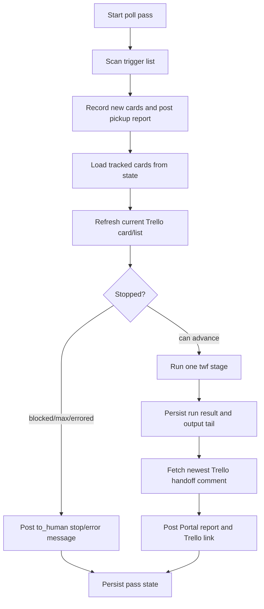
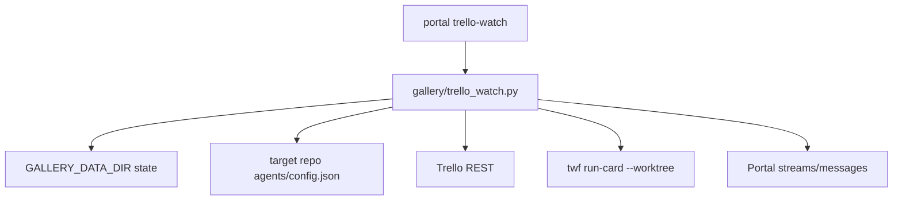

# feat: Add Portal Trello watcher

## Summary

Add `portal trello-watch` as a foreground CLI watcher that polls a target
twf repo's Trello trigger list, advances tracked cards by one twf stage per
poll pass, and mirrors pickup, handoff, failure, and stop states into per-card
Portal streams. The implementation should keep the loop in a new testable
module, use repo-local Trello config plus existing Portal client conventions,
and avoid any server-side polling or landing behavior.

---

## Problem Frame

The coworker can create Trello cards but should not need to own a terminal.
Portal phase 3 needs a small bridge that notices those cards, delegates one
pipeline step to twf, and exposes results in Portal without taking over human
conductor duties like merge or land.

---

## Assumptions

*This plan was authored in pipeline mode without synchronous user confirmation.
The items below are unvalidated planning bets that should be reviewed before
implementation proceeds.*

- There is no upstream brainstorm document under `docs/brainstorms/`; the
  Trello card description and `docs/portal-spec.md` are the origin inputs.
- The Trello short URL for frontmatter is `https://trello.com/c/08KM8i8Q`.
- Trello short links must be preserved in their original case for Trello and
  `twf run-card`, but Portal stream slugs must be normalized to lowercase,
  e.g. `trello-08km8i8q`.
- Text-only watcher reports should still be attached as small generated HTML
  report files, because file-less `report` posts persist but render poorly on
  stream pages.
- The first implementation should use Trello REST polling, not webhooks,
  because the card explicitly chose a foreground polling loop.
- Retrying Portal or Trello reporting after a successful `twf run-card` must
  never rerun `twf` for the same stage result.
- Portal links written back to Trello are tokenless convenience links only. A
  coworker/operator still needs Tailscale plus the existing Portal cookie/token
  access to open them.
- Human recovery from an errored card is manual state cleanup or edit; this
  card does not add a separate `portal trello-watch clear-error` command.

---

## Requirements

- R1. Add `portal trello-watch` with flags `--repo <path>`, `--list <id-or-name>`,
  `--interval <seconds>`, `--once`, and `--max-stage <column>`, preserving all
  existing CLI verbs.
- R2. Resolve Trello board/list configuration from the target repo's
  `agents/config.json`, defaulting the trigger list to the repo board's `todo`
  list and `--max-stage` to `aesthetics_reviewed`.
- R3. Use current Trello credentials from `TRELLO_API_KEY` and `TRELLO_TOKEN`
  only; do not introduce new secrets files.
- R4. Poll the trigger list for cards and pick up each untracked open card once,
  creating or using stream `trello-<shortid-lowercase>` and posting a Portal
  report titled around `Picked up <title>`.
- R5. Store watcher state under `GALLERY_DATA_DIR` in a small per-watch-context
  JSON file, write it atomically with `config.atomic_write_json`, and load it on
  restart.
- R6. Continue advancing tracked cards after they leave the trigger list by
  fetching their fresh Trello card/list state each poll pass.
- R7. For every tracked card that is not stopped or errored, run at most one
  `twf run-card <shortid> --worktree` subprocess per poll pass with `cwd` set
  to `--repo` and an explicit environment allowlist that includes only the
  needed Trello credentials and runtime variables.
- R8. Capture subprocess exit code and a bounded, secret-scrubbed output tail.
- R9. On successful `twf run-card`, fetch the newest Trello `commentCard`
  action that contains the twf handoff, then post it as a Portal report and
  comment/update Trello with a tokenless Portal result link plus inline status
  text.
- R10. On nonzero subprocess exit or subprocess timeout, persist the errored run
  result and sanitized tail before reporting, then post one failure report and
  one `to_human` message when entering errored state. Later passes skip the
  runner and do not duplicate those messages unless reporting is still pending.
- R11. Stop a card without advancing when its current column is
  `blocked_on_batu`, when it reaches or passes `--max-stage`, or when it is
  errored; post a `to_human` Portal message describing the needed human action.
- R12. Never merge, land, run `twf next`, run `twf land`, or advance a card
  beyond `--max-stage`.
- R13. Keep all real subprocess, Trello REST, Portal client, clock, sleep, and
  filesystem state seams injectable so unit tests do not call real twf,
  Trello, Portal, or the user's home directory.
- R14. Document usage in `README.md`, including a foreground example and a
  `nohup` one-liner for running the watcher outside a terminal.
- R15. Verify with unit tests for pickup idempotence, one-stage-per-pass,
  max-stage stop, blocked/error stop, error skip, `--once`, and restart from
  persisted state, plus the required full suite and `portal trello-watch --help`.
- R16. Keep generated reports, Trello comments, logs, and subprocess tails
  token-safe: no `?token=`, bearer tokens, Trello keys/tokens, Telegram tokens,
  raw HTML injection, or unrelated environment secrets.

**Terminology note:** Trello list, pipeline column, and stage refer to the same
ordered entries in target repo `agents/config.json` `trello.lists`. `--list`
accepts a config key/name or raw list ID, while `--max-stage` must resolve to an
ordered config list key/name.

---

## Card Acceptance Criteria Trace

| Card acceptance criterion | Requirements | Units | Verification anchor |
|---|---|---|---|
| Pickup posts stream report exactly once per card | R4, R5, R13 | U2, U3 | `tests/test_trello_watch.py` pickup idempotence |
| One-stage-per-pass invariant | R6, R7, R12, R13 | U3 | fake runner call counts across multiple passes |
| Max-stage stop posts `to_human` message | R11, R12 | U3 | max-stage and past-max list tests |
| Error path marks and skips | R8, R10, R11 | U3 | nonzero runner then subsequent pass test |
| `--once` does a single pass | R1, R13 | U4 | CLI/core loop test with fake sleeper |
| State survives restart | R5, R10, R13 | U2, U3 | state reload tests across pickup/run/report states |
| No real twf/network in tests | R13, R15 | U1-U5 | fake Trello, Portal, runner, clock, and state store |
| Secrets and generated reports stay safe | R8, R9, R16 | U2, U3 | token-redaction and escaped-report tests |
| Required verification commands | R15 | U5 | full suite and `portal trello-watch --help` |

---

## Scope Boundaries

- No `gallery/server.py` changes.
- No new database tables, migrations, or server-side handlers.
- No server-side sleep, long poll, websocket, SSE, or background worker inside
  FastAPI.
- No launchd plist or daemon installation. The README only documents a `nohup`
  foreground-loop invocation.
- No full-pipeline automation past `--max-stage`.
- No conductor actions: no merge, land, default-branch work, pull requests, or
  `twf next` on watched cards.
- No new dependency such as `requests`; follow the repo's stdlib HTTP pattern.
- No new secrets file; Trello and Portal credentials come from existing env and
  config conventions.
- No broad rewrite of existing CLI structure or Portal stream/message API.

### Deferred to Follow-Up Work

- Trello webhooks or launchd-managed daemon mode.
- Public/per-stream Portal auth changes for coworker access. This version keeps
  the existing single-token/Tailscale access model and never writes Portal
  tokens into Trello.
- A CLI command to clear or retry errored watcher state.
- A cross-process lock for preventing two watcher processes from handling the
  same repo/list context concurrently. This version documents one watcher per
  context and partitions state to avoid cross-repo/list collisions.
- Correlation-aware ask/reply protocol improvements unrelated to Trello watch.
- Automatic conductor landing after human review.

---

## Context & Research

### Relevant Code and Patterns

- `gallery/cli.py` uses `argparse`, one `cmd_*` function per verb,
  `config.client_config()`, compact JSON stdout for agent-facing results, and
  stderr plus exit `1` for client/API errors.
- `gallery/client.py` is stdlib-only `urllib` and already exposes
  `create_stream_post` and `create_stream_message`; the watcher can reuse these
  for report posts and `to_human` messages without server changes.
- `gallery/config.py` owns `GALLERY_DATA_DIR` and `atomic_write_json(path, obj)`.
  Watcher state should use that data-dir and atomic-write precedent.
- `gallery/cli.py` and `gallery/server.py` enforce lowercase Portal stream slug
  rules. Trello short links can contain uppercase letters, so `trello-<shortid>`
  needs slug normalization before Portal calls.
- `tests/test_cli.py` shows the preferred CLI test style: monkeypatch
  `sys.argv`, config/client helpers, clock/sleep, then assert stdout/stderr and
  exit codes.
- `tests/conftest.py` isolates `GALLERY_DATA_DIR` in a pytest temp dir. New
  state-file tests should follow that pattern.
- `tests/test_streams_api.py` and `tests/test_messages_api.py` cover stream post
  auto-create, message directions, and consume semantics the watcher will rely
  on.
- `agents/config.json` contains the target Trello shape the watcher must read:
  `trello.board_id`, `trello.board_name`, and ordered list IDs including
  `todo`, `planned`, `worked`, `aesthetics_reviewed`, and `blocked_on_batu`.
- `twf run-card --help` confirms the subprocess contract:
  `twf run-card <shortid> --worktree` runs a worker in a dedicated worktree, and
  `--through` exists but must not be used by this watcher because it can advance
  multiple stages.

### Institutional Learnings

- `docs/solutions/2026-07-08-browser-writes-need-cookie-twins.md` reinforces
  that polling belongs in clients, not server handlers.
- `docs/solutions/2026-07-08-project-stream-slugs-stay-visible-and-routable.md`
  makes slug routability and deterministic normalization a durable Portal rule.
- `docs/solutions/2026-07-08-run-uv-with-sandbox-cache.md` requires uv commands
  in this sandbox to use `UV_CACHE_DIR=/private/tmp/uv-cache`.
- `docs/solutions/2026-07-08-plan-artifacts-need-porcelain-status.md` requires
  plan-stage workers to verify `git status --porcelain --untracked-files=all`
  after committing the plan artifact.

### External References

- Atlassian's Trello REST docs still expose API-key plus token auth and the
  card/list/action endpoints needed by this watcher.
- `GET /lists/{id}/cards` lists trigger-list cards and returns card objects.
- `GET /cards/{id}` and `GET /cards/{id}/list` can refresh tracked card/list
  state before running twf.
- `GET /cards/{id}/actions?filter=commentCard` lists comment actions; the
  implementation should page conservatively and filter/sort client-side for the
  newest structured handoff.
- `POST /cards/{id}/actions/comments` can write watcher status or Portal links
  back to the Trello card when the token has write scope.
- Trello rate-limit guidance makes `429` a transient polling concern; tests
  should assert no state mutation or duplicate twf run on transient poll
  failures.
- Existing Portal browser access requires an existing cookie or token. Trello
  comments should therefore use tokenless URLs plus inline status text rather
  than embedding `?token=` links.

---

## Key Technical Decisions

- Keep `gallery/cli.py` thin and put watcher logic in new
  `gallery/trello_watch.py`. This matches the card's unit-testability fence and
  avoids growing a long-running command inside argparse handlers.
- Model the watcher as a restartable state machine keyed by stable Trello
  `card.id`, with `shortLink` retained for `twf run-card` and stream naming.
  This avoids collisions and allows state to survive card renames.
- Partition state by watch context, for example a file under
  `GALLERY_DATA_DIR/trello-watch/` keyed by target repo realpath, board ID, and
  trigger list ID. Different repos/lists should not block or overwrite each
  other.
- Persist state after meaningful side effects, and make reporting failures
  retryable without rerunning `twf`. Once a run result is recorded, Portal or
  Trello reporting retries must resume from that recorded output/handoff state.
- If the watcher restarts with a stale `running` state and no recorded run
  result, convert that card to errored/to_human and do not rerun automatically.
- Persist successful run results into a pending handoff/reporting state before
  fetching Trello actions; action-fetch 429/5xx/network failures retry without
  rerunning twf, while 401/403 become operator-visible fatal errors.
- Generate small HTML report files for pickup, handoff, and failure posts
  rather than posting file-less reports. This keeps the stream page useful
  without changing server rendering behavior.
- Resolve list names from the target repo's ordered `trello.lists` mapping and
  treat unknown `--list` values as raw Trello list IDs. Use the same mapping to
  compare current card column against `--max-stage`.
- Use `shortLink`, not `idShort`, as the card identity passed to
  `twf run-card`. Trello short links are stable and match the existing twf
  shortid interface.
- Use `shell=False` subprocess invocation with argument lists and a bounded
  output tail. Build the subprocess environment from an explicit allowlist and
  scrub Trello credentials, `GALLERY_TOKEN`, Telegram credentials, and
  URL-token-like values before storing or posting tails.
- Render Trello titles, handoff comments, and subprocess tails as escaped text
  in generated report HTML. Watcher reports should not contain external
  resources, forms, scripts, or raw Markdown/HTML from Trello or subprocess
  output.
- Treat 401/403/config errors as fatal startup or poll errors; treat 429/5xx
  and network timeouts as transient poll errors that do not mutate card state;
  treat closed Portal streams as reportable/retryable operator issues rather
  than as permission to rerun twf.
- Verify Trello cards and raw trigger-list IDs belong to the configured
  `trello.board_id`; reject cross-board data instead of trusting arbitrary list
  IDs.

---

## Open Questions

### Resolved During Planning

- Should this feature run inside the Portal server? No. The spec and card choose
  a foreground CLI polling loop, and server handlers must not sleep or long-poll.
- Should the watcher use `twf run-card --through`? No. The card requires at most
  one stage per poll pass and never advancing past `--max-stage`.
- Should the watcher modify `gallery/server.py` to render text-only reports
  differently? No. Generate HTML report uploads instead.
- Should watched cards continue after they leave the trigger list? Yes. Trigger
  list polling discovers new cards; tracked state drives later stage advances.
- Should reporting retries rerun `twf run-card`? No. Persist run results before
  reporting so retrying Portal/Trello side effects cannot create duplicate stage
  work.
- Should Trello comments include a Portal token so coworkers can open links
  directly? No. Trello comments get tokenless links and inline status text; the
  existing Portal cookie/token access model remains in force.
- What happens to stale `running` state after watcher restart? It becomes an
  errored card with a human-visible message and is not rerun automatically.

### Deferred to Implementation

- Exact state schema field names for the resolved restart policy.
- Exact HTML template for watcher reports, as long as it is self-contained,
  scriptless, and contains the pickup/handoff/failure text.
- Exact structured-handoff detector for Trello comments. It should prefer
  canonical `twf handoff` fields but handle an absent handoff visibly.
- Exact transient backoff constants for Trello `429` and network failures.

---

## Output Structure

The implementation should create this shape:

```text
gallery/
  trello_watch.py
tests/
  test_trello_watch.py
README.md
```

Existing `gallery/cli.py` is the planned integration point. Existing
`gallery/client.py` is a helper dependency to reuse, not a planned write target.

---

## High-Level Technical Design

> *This illustrates the intended approach and is directional guidance for
> review, not implementation specification. The implementing agent should treat
> it as context, not code to reproduce.*



---

## Implementation Units

- U1. **Add Trello/config/state primitives**

**Goal:** Create the reusable foundation for reading target repo Trello config,
calling Trello through an injectable stdlib client, and storing watcher state
atomically under `GALLERY_DATA_DIR`.

**Requirements:** R2, R3, R5, R13, R16

**Dependencies:** None

**Files:**
- Create: `gallery/trello_watch.py`
- Test: `tests/test_trello_watch.py`

**Approach:**
- Read `--repo/agents/config.json` and validate the `trello` block before the
  first poll.
- Resolve list keys/names against the config's `trello.lists` mapping; accept
  raw list IDs for `--list`, and require `--max-stage` to map to a known stage
  when stage ordering matters.
- Isolate Trello key/token auth in a small Trello REST layer with injectable
  transport and typed errors.
- Implement state load/save under `config.data_dir() / "trello-watch"` using a
  stable filename keyed by repo realpath, board ID, and trigger list ID, then
  use `config.atomic_write_json`.
- Key tracked cards by stable Trello card ID and include repo/board/list context
  in state so different watched repos do not collide.
- Provide the fresh card/list fetch primitive U3 will use to continue tracked
  cards after they leave the trigger list.

**Patterns to follow:**
- `gallery/config.py` for data-dir and atomic JSON writes.
- `gallery/client.py` for stdlib HTTP style and error normalization.
- `agents/config.json` for Trello board/list config shape.

**Test scenarios:**
- Happy path: config with `todo` and `aesthetics_reviewed` resolves defaults to
  list IDs and ordered stage names.
- Happy path: explicit raw `--list` ID is accepted without requiring a matching
  config key.
- Edge case: missing repo path, missing `agents/config.json`, malformed JSON,
  or missing `trello.lists` fails before polling.
- Edge case: uppercase Trello `shortLink` is preserved for card identity while
  the derived Portal stream slug is lowercase and route-safe.
- Edge case: state is written under a temp `GALLERY_DATA_DIR`, reloads on
  restart, and does not touch the target repo.
- Error path: corrupt state JSON fails visibly and does not overwrite the file.
- Error path: missing `TRELLO_API_KEY` or `TRELLO_TOKEN` produces a startup
  error without network calls.
- Edge case: two different repo/list contexts resolve to different state files.

**Verification:**
- Config, slug, credential, and state tests pass with no real Trello, Portal, or
  twf calls.

- U2. **Implement Portal and Trello reporting adapters**

**Goal:** Make pickup, handoff, failure, and human-stop messages visible in
Portal and, where useful, linked back to Trello.

**Requirements:** R4, R8, R9, R10, R11, R13, R16

**Dependencies:** U1

**Files:**
- Modify: `gallery/trello_watch.py`
- Test: `tests/test_trello_watch.py`

**Approach:**
- Reuse existing Portal bearer config via `config.client_config()` and existing
  `gallery.client` helpers for stream reports and messages.
- Keep generated watcher report-file handling inside `gallery/trello_watch.py`
  so `gallery/client.py` does not grow one-off watcher-specific abstractions.
- Generate self-contained, scriptless HTML report files for text reports so
  pickup/handoff/failure entries render usefully on stream pages.
- Escape all Trello and subprocess text before embedding it in generated HTML;
  do not render arbitrary Trello comments or output tails as raw HTML or
  Markdown.
- Post `to_human` stream messages for max-stage, blocked, and errored stop
  states, relying on the phase-2 doorbell behavior.
- Fetch Trello comment actions with `filter=commentCard`, page conservatively,
  and choose the newest structured handoff comment created after the recorded
  run start. If an expected twf actor can be identified, enforce it; otherwise
  treat ambiguous after-run comments as missing/ambiguous handoff.
- Post a short Trello comment containing watcher status and the Portal stream or
  post URL when reporting succeeds. Use tokenless Portal URLs only and include
  enough inline status for Trello-only readers.
- Sanitize output tails and comments before they are persisted or posted.

**Patterns to follow:**
- `gallery/client.py` `create_stream_post` and `create_stream_message`.
- `tests/test_streams_api.py` report-post auto-create expectations.
- `tests/test_messages_api.py` `to_human` message behavior.

**Test scenarios:**
- Happy path: pickup creates/uses stream `trello-<shortid-lowercase>` and posts
  one HTML report for a new card.
- Happy path: successful run posts the newest structured handoff comment as a
  Portal report and records the Portal/Trello reporting completion in state.
- Edge case: file-less report regression is avoided by asserting report calls
  include generated HTML content.
- Edge case: report HTML escapes `<script>`, ``, and `</pre>` in
  Trello titles, handoff text, and subprocess tails.
- Edge case: newest handoff is found on a later comment-action page.
- Edge case: no structured handoff comment is found, so the watcher posts a
  visible "handoff missing" report without crashing.
- Edge case: action-fetch 429/5xx/network failure after a recorded successful
  run persists pending handoff fetch and retries without rerunning twf.
- Error path: action-fetch 401/403 after a recorded successful run becomes a
  fatal operator-visible reporting state and still does not rerun twf.
- Error path: Portal reporting failure after a recorded run becomes a retryable
  reporting state, not a rerun.
- Error path: Trello comment-post failure after Portal report becomes retryable
  without rerunning twf.
- Error path: sanitized tails/comments do not contain Trello key/token, Portal
  token, Telegram token, or query-string token values.

**Verification:**
- Reporting tests prove the watcher can post visible Portal reports/messages
  and Trello comments through fake clients only.

- U3. **Implement the poll-pass state machine and runner**

**Goal:** Advance tracked cards by exactly one twf stage per poll pass, preserve
restartable state, and stop safely at max-stage, blocked, or error states.

**Requirements:** R4, R5, R6, R7, R8, R9, R10, R11, R12, R13, R16

**Dependencies:** U1, U2

**Files:**
- Modify: `gallery/trello_watch.py`
- Test: `tests/test_trello_watch.py`

**Approach:**
- Split "discover new cards from trigger list" from "advance tracked cards from
  state" so cards continue after leaving the trigger list.
- Before running twf, refresh each tracked card's current Trello card/list state
  and stop if the card is closed, blocked, unknown, errored, or at/past
  `--max-stage`.
- Run `twf run-card <shortLink> --worktree` with `cwd` set to `--repo`,
  `shell=False`, an explicit environment allowlist, and an injected runner that
  captures return code and bounded output tail.
- Persist a running/result state before attempting Portal/Trello reporting.
- Persist successful runs into a pending handoff/reporting state before fetching
  Trello actions so handoff-fetch failures never cause a duplicate twf run.
- Ensure each pass attempts no more than one twf subprocess per eligible card.
- Mark nonzero and timed-out subprocesses as errored, post failure report and
  `to_human` message, then skip future passes until state is cleared.
- On restart, convert stale `running` state with no recorded run result into an
  errored/to_human state rather than rerunning automatically.
- Treat transient Trello poll failures as pass-level failures that leave card
  state unchanged.

**Patterns to follow:**
- `twf run-card --help` for subprocess arguments.
- `gallery/cli.py` `_sleep_if_time_remains` and monotonic polling style.
- Existing `tests/test_cli.py` fake sleep/clock pattern.

**Test scenarios:**
- Happy path: one new trigger-list card is picked up and advanced once on pass
  1, then a second pass advances it once again only if below max-stage.
- Happy path: a tracked card no longer in the trigger list is still refreshed
  and advanced from state.
- Edge case: two tracked cards each get at most one runner call in one poll
  pass.
- Edge case: current list equals `--max-stage`; no runner call occurs and one
  `to_human` stop message is posted.
- Edge case: current list is past `--max-stage` in configured order; no runner
  call occurs and the stop is recorded.
- Edge case: current list is `blocked_on_batu`; no runner call occurs and a
  `to_human` message names the blocker.
- Edge case: current list is unknown to config; watcher stops the card with a
  human-visible message instead of guessing stage order.
- Error path: nonzero runner result stores output tail, posts failure report,
  marks errored, and a later pass skips the runner.
- Error path: runner timeout is treated like an errored run and does not leave a
  stale in-flight state.
- Error path: restart from stale `running` state creates an errored/to_human
  state and does not call the runner.
- Error path: runner env includes only required runtime keys plus Trello
  credentials, and excludes `GALLERY_TOKEN`, Telegram tokens, unrelated
  `TRELLO_*` values, and `.env`-style secrets.
- Error path: Trello `429` while scanning the trigger list backs off or exits
  the pass without mutating state.
- Restart: state saved after pickup prevents a duplicate pickup report after
  process restart.
- Restart: state saved after run result but before Portal report resumes
  reporting without rerunning the subprocess.
- Restart: state saved after successful run but before handoff action fetch
  retries the fetch/reporting path without rerunning the subprocess.

**Verification:**
- Poll-pass tests prove idempotent pickup, restart safety, stop conditions,
  one-stage-per-pass, and no real subprocess or network calls.

- U4. **Wire the CLI command**

**Goal:** Expose the watcher through `portal trello-watch` while keeping the
long-running logic in `gallery/trello_watch.py`.

**Requirements:** R1, R2, R3, R13, R15

**Dependencies:** U1, U2, U3

**Files:**
- Modify: `gallery/cli.py`
- Test: `tests/test_cli.py`
- Test: `tests/test_trello_watch.py`

**Approach:**
- Add an argparse subparser for `trello-watch` with the card-defined flags and
  clear help text for foreground behavior.
- Validate positive `--interval`, existing `--repo`, and parseable
  `--max-stage` before building real clients.
- In normal mode, loop poll passes forever with immediate first pass and bounded
  sleeps between passes.
- In `--once` mode, execute one pass and return without sleeping.
- Convert watcher startup/config/client errors to existing CLI-style stderr plus
  nonzero exit, and avoid branch JSON unless the implementation defines a small
  machine-readable status payload.
- Keep `gallery` as an alias because `pyproject.toml` maps both binaries to
  `gallery.cli:main`.

**Patterns to follow:**
- Existing `portal ask` and `portal pull` CLI structure in `gallery/cli.py`.
- `tests/test_cli.py` help and argparse validation tests.

**Test scenarios:**
- Happy path: `portal --help` lists `trello-watch` alongside existing verbs.
- Happy path: `portal trello-watch --help` exits 0 and documents all required
  flags.
- Happy path: `--once` invokes exactly one poll pass and does not call sleep.
- Happy path: `--once` with a new trigger-list card performs pickup and exactly
  one eligible runner call in that single pass.
- Edge case: missing `--repo`, nonexistent repo, non-positive interval, and
  invalid max-stage are rejected before network/subprocess setup.
- Error path: watcher-raised startup errors exit nonzero with useful stderr and
  no traceback.
- Regression: existing CLI help still lists prior verbs and existing CLI tests
  remain green.

**Verification:**
- CLI tests cover parser/help/once behavior and existing CLI tests pass.

- U5. **Document operation and final verification**

**Goal:** Give operators enough usage guidance to run the watcher intentionally
and verify the feature end to end in tests.

**Requirements:** R14, R15

**Dependencies:** U1, U2, U3, U4

**Files:**
- Modify: `README.md`
- Test: `tests/test_trello_watch.py`
- Test: `tests/test_cli.py`

**Approach:**
- Add a compact README section under Portal streams or CLI usage that describes
  `portal trello-watch`, required env/config inputs, foreground behavior, stop
  conditions, and manual error-state clearing.
- Include a `nohup` one-liner that redirects logs under the existing Gallery
  data/logs convention.
- Document that the watcher never merges/lands and defaults to
  `--max-stage aesthetics_reviewed`.
- Keep verification focused on unit tests with fakes plus the card-required
  full suite and help command.

**Patterns to follow:**
- README's existing concise command examples.
- `docs/solutions/2026-07-08-run-uv-with-sandbox-cache.md` for uv cache
  verification wording.

**Test scenarios:**
- Integration-style unit test: a fake Trello card goes from trigger-list pickup
  through one successful run, handoff report, and max-stage stop over multiple
  passes with state persisted between watcher instances.
- Error integration test: nonzero run posts failure, marks errored, and restart
  skips the runner until state is cleared.
- Documentation expectation: no separate test required beyond CLI help unless
  the README includes generated command text.

**Verification:**
- The implementation worker should run
  `UV_CACHE_DIR=/private/tmp/uv-cache uv run --extra dev pytest -q` and
  `UV_CACHE_DIR=/private/tmp/uv-cache uv run portal trello-watch --help >/dev/null`.

---

## System-Wide Impact

- **Interaction graph:** The feature connects `gallery/cli.py`,
  `gallery/trello_watch.py`, existing `gallery/client.py` Portal APIs, target
  repo `agents/config.json`, Trello REST, `twf run-card`, and the watcher state
  JSON file. It must not touch FastAPI handlers.
- **Error propagation:** Fatal config/auth errors should stop the watcher
  visibly; transient Trello/network failures should skip mutation for that pass;
  subprocess nonzero/timeouts should become per-card error state; Portal/Trello
  reporting failures after a recorded run should be retried without rerunning
  twf.
- **State lifecycle risks:** Partial side effects are the main risk. The state
  machine must persist before and after subprocess/reporting boundaries so a
  restart does not duplicate pickup reports or stage runs. Per-context state
  files avoid cross-repo/list collisions, and stale `running` states become
  errored/to_human instead of rerunning automatically.
- **API surface parity:** `portal` and `gallery` aliases expose the same
  subcommand because both scripts point to `gallery.cli:main`.
- **Integration coverage:** Unit tests with fakes must cover full pickup-run-
  report-stop flows because no test should call real Trello, Portal, or twf.
- **Unchanged invariants:** Portal remains push-only, server routes remain
  non-blocking, existing request/stream/message APIs remain unchanged, and twf
  conductor landing stays human-owned.



---

## Risks & Dependencies

| Risk | Mitigation |
|------|------------|
| Duplicate twf runs after restart or reporting failure | Persist run result before reporting and resume reporting from state without rerunning `twf`. |
| Two watcher processes race the same cards | Document one watcher per repo/list context for v1; partition state per context and defer a cross-process lock unless concurrent operators become real. |
| Trello rate limiting or transient outages mutate state incorrectly | Treat 429/5xx/network failures as transient pass failures and avoid state mutation for failed scans. |
| Secrets leak into Portal reports, Trello comments, stderr, or test snapshots | Centralize output-tail redaction and test Trello/Portal token patterns explicitly. |
| Trello comments leak Portal access tokens | Use tokenless Portal URLs plus inline status text and test for absence of `?token=` and bearer/token values. |
| Generated report HTML reflects malicious Trello/comment/output text | Escape all external text and disallow scripts, forms, and external resources in generated watcher reports. |
| Portal report posts render poorly if no files are uploaded | Generate small HTML report files for text reports and test report upload behavior. |
| Card moves between Trello lists while a poll pass is running | Refresh card/list state immediately before spawning and stop/skip if the card is no longer eligible. |
| Stage ordering differs across target repos | Use the target repo's ordered `trello.lists` mapping and fail visibly when `--max-stage` or current list cannot be ordered. |
| The watcher accidentally performs conductor duties | Do not call `twf next`, `twf land`, `twf merge-card`, or `twf run-card --through`; test runner arguments exactly. |

---

## Documentation / Operational Notes

- README should state that `portal trello-watch` is foreground by design and
  that launchd/daemon management is deferred.
- README should name required env inputs: `TRELLO_API_KEY`, `TRELLO_TOKEN`, plus
  existing `GALLERY_URL`/`GALLERY_TOKEN` or Gallery config.
- README should show the target repo argument as a repo path, not the Portal
  repo path by default.
- README should state that Trello comments contain tokenless Portal links only;
  opening Portal still requires existing Tailscale and Portal cookie/token
  access.
- README should explain stop states: max-stage reached, `blocked_on_batu`, and
  errored cards ring the existing `to_human` doorbell.
- README should state that clearing errored watcher state is a manual operator
  action for this version.
- README should state that operators should run one watcher per repo/list
  context for this version.

---

## Sources & References

- **Origin card:** [trello-card:08KM8i8Q](https://trello.com/c/08KM8i8Q)
- **Spec:** [docs/portal-spec.md](docs/portal-spec.md)
- Related code: [gallery/cli.py](gallery/cli.py), [gallery/client.py](gallery/client.py), [gallery/config.py](gallery/config.py)
- Related tests: [tests/test_cli.py](tests/test_cli.py), [tests/test_streams_api.py](tests/test_streams_api.py), [tests/test_messages_api.py](tests/test_messages_api.py)
- Related config: [agents/config.json](agents/config.json)
- Institutional learnings: [docs/solutions/2026-07-08-browser-writes-need-cookie-twins.md](docs/solutions/2026-07-08-browser-writes-need-cookie-twins.md), [docs/solutions/2026-07-08-project-stream-slugs-stay-visible-and-routable.md](docs/solutions/2026-07-08-project-stream-slugs-stay-visible-and-routable.md), [docs/solutions/2026-07-08-run-uv-with-sandbox-cache.md](docs/solutions/2026-07-08-run-uv-with-sandbox-cache.md), [docs/solutions/2026-07-08-plan-artifacts-need-porcelain-status.md](docs/solutions/2026-07-08-plan-artifacts-need-porcelain-status.md)
- External docs: [Trello REST API](https://developer.atlassian.com/cloud/trello/rest/), [Trello Cards API](https://developer.atlassian.com/cloud/trello/rest/api-group-cards/), [Trello Lists API](https://developer.atlassian.com/cloud/trello/rest/api-group-lists/), [Trello nested resources](https://developer.atlassian.com/cloud/trello/guides/rest-api/nested-resources/), [Trello authorization](https://developer.atlassian.com/cloud/trello/guides/rest-api/authorization/), [Trello rate limits](https://developer.atlassian.com/cloud/trello/guides/rest-api/rate-limits/)
