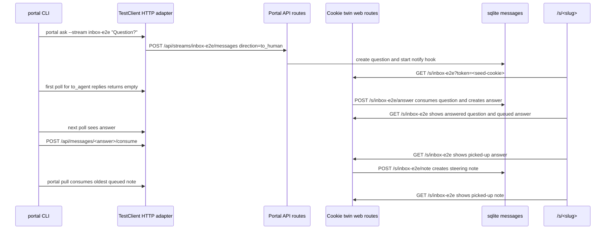
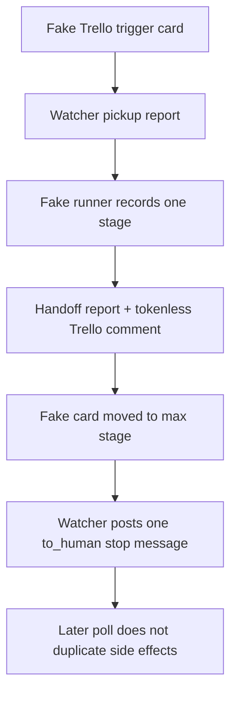

# feat: Add Portal phase-2/3 E2E proof and docs

## Summary

Add the final Portal phase-2/3 proof layer: one inbox E2E that crosses API, browser cookie twins, CLI polling, notifications, message rendering, and media-header regressions; one no-network Trello watcher E2E that proves the pickup/run/stop lifecycle; a committed evidence bundle; and README updates grounded in the shipped CLI help.

---

## Problem Frame

Portal phase 1 already has durable E2E proof, and phase 2/3 slices have unit and integration coverage for messages, browser twins, CLI `ask`/`pull`, and `trello-watch`. The final run needs a single proof card that demonstrates those pieces working together and leaves reviewable artifacts for future deploy and regression checks.

---

## Assumptions

*This plan was authored in pipeline mode without synchronous user confirmation. The items below are unvalidated planning bets that should be reviewed before implementation proceeds.*

- There is no upstream brainstorm document under `docs/brainstorms/`; the Trello card description and `docs/portal-spec.md` are the origin inputs.
- This planned-stage worker only writes the plan. The next pipeline stage owns implementation.
- The implementation must stay inside the card scope fence: `tests/test_e2e_inbox.py`, `tests/test_e2e_watch.py`, `docs/evidence/2026-07-08-portal-phase2-3/**`, and `README.md`.
- Product code is intentionally frozen for this card. A failing E2E that exposes shipped behavior outside the contract should stop the implementation and be reported as a fix-card surprise.
- The inbox CLI proof should route real `portal ask` and `portal pull` command handlers through a TestClient-backed HTTP adapter instead of only stubbing `cli.client` helpers. This keeps the proof cross-layer while avoiding network.
- The shipped `ask`/`pull` protocol does not correlate answers to questions beyond the `since` cursor and oldest unconsumed `to_agent` message. The E2E should isolate the ask answer before creating a separate steering note and should not claim full reply correlation is solved.
- The Trello watcher E2E should use fakes only. It must not call real Trello, real `twf run-card`, Telegram, or external network.

---

## Requirements

### Inbox E2E

- R1. Add `tests/test_e2e_inbox.py` with a TestClient plus CLI-level flow for Portal phase-2 inbox behavior.
- R2. The inbox E2E must prove `portal ask` creates one `to_human` message and triggers the notification hook.
- R3. The inbox E2E must prove the stream page renders the unanswered question with a cookie-authenticated answer form and no rendered `token=` leak.
- R4. The inbox E2E must prove a human answer submitted through `POST /s/{slug}/answer` consumes the source `to_human` question and creates one `to_agent` answer.
- R5. The inbox E2E must prove `portal ask` polling consumes that answer and prints the expected success JSON.
- R6. The inbox E2E must separately prove a human note submitted through `POST /s/{slug}/note` queues a `to_agent` message and `portal pull` consumes the oldest queued note.
- R7. The inbox E2E must prove unconsumed and consumed states render on `/s/{slug}` for unanswered questions, answered questions, queued notes, picked-up answers, and picked-up notes.
- R8. The inbox E2E must prove closed streams reject note, answer, `ask`, and `pull` mutation paths visibly, while existing messages remain readable and forms are hidden.
- R9. The inbox E2E must regression-lock the phase-1 browser header proxies again: report HTML inline with `text/html`, `nosniff`, CSP `sandbox allow-same-origin`, no attachment disposition, and no `allow-scripts`; request-variant and decision-post HTML attachment-only with no report CSP.

### Watch E2E

- R10. Add `tests/test_e2e_watch.py` with fake Trello, fake Portal, fake runner, fake state, and no network/subprocess side effects.
- R11. The watch E2E must prove a fake trigger card is picked up once, posts a pickup report, runs exactly one `twf run-card <shortid> --worktree`-equivalent stage, posts a handoff report, and records one tokenless Trello result comment.
- R12. The watch E2E must then move the fake card to `--max-stage`, prove the watcher stops without a second runner call, and posts one `to_human` message describing the human action needed.
- R13. The watch E2E must prove an additional poll does not duplicate pickup reports, handoff reports, runner calls, Trello comments, or `to_human` messages.

### Evidence And Documentation

- R14. Add `docs/evidence/2026-07-08-portal-phase2-3/evidence.md` plus assets showing commands, outputs, rendered stream page HTML for question/answer/note states, media headers, and the fake watch-loop transcript.
- R15. Evidence must cite `docs/portal-spec.md` section 7 for steering/questions and section 11's phase-3 Trello watcher bullet, plus the phase-1 evidence and applicable solution learnings.
- R16. Evidence must include focused test outputs for `tests/test_e2e_inbox.py` and `tests/test_e2e_watch.py`, the required full-suite output, relevant CLI help captures, and a token-leak scan over committed artifacts that distinguishes raw token leaks from harmless source assertions about `token=`.
- R17. Update `README.md` with an Inbox section covering `ask`/`pull` semantics, exit codes, client-side polling, the stream note box, and spec pointers.
- R18. Update `README.md` or validate the existing Trello watcher section against shipped help, including flags, foreground/nohup usage, stop conditions, and no-merge/no-land boundaries.
- R19. The implementation handoff to the conductor must include the deploy note: service restart is required after merge; `deploy/install.sh` handles install, and `launchctl bootstrap` may need one retry over SSH.

### Scope And Verification

- R20. Do not modify product code, schema, templates, static assets, config, deployment scripts, or package metadata on this card.
- R21. Verify with `UV_CACHE_DIR=/private/tmp/uv-cache uv run --extra dev pytest -q`; the full suite must pass with both new E2E tests included.
- R22. Before handoff, verify intended scope artifacts are tracked with `git status --porcelain --untracked-files=all`, verify whitespace with `git diff --check`, and leave unrelated pre-existing workspace changes alone.
- R23. Do not create a pull request, merge, land, or run twf conductor actions; the twf conductor owns branch landing.

---

## Card Acceptance Criteria Trace

| Card acceptance criterion | Requirements | Units | Verification anchor |
|---|---|---|---|
| Inbox flow: ask -> answer twin -> ask consumes; note twin -> pull consumes | R1-R7 | U1 | `tests/test_e2e_inbox.py` focused pass |
| Closed-stream rejections and stream page unconsumed states | R7, R8 | U1 | Inbox E2E rendered HTML assertions and evidence assets |
| Header/disposition regressions carried over | R9 | U1, U4 | Inbox E2E media assertions and header artifacts |
| Watch fake pickup -> one stage -> max-stage stop -> `to_human` | R10-R13 | U2 | `tests/test_e2e_watch.py` focused pass |
| README accurate against shipped `--help` output | R17, R18 | U3 | Help output captures and README review |
| Evidence bundle complete with citations | R14-R16 | U4 | `docs/evidence/2026-07-08-portal-phase2-3/evidence.md` |
| Full suite green | R21 | U4 | Full-suite output artifact |
| Token-leak scan on committed artifacts | R16, R22 | U4 | Token scan command result |
| Deploy note for conductor | R19 | U3 | twf handoff from implementation stage |

---

## Scope Boundaries

- No edits outside `tests/test_e2e_inbox.py`, `tests/test_e2e_watch.py`, `docs/evidence/2026-07-08-portal-phase2-3/**`, and `README.md`.
- No product-code fixes in `gallery/`, including `server.py`, `db.py`, `cli.py`, `client.py`, `notify.py`, `trello_watch.py`, templates, or static assets.
- No schema migration, message kind/correlation protocol, per-stream auth, Stop/turn hook, automatic `portal pull`, websocket, SSE, or server-side long poll.
- No real Trello, Telegram, external network, or real `twf run-card` in tests or evidence generation.
- No launchd plist or deploy script changes; only document the deployment restart note for the conductor.
- No browser automation requirement. TestClient assertions should be explicit browser-contract proxies, not visual proof claims.
- No pull request creation, merge, landing, or default-branch work by the implementation worker.

### Deferred to Follow-Up Work

- Correlation-aware ask/reply protocol so human notes and ask answers cannot contend for the same unconsumed `to_agent` queue.
- Public/per-stream Portal auth and coworker sharing beyond the existing token/Tailscale model.
- Automatic agent Stop/turn hooks that call `portal pull`.
- Watcher daemonization or launchd-managed service mode beyond the README `nohup` example.
- Any product bug found by the E2E proof.

---

## Context & Research

### Relevant Code and Patterns

- `docs/portal-spec.md` sections 7 and 11 define steering/questions and the Trello watcher phase. Section 13 preserves the auto-create rule: agent message creation auto-creates session streams, while read/pull and browser twins require existing streams.
- `gallery/server.py` owns `/api/streams/{slug}/messages`, `/api/messages/{id}/consume`, `/s/{slug}/note`, `/s/{slug}/answer`, stream rendering, and media header policy.
- `gallery/db.py` owns the v2 `messages` table, `create_message_for_stream`, `list_messages`, idempotent `consume_message`, and closed-stream mutation errors.
- `gallery/cli.py` owns `cmd_ask`, `cmd_pull`, `cmd_trello_watch`, machine-readable stdout contracts, and exit codes.
- `gallery/client.py` exposes stdlib HTTP helpers that can be routed through TestClient by patching the request seam during tests.
- `gallery/templates/stream.html` renders question forms, answered question history, queued/picked-up human notes, archived state, and report iframes.
- `gallery/static/app.js` posts stream note/answer forms to token-free `/s/<slug>/note` and `/s/<slug>/answer` endpoints with same-origin credentials.
- `gallery/trello_watch.py` exposes `Watcher`, `StateStore`, `PortalReporter`, `run_twf_card`, max-stage stop logic, and injectable Trello/Portal/runner seams.
- `tests/test_e2e_portal.py` is the direct phase-1 proof precedent for one TestClient flow and local media header helper functions.
- `tests/test_web_messages.py` covers individual cookie twin behavior; the new E2E should stitch those routes to CLI ask/pull consumption rather than re-test every validation branch.
- `tests/test_messages_api.py` covers message filters, consume semantics, notification hook behavior, and client helper URL construction.
- `tests/test_cli.py` covers parser/help contracts, `ask`/`pull` JSON stdout, exit codes, and sleep/timeout behavior.
- `tests/test_trello_watch.py` provides fake Trello/Portal/runner patterns for no-network watcher coverage.
- `docs/evidence/2026-07-08-portal-phase1/evidence.md` and `docs/evidence/2026-07-08-portal-phase1/generate_rendered_assets.py` are the evidence structure to mirror: command table, focused/full outputs, rendered HTML/header assets, help captures, deterministic ID normalization, and token scans.

### Institutional Learnings

- `docs/solutions/2026-07-08-browser-writes-need-cookie-twins.md`: browser write paths must use cookie-authenticated twin routes, rendered forms/actions must be token-free, and polling belongs in clients.
- `docs/solutions/2026-07-08-testclient-needs-browser-header-proxies.md`: TestClient proof must assert browser-critical header and iframe contracts directly.
- `docs/solutions/2026-07-08-iframe-report-rendering-needs-cookie-sandbox-and-inline-media.md`: report iframes need `sandbox="allow-same-origin"` without scripts, and report HTML must be inline while non-report HTML remains attachment-only.
- `docs/solutions/2026-07-08-run-uv-with-sandbox-cache.md`: use `UV_CACHE_DIR=/private/tmp/uv-cache` for `uv run` tests and help captures in this sandbox.
- `docs/solutions/2026-07-08-plan-artifacts-need-porcelain-status.md`: `git diff --check` does not prove new artifacts are tracked; use `git status --porcelain --untracked-files=all`.
- `docs/solutions/2026-07-08-chromium-launch-may-be-worker-sandbox-blocked.md`: do not claim visual browser proof from this card unless real browser evidence exists.

### External References

- External research is not needed. This is a repository-local proof/docs task over shipped FastAPI, SQLite, argparse, and watcher surfaces.

---

## Key Technical Decisions

- Keep the inbox proof in a new E2E test file and build a TestClient-backed adapter for the existing `gallery.client` request seam. This proves CLI command handlers, client serialization, API routes, DB state, and browser twins together without opening a socket.
- Use deterministic time and a patched CLI sleep hook to let the `ask` loop post the browser answer between polls. This avoids server-side waiting and lets the E2E observe the queued answer state before CLI consumption.
- Seed the stream cookie once with `/s/{slug}?token=<token>`, then perform browser twin writes without query tokens. Rendered HTML and evidence assets should prove no token is propagated into forms or JS endpoints.
- Keep the ask answer and human steering note as separate phases in the same E2E. This avoids the known uncorrelated `to_agent` queue ambiguity while still proving both delivery paths.
- Reuse local copies of the phase-1 media assertion helpers in `tests/test_e2e_inbox.py` instead of moving shared test utilities, because the scope fence allows only the new E2E files.
- Make the watcher E2E a lifecycle transcript, not another isolated unit test. The value is proving pickup, one-stage run, handoff reporting, max-stage stop, and idempotent later poll in one no-network flow.
- Mirror the phase-1 evidence shape, including a generator or deterministic capture path under `docs/evidence/2026-07-08-portal-phase2-3/`, so rendered HTML and transcript assets are reproducible.
- Treat README as checked against live checkout-bound help output. Do not rely on global `portal` binaries or memory of the command surface.

---

## Open Questions

### Resolved During Planning

- Should this planned-stage worker implement the tests and docs? No. `twf status` for the current stage requires only a plan artifact and card comment before advancing.
- Should product code be fixed if an E2E fails? No. The card explicitly forbids product-code changes; the implementation worker should stop and report the failure.
- Should the inbox E2E prove full ask/reply correlation? No. The spec review log documents correlation as follow-up work. This card should prove current shipped behavior without overclaiming.
- Should the watch E2E call real `twf run-card` or Trello? No. The card requires fakes and no network.
- Should README document public or per-stream auth as shipped? No. It should point to `docs/portal-spec.md` for planned auth expansion.

### Deferred to Implementation

- Exact adapter shape for routing `gallery.client` HTTP calls into TestClient: choose the smallest local helper in `tests/test_e2e_inbox.py`.
- Exact evidence asset filenames: keep them stable and descriptive under `docs/evidence/2026-07-08-portal-phase2-3/assets/`.
- Exact README wording: derive it from the current `--help` output and existing README tone.
- Exact token-scan regex: cover raw test tokens, actual tokenized URLs, `Authorization: Bearer`, Trello API key/token placeholders, and any notify text that could include a tokenized stream URL, without failing on source-code assertions that merely mention `token=`.

---

## High-Level Technical Design

> *This illustrates the intended approach and is directional guidance for review, not implementation specification. The implementing agent should treat it as context, not code to reproduce.*

---

## Implementation Units

- U1. **Add the inbox E2E proof**

**Goal:** Prove Portal phase-2 inbox behavior across CLI `ask`/`pull`, API routes, DB message state, cookie twin browser writes, notification hooks, stream rendering, closed streams, and media header regressions.

**Requirements:** R1, R2, R3, R4, R5, R6, R7, R8, R9, R20

**Dependencies:** Shipped phase-2 message API, browser twins, CLI `ask`/`pull`, and phase-1 media behavior

**Files:**
- Create: `tests/test_e2e_inbox.py`

**Approach:**
- Define local helpers for bearer headers, tiny media bytes, content-disposition parsing, report-inline assertions, and HTML-attachment assertions, following `tests/test_e2e_portal.py`.
- Build a local adapter by patching the `gallery.client` request seam so `cli.main()` exercises real request serialization and server routes without network. The adapter should emulate the real client contract: parse method/path/query from the absolute URL, pass method/headers/body into TestClient, return decoded JSON or an empty object for empty 2xx responses, and raise `GalleryClientError` with status/detail for non-2xx responses.
- Monkeypatch `cli.config.client_config` to the in-process base URL and token, and monkeypatch `sys.argv` for `portal ask` and `portal pull` invocations following `tests/test_cli.py`.
- Fake `server.threading.Thread` to capture notification target, args, daemon flag, and start count without calling Telegram or persisting raw tokenized notification text.
- Run `portal ask` with deterministic monotonic time. On the first empty poll/sleep boundary, seed or reuse the stream cookie and post `/s/{slug}/answer` with the created question id.
- Patch message timestamps with strictly increasing timezone-aware values, or assert the answer's `created_at` is greater than the question's `created_at` before resuming the CLI poll, because `ask` uses a strict `since` cursor.
- Capture stream pages before answer, after answer before CLI consumption, after `ask` consumes, after note creation, after `pull` consumes, and after stream close.
- Submit `/s/{slug}/note` after the ask answer has been consumed, then run `portal pull` to consume that separate note.
- Close the stream and assert browser twins reject with `409`, `portal ask` against the closed stream exits through the existing client-error branch, and `portal pull` against a pre-existing unconsumed message exits through the consume-error branch.
- Create a report post, request HTML variant, and decision-post HTML upload inside the same file to assert inline vs attachment media policies again.
- Assert rendered stream HTML uses token-free `/s/{slug}/note` and `/s/{slug}/answer` form actions. Rely on existing focused tests for static JS endpoint construction unless the evidence generator naturally captures the script as a supporting artifact.

**Execution note:** Add the E2E test before writing evidence. If it fails because product behavior is wrong, stop rather than editing `gallery/` product code.

**Patterns to follow:**
- `tests/test_e2e_portal.py` for one-flow TestClient proof and media header helpers.
- `tests/test_web_messages.py` for cookie seeding, note/answer twin expectations, stream page message state assertions, and token hygiene.
- `tests/test_messages_api.py` for notification thread fake and message consume expectations.
- `tests/test_cli.py` for CLI invocation, stdout JSON, and exit-code assertions.

**Test scenarios:**
- Integration: `portal ask` creates one `to_human` message, returns success JSON after the human answer, and the fake notification thread starts exactly once for the question.
- Integration: stream page before answer renders the question, answer form, token-free form action, and no raw `token=`.
- Integration: `/s/{slug}/answer` consumes the question and creates one `to_agent` answer.
- Integration: before CLI consumption, the answer is visible as a queued human note/answer on the stream page; after `ask` consumes it, it renders as picked up.
- Integration: `/s/{slug}/note` creates a separate queued `to_agent` message and `portal pull` consumes it as the oldest queued steering note.
- Error path: closed stream rejects note and answer twins with `409`, hides forms, and leaves existing message state readable.
- Error path: `portal ask` against a closed stream exits with client/API error behavior and no success/timeout JSON.
- Error path: `portal pull` against a closed stream with an unconsumed message exits with client/API error behavior when consume is rejected.
- Integration: report HTML media is inline with the expected CSP/no-attachment contract.
- Integration: request-variant HTML and decision-post HTML are attachment-only and do not receive report CSP.

**Verification:**
- `tests/test_e2e_inbox.py` passes focused.

---

- U2. **Add the no-network Trello watcher E2E proof**

**Goal:** Prove the Portal Trello watcher phase-3 lifecycle across pickup, one stage run, handoff reporting, max-stage stop, `to_human` escalation, and idempotent later polls using fakes only.

**Requirements:** R10, R11, R12, R13, R20

**Dependencies:** Shipped `gallery/trello_watch.py` watcher with injectable Trello, Portal, runner, state, and config seams

**Files:**
- Create: `tests/test_e2e_watch.py`

**Approach:**
- Build minimal local fakes for Trello cards/actions/comments, Portal reports/messages, runner calls, and a temp target repo with `agents/config.json`, following `tests/test_trello_watch.py`.
- Create one fake card in the trigger list, one fake handoff comment, and a fake runner that records calls and returns a successful run result.
- Run the watcher for one poll and assert pickup report, single runner call, handoff report, and one tokenless Trello comment.
- Move the fake card into the configured max-stage list and run another poll. Assert no additional runner call and exactly one `to_human` stop message.
- Run one more poll and assert no duplicate pickup, handoff, comment, runner, or human-message side effects.
- Include explicit assertions that fake transcripts do not contain Trello API keys, Trello tokens, `GALLERY_TOKEN`, bearer strings, or `?token=`.

**Execution note:** Keep this no-network and no-subprocess. If the available watcher seams cannot support this lifecycle without product edits, stop and report the seam gap.

**Patterns to follow:**
- `tests/test_trello_watch.py` fake objects, `write_repo`, `make_watcher`, max-stage stop, and idempotence checks.
- `gallery/trello_watch.py` state machine concepts: tracking, pending report, stopped, human-notified.

**Test scenarios:**
- Integration: trigger-list card pickup creates one per-card Portal stream report and records card identity/state.
- Integration: one poll runs exactly one fake stage for the tracked short link.
- Integration: successful run posts one handoff report and one tokenless Trello result comment.
- Integration: after the fake card reaches max-stage, the next poll posts one `to_human` stop message and does not invoke the runner.
- Integration: a third poll is idempotent and does not duplicate reports, comments, runner calls, or human messages.
- Error path: transcript/token assertions fail if fake output would leak `?token=`, bearer tokens, Trello keys, or Portal tokens.

**Verification:**
- `tests/test_e2e_watch.py` passes focused.

---

- U3. **Update README and implementation handoff notes**

**Goal:** Make README accurately describe the shipped Inbox and Trello watcher surfaces, and ensure the conductor receives the required deploy restart note.

**Requirements:** R17, R18, R19, R20

**Dependencies:** U1, U2

**Files:**
- Modify: `README.md`

**Approach:**
- Add or expand an Inbox section near the Portal command documentation.
- Describe `portal ask` as posting a `to_human` question, ringing the notification hook, then polling client-side for a `to_agent` answer; document success JSON, timeout JSON, and exit-code distinctions at README depth.
- Describe `portal pull` as non-blocking by default, consuming the oldest unconsumed `to_agent` steering note, and returning empty JSON with exit `3` when no note is available.
- Describe the stream note box as the browser path for human steering, and the answer form as the browser path for replying to agent questions.
- Point to `docs/portal-spec.md` section 7 for steering/questions and section 11's phase-3 watcher bullet for the watcher context.
- Validate or update the existing `trello-watch` section against current help: `--repo`, `--list`, `--interval`, `--once`, `--max-stage`, foreground use, nohup line, state location, stop conditions, and no merge/land behavior. U4 should commit the final help captures that back these README claims.
- Keep README wording clear that public/per-stream auth, daemonization, and automatic turn hooks are planned/deferred rather than shipped.
- Prepare the twf handoff `remaining` field for the implementation stage to include: service restart required after conductor merge; use `deploy/install.sh`; `launchctl bootstrap` may need one retry over SSH.

**Patterns to follow:**
- Existing `README.md` Portal and Trello watcher sections.
- Checkout-bound help output captured during implementation and committed in U4, not global binaries.
- `docs/portal-spec.md` section 7 and section 11's phase-3 watcher bullet.

**Test scenarios:**
- Docs verification: README command names, flags, exit codes, and stop conditions match the captured `--help` output.
- Docs verification: README does not claim unshipped public auth, daemon mode, automatic `portal pull` hooks, or full ask/reply correlation.

**Verification:**
- README changes are backed by help output artifacts that U4 will commit.

---

- U4. **Add the phase-2/3 evidence bundle and final verification**

**Goal:** Commit durable proof artifacts for the inbox and watcher E2Es, CLI help surfaces, README claims, token hygiene, final full-suite verification, and handoff readiness.

**Requirements:** R14, R15, R16, R21, R22

**Dependencies:** U1, U2, U3

**Files:**
- Create: `docs/evidence/2026-07-08-portal-phase2-3/evidence.md`
- Create: `docs/evidence/2026-07-08-portal-phase2-3/assets/*`
- Create: `docs/evidence/2026-07-08-portal-phase2-3/generate_rendered_assets.py` if a generator is the simplest reproducible way to capture HTML/transcripts

**Approach:**
- Mirror the phase-1 evidence layout: YAML frontmatter, verdict, changed-scope bullets, command table, rendered artifacts table, token scan, gaps, next action, and JSON summary.
- Save focused test outputs for `tests/test_e2e_inbox.py` and `tests/test_e2e_watch.py`.
- Save the required full-suite output from the sandbox-cache command after README changes are in place.
- Save checkout-bound help outputs for at least `portal --help`, `gallery --help`, `portal ask --help`, `portal pull --help`, and `portal trello-watch --help`.
- Generate or save rendered stream pages for unanswered question, answered/queued answer, picked-up answer, queued note, picked-up note, and archived stream.
- Save media header dumps for report inline HTML, request-variant HTML attachment, and decision-post HTML attachment.
- Save a watch transcript containing poll summaries, runner calls, Portal reports/messages, Trello comments, and explicit fake/no-network boundaries.
- Normalize generated `req_`, `p_`, `s_`, and `m_` ids in artifacts so diffs are stable.
- Fail fast if the evidence generator or token scan sees raw bearer tokens, actual tokenized URLs, `Authorization: Bearer`, Trello credentials, or Telegram credentials in committed artifacts. Do not treat source assertions that check for absence of `token=` as leaks.
- Cite `docs/portal-spec.md`, phase-1 evidence, and applicable `docs/solutions/` learnings in `evidence.md`.

**Patterns to follow:**
- `docs/evidence/2026-07-08-portal-phase1/evidence.md`
- `docs/evidence/2026-07-08-portal-phase1/generate_rendered_assets.py`
- `docs/solutions/2026-07-08-testclient-needs-browser-header-proxies.md`
- `docs/solutions/2026-07-08-browser-writes-need-cookie-twins.md`

**Test scenarios:**
- Test expectation: none as a separate product behavior test. The evidence bundle is verified by regenerating/capturing artifacts from U1/U2 behavior, running the focused/full test commands, and running token scans.

**Verification:**
- Evidence files exist and are referenced from `evidence.md`.
- Focused and full-suite command artifacts show passing results.
- Help captures exist for every README command surface that changed.
- Token scan over committed artifacts returns no matches.
- `git status --porcelain --untracked-files=all` shows no untracked or unstaged intended scope artifacts after staging/committing. If unrelated pre-existing changes are present, leave them alone and call them out in handoff rather than cleaning or staging them.

---

## System-Wide Impact

- **Interaction graph:** The proof crosses CLI command handlers, stdlib client serialization, FastAPI bearer routes, cookie-auth web routes, SQLite message state, Jinja stream rendering, notification thread creation, media serving, and watcher state-machine seams.
- **Error propagation:** Closed-stream errors should surface as HTTP `409`; CLI client errors should exit `1` without success/timeout/empty branch JSON; `ask` timeout remains exit `2`; `pull` empty remains exit `3`.
- **State lifecycle risks:** `to_human` questions and `to_agent` notes share one stream queue. The E2E must sequence answer and note phases deliberately to avoid proving an accidental ordering artifact as correlation.
- **API surface parity:** The card proves both browser and CLI access to the same message state but does not add new API behavior.
- **Integration coverage:** Unit tests already cover validation branches; these E2Es should focus on the cross-layer state transitions and artifacts that mocks alone do not prove.
- **Unchanged invariants:** No server-side sleeps or long polls; no product-code changes; no real external services in tests; report HTML remains the only inline HTML media class.

---

## Risks & Dependencies

| Risk | Mitigation |
|---|---|
| CLI proof degrades into another unit test if all client helpers are stubbed | Route real `gallery.client` calls through a TestClient-backed adapter and only patch external seams like config, time, and sleep |
| Ask answer and steering note ambiguity creates flaky or misleading proof | Finish the answer/ask consumption phase before creating the separate human note; document correlation as follow-up |
| Notification text includes tokenized stream URL and leaks into evidence | Capture only hook metadata needed for assertions, or redact before writing artifacts; token-scan evidence |
| TestClient cannot prove actual browser rendering | Assert the exact proxy contracts learned in phase 1: sandbox, CSP, disposition, content type, `nosniff`, and token-free rendered HTML |
| Watch E2E accidentally calls real Trello or twf | Use local fakes only and assert transcript/fake boundaries |
| Evidence generator leaves untracked artifacts | Verify `git status --porcelain --untracked-files=all` after artifact creation and before handoff |
| README drifts from shipped CLI | Capture help output from `UV_CACHE_DIR=/private/tmp/uv-cache uv run --extra dev portal ... --help` and cite those artifacts |

---

## Documentation / Operational Notes

- README should name phase 2 Inbox as shipped and should point to `docs/portal-spec.md` for future auth/correlation/hook work.
- README should keep `portal` as the primary command and mention `gallery` only as the compatibility alias where relevant.
- Evidence should explicitly state that TestClient header assertions are browser-contract proxies, not a real visual browser run.
- Implementation handoff must tell the conductor that deploy requires restarting the installed service after merge. Use `deploy/install.sh`; if `launchctl bootstrap` fails over SSH on the first attempt, retry once.

---

## Sources & References

- **Origin card:** [https://trello.com/c/hVtTtwRa](https://trello.com/c/hVtTtwRa)
- **Spec:** [docs/portal-spec.md](../portal-spec.md)
- Prior phase-1 plan: [docs/plans/2026-07-08-005-feat-portal-phase1-e2e-proof-plan.md](2026-07-08-005-feat-portal-phase1-e2e-proof-plan.md)
- Prior phase-1 evidence: [docs/evidence/2026-07-08-portal-phase1/evidence.md](../evidence/2026-07-08-portal-phase1/evidence.md)
- Inbox CLI plan: [docs/plans/2026-07-08-007-feat-portal-ask-pull-cli-verbs-plan.md](2026-07-08-007-feat-portal-ask-pull-cli-verbs-plan.md)
- Trello watcher plan: [docs/plans/2026-07-08-010-feat-portal-trello-watch-plan.md](2026-07-08-010-feat-portal-trello-watch-plan.md)
- Cookie twin learning: [docs/solutions/2026-07-08-browser-writes-need-cookie-twins.md](../solutions/2026-07-08-browser-writes-need-cookie-twins.md)
- Browser proxy learning: [docs/solutions/2026-07-08-testclient-needs-browser-header-proxies.md](../solutions/2026-07-08-testclient-needs-browser-header-proxies.md)
- Inline report learning: [docs/solutions/2026-07-08-iframe-report-rendering-needs-cookie-sandbox-and-inline-media.md](../solutions/2026-07-08-iframe-report-rendering-needs-cookie-sandbox-and-inline-media.md)
- Sandbox uv learning: [docs/solutions/2026-07-08-run-uv-with-sandbox-cache.md](../solutions/2026-07-08-run-uv-with-sandbox-cache.md)
- Plan artifact tracking learning: [docs/solutions/2026-07-08-plan-artifacts-need-porcelain-status.md](../solutions/2026-07-08-plan-artifacts-need-porcelain-status.md)
