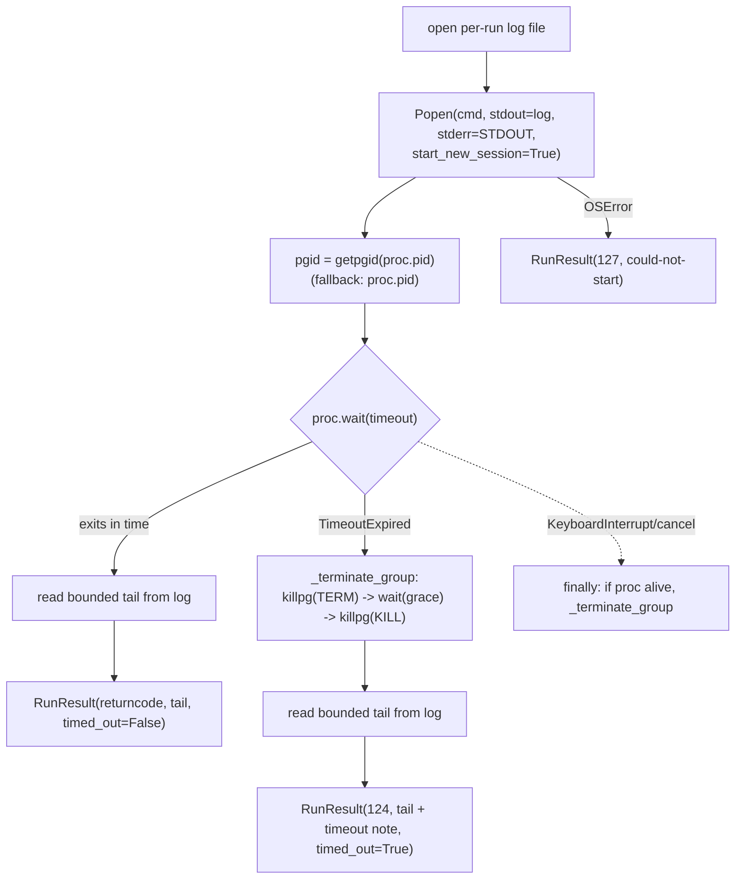

# AUDIT #18: Bound TWF worker logs + terminate descendant process groups - Plan

## Goal Capsule

| Field | Value |
|---|---|
| Objective | Make `gallery/trello_watch.py`'s `twf run-card` subprocess launch safe for multi-hour runs: bound output to keep RAM flat, own a process group/session so timeout/cancellation reaps every descendant (no orphaned agent workers), and preserve partial diagnostics plus the existing `RunResult(returncode, output, timed_out)` contract. |
| Authority | Trello card `jm7WrMXC` first, then existing `gallery/trello_watch.py` subprocess/RunResult/report patterns and `gallery/config.py` data-dir helpers, then POSIX process-group semantics. |
| Execution profile | Rewrite one function (`run_twf_card`) behind a small testable subprocess helper in `gallery/trello_watch.py`; add deterministic nested-child process tests. No schema, server, or API changes. |
| Stop conditions | Files limited to `gallery/trello_watch.py` and `tests/**` (new/edited watcher-process tests). Do not touch the Portal lifecycle surfaces (`gallery/db.py`, `gallery/server.py`, `gallery/cli.py`, `gallery/client.py`, `gallery/templates/**`) — if any overlap with the in-flight lifecycle branch appears, stop and report rather than editing through it. POSIX-only (`os.setsid`/`os.killpg`); the watcher already runs on the darwin host. Commit only — the conductor lands. If the baseline suite is red before any edit, report and stop. |
| Completion signal | `UV_CACHE_DIR=/private/tmp/uv-cache uv run --extra dev pytest -q` is green including the new deterministic nested-child cleanup + bounded-output tests, and `uv run ruff check .` is clean. |

---

## Product Contract

### Summary

`run_twf_card` (`gallery/trello_watch.py:683-702`) runs a six-hour `twf run-card` job through `subprocess.run(..., capture_output=True, timeout=RUN_TIMEOUT_SECONDS)`. Two defects compound: (1) `capture_output` buffers the entire stdout+stderr stream in RAM for the whole run, so a chatty multi-hour job grows watcher memory without bound; (2) on `TimeoutExpired`, `subprocess.run` kills only the direct child. Agency launches descendant agent workers in the *same* process group, so the grandchildren survive the timeout — a reproduction left the worker alive after the watcher believed it had cleaned up. This plan launches the job in an owned session/process group, streams combined output to a bounded on-disk log (constant RAM), and on timeout or cancellation performs terminate-with-grace then kill across the entire group, while preserving the partial-log tail and the existing return/status behavior.

### Problem Frame

- `subprocess.run(capture_output=True)` accumulates all output in memory; a 6-hour job that logs steadily can consume arbitrary RAM (AC1 violation).
- The child is launched in the watcher's own process group. `TimeoutExpired` cleanup (and any `KeyboardInterrupt`/cancellation of the watcher) signals only the immediate child PID, so agency's descendant workers — spawned without a fresh process group — are orphaned and keep running (AC2 violation). This is the reproduced live failure.
- On timeout the current code salvages `exc.stdout`/`exc.stderr` for diagnostics; any replacement must keep partial output surfacing in the Portal result (AC3).
- The bug is timing-dependent (needs a hung descendant), so it needs a deterministic nested-child test that proves group cleanup in milliseconds rather than waiting on real multi-hour runs (AC4).

### Requirements

- R1. Watcher RAM stays bounded regardless of how much a job writes: output is streamed to disk, and only a bounded tail is ever held in memory or returned in `RunResult.output`.
- R2. The job runs in a process group/session the watcher owns (`os.setsid` via `start_new_session`), so the group id is well-defined and distinct from the watcher's own group.
- R3. On timeout, the watcher signals the whole group `SIGTERM`, waits a bounded grace period, then `SIGKILL`s the whole group; no descendant process survives the cleanup.
- R4. Cancellation/interruption of the wait (not just the timer) also reaps the whole group — cleanup lives in a `finally`/guaranteed path, not only the `TimeoutExpired` branch.
- R5. `run_twf_card` preserves its existing contract and observable behavior: `RunResult(returncode, output, timed_out=False)` on completion, `RunResult(124, <tail+timeout note>, timed_out=True)` on timeout, `RunResult(127, <error>)` when the process cannot start; the argv (`["twf", "run-card", short_link, "--worktree"]`), `cwd`, and `env` are unchanged; the returned `output` still feeds `sanitize_text` -> `_tail` -> Portal report unchanged downstream.
- R6. Partial output produced before a timeout survives on disk and its bounded tail appears in `RunResult.output` (and therefore in the Portal handoff/failure report).
- R7. The timeout duration and termination grace are injectable so tests exercise real subprocesses deterministically in milliseconds; production defaults remain `RUN_TIMEOUT_SECONDS` (6h) and a short grace.
- R8. Existing green watcher behavior (state machine, pickup/advance/error/report flow, redaction) is unchanged except for how the subprocess is launched and captured.

### Acceptance Examples

- AE1. Given a subprocess that writes far more than the tail cap to stdout, when it completes, then `RunResult.output` length is bounded by the tail cap and watcher memory does not scale with total output. (Covers R1.)
- AE2. Given a subprocess that spawns a grandchild which sleeps well past the timeout, when the run times out, then `RunResult.timed_out is True`, `returncode == 124`, and both the child and grandchild PIDs are gone (`os.kill(pid, 0)` raises `ProcessLookupError`). (Covers R2, R3.)
- AE3. Given a subprocess that prints a marker line and then hangs, when the run times out, then the marker appears in `RunResult.output` alongside the timeout note. (Covers R6.)
- AE4. Given a subprocess that exits 0 with normal output, when it completes before timeout, then `RunResult(returncode=0, timed_out=False)` and the output is captured. (Covers R5.)
- AE5. Given a subprocess that exits non-zero (e.g., 3), when it completes, then `RunResult.returncode == 3` and `timed_out is False`. (Covers R5.)
- AE6. Given an argv that cannot be executed, when the launch is attempted, then `RunResult.returncode == 127` and the error text explains the failure. (Covers R5.)

### Scope Boundaries

- Only `gallery/trello_watch.py` and `tests/**` change.
- No change to the watcher state machine, report/HTML generation, redaction, argv, `cwd`, or `env` construction.
- POSIX-only implementation (`os.setsid`/`os.killpg`). No Windows support is added or claimed — the watcher runs on the darwin host today. Stated as an explicit assumption below.
- No new dependencies.

#### Deferred to Follow-Up Work

- On-disk run-log rotation/pruning across many runs (this plan keeps per-run logs for diagnostics but does not garbage-collect them). Not required by any acceptance criterion; flagged so it is not silently assumed done.
- Capping total on-disk log size for a single pathological run (RAM is bounded by construction; disk growth is a weaker, operational concern).

---

## Planning Contract

### Assumptions

- The watcher process runs on POSIX (darwin host). `subprocess.Popen(start_new_session=True)` calls `setsid()` in the child, making the child a session and process-group leader with `pgid == child.pid`, so `os.getpgid(proc.pid)` gives a group id disjoint from the watcher's. `os.killpg(pgid, sig)` then reaches every descendant that did not itself create a new group. Agency descendants are reported to *not* create a new group (that is the bug), so they are reachable via the group signal.
- Combining stderr into stdout (`stderr=subprocess.STDOUT`) preserves interleaved ordering and yields a single log file. The current code concatenated `stdout` then `stderr` with a newline; the merged single-stream tail is an acceptable, arguably better, diagnostic and keeps the `RunResult.output` shape (a single string) unchanged for downstream `sanitize_text`/`_tail`.
- `config.data_dir()` is the established root for watcher artifacts (`config.data_dir() / "trello-watch" / ...` is already used for reports), so run logs live under `config.data_dir() / "trello-watch" / "run-logs"`.
- `RunResult.output` is already passed through `sanitize_text(...)` then `_tail(...)` (8000 chars) before it reaches state/Portal, so returning a bounded tail from `run_twf_card` is compatible; the point of bounding here is to stop the *whole* stream from living in RAM, not to change the Portal tail size.
- Reading a bounded tail from the end of the log file (seek to `end - N`) bounds RAM even when the file is large; the file itself may be large on disk but is not held in memory.

### Key Technical Decisions

- KTD1. **Extract a testable seam `_run_subprocess`.** Add `_run_subprocess(cmd: list[str], *, cwd: Path, env: dict[str, str], timeout: float, grace: float) -> RunResult` holding all the launch/stream/wait/terminate logic. `run_twf_card` becomes a thin wrapper that builds the `twf` argv and calls it with production defaults. This is the seam the deterministic tests drive with `[sys.executable, "-c", <script>]` instead of the real `twf` binary, so nested-child cleanup is proven without invoking twf or waiting hours. Chosen over parametrizing `run_twf_card` directly because the tests must run a *controllable* command, which the hardcoded `twf` argv forbids.
- KTD2. **Own a session via `start_new_session=True`.** Launch with `subprocess.Popen(cmd, cwd=cwd, env=env, shell=False, text=True, stdout=<log fd>, stderr=subprocess.STDOUT, start_new_session=True)`. Capture `pgid = os.getpgid(proc.pid)` immediately after spawn (guarding `ProcessLookupError` for an instantly-exited child, in which case fall back to the child pid). This satisfies R2 and makes group signaling well-defined.
- KTD3. **Stream to a bounded on-disk log, return a bounded tail.** Open a per-run log file under `config.data_dir() / "trello-watch" / "run-logs"` (created if missing) and hand its fd to `Popen` for merged stdout+stderr. After the process ends (normally or via kill), read only the last `RUN_LOG_TAIL_BYTES` from the file for `RunResult.output`. RAM stays flat (R1); the on-disk file preserves fuller partial diagnostics (R6). The log file is kept (not deleted) so operators can inspect a failed run; pruning is deferred.
- KTD4. **Terminate the whole group, terminate-with-grace then kill, in a guaranteed path.** Factor a helper `_terminate_group(proc, pgid, grace)`: `os.killpg(pgid, signal.SIGTERM)` (swallow `ProcessLookupError`), `proc.wait(timeout=grace)`; on a second `TimeoutExpired`, `os.killpg(pgid, signal.SIGKILL)` then `proc.wait()`. Call it from the `TimeoutExpired` branch **and** from a `finally` so a `KeyboardInterrupt`/cancellation of the outer `wait` still reaps the group (R3, R4). The `finally` must be a no-op when the process already exited cleanly (check `proc.poll()`), so the happy path does not signal a dead group.
- KTD5. **Preserve the RunResult contract exactly.** Completion -> `RunResult(proc.returncode, tail, timed_out=False)`. Timeout -> `RunResult(124, tail + "\ntwf run-card timed out after {timeout}s", timed_out=True)`. Launch failure (`OSError`) -> `RunResult(127, "twf run-card could not start: {exc}")`. The magic numbers (124/127) and the timeout-note wording match today's behavior so downstream state/report logic and any tests keying on them are unaffected (R5, R8).
- KTD6. **New module constants.** `RUN_GRACE_SECONDS` (short, e.g. 10) for the TERM->KILL grace, and `RUN_LOG_TAIL_BYTES` (e.g. 64_000 — comfortably larger than the 8000-char Portal `_tail` so no diagnostic is lost before downstream trimming). `RUN_TIMEOUT_SECONDS` stays the production timeout. These are the injectable knobs (R7) via `_run_subprocess` parameters.

### Relevant Code and Patterns

- `gallery/trello_watch.py`: `run_twf_card` (target, lines ~683-702), `RunResult` dataclass (line 94), `RUN_TIMEOUT_SECONDS`/`OUTPUT_TAIL_CHARS` constants (lines 26-27), `_tail` (line 828), the runner call site `self.runner(...)` in `_run_one_stage` (line 429) and the runner type `Callable[[Path, str, dict[str, str]], RunResult]` (line 237) — the wrapper signature must stay compatible.
- `gallery/config.py`: `data_dir()` (line 21) as the artifact root; `config.data_dir() / "trello-watch" / "reports"` in `_write_report_html` (line 757) is the existing precedent for placing watcher artifacts.
- `tests/test_trello_watch.py`: `make_watcher(..., runner=...)` fixture pattern (line 112) and the many `runner=lambda ...: RunResult(...)` fakes — existing tests stub the runner and are unaffected by the internal change; the new tests target `_run_subprocess` directly with real subprocesses.
- Board lesson: run tests as `UV_CACHE_DIR=/private/tmp/uv-cache uv run --extra dev pytest -q`.

---

## High-Level Technical Design

Control flow of the new `_run_subprocess` seam (directional guidance, not implementation spec):

Key invariant: every non-error exit path passes through `_terminate_group` **or** a clean `proc.poll()`-is-set check, so no code path leaves a live group behind.

---

## Implementation Units

### U1. Bounded, process-group-owning subprocess seam

- **Goal:** Replace RAM-buffered, single-child-killing capture with a session-owning, disk-streaming, group-terminating subprocess helper.
- **Requirements:** R1, R2, R3, R4, R6, R7; supports R5. Covers AE1, AE2, AE3.
- **Dependencies:** None.
- **Files:** Modify `gallery/trello_watch.py`.
- **Approach:** Add `signal` (and confirm `os`, `subprocess`, `tempfile`/`pathlib` availability) imports. Add constants `RUN_GRACE_SECONDS` and `RUN_LOG_TAIL_BYTES` (KTD6). Implement `_run_subprocess(cmd, *, cwd, env, timeout, grace)` per KTD2/KTD3/KTD5: create `config.data_dir() / "trello-watch" / "run-logs"` (mkdir parents/exist_ok), open a per-run log file (e.g., via `tempfile.NamedTemporaryFile(delete=False)` or a slug/timestamped name) for writing, `Popen` with `start_new_session=True` and `stdout=log_fd, stderr=subprocess.STDOUT`, capture `pgid` (guard `ProcessLookupError`), `proc.wait(timeout=timeout)`. On success read bounded tail and return `RunResult(returncode, tail, timed_out=False)`; on `TimeoutExpired` call `_terminate_group` then return `RunResult(124, tail + timeout note, timed_out=True)`; wrap the whole body so `OSError` at launch yields `RunResult(127, ...)`; a `finally` calls `_terminate_group` only when `proc` exists and `proc.poll() is None`. Implement `_terminate_group(proc, pgid, grace)` per KTD4 (TERM, wait grace, KILL, all guarding `ProcessLookupError`). Add a small `_read_log_tail(path, limit)` helper that seeks to `max(0, size - limit)` and reads to end (decode with errors="replace").
- **Patterns to follow:** `_write_report_html`'s use of `config.data_dir() / "trello-watch" / ...`; existing `RunResult` construction and the 124/127/timeout-note conventions in the current `run_twf_card`.
- **Test scenarios:** Covered by U3 (this unit is exercised through `_run_subprocess`).
- **Verification:** `_run_subprocess` returns the documented `RunResult` shapes; on timeout the whole group is reaped; RAM does not scale with output.

### U2. Rewrite `run_twf_card` as a thin wrapper

- **Goal:** Preserve the public runner contract and argv while delegating to the new seam.
- **Requirements:** R5, R8. Covers AE4, AE5, AE6.
- **Dependencies:** U1.
- **Files:** Modify `gallery/trello_watch.py`.
- **Approach:** Replace the `subprocess.run` body of `run_twf_card(repo, short_link, env)` with `return _run_subprocess(["twf", "run-card", short_link, "--worktree"], cwd=repo, env=env, timeout=RUN_TIMEOUT_SECONDS, grace=RUN_GRACE_SECONDS)`. Keep the function signature and `Callable[[Path, str, dict[str, str]], RunResult]` type identical so `_run_one_stage`'s call site and the test `runner=` fakes are untouched. Ensure the `OSError`->127 mapping now lives inside `_run_subprocess` (so the wrapper needs no try/except).
- **Patterns to follow:** Existing `run_twf_card` return contract.
- **Test scenarios:** Covered by U3 (normal exit, non-zero exit, unlaunchable command). Existing `tests/test_trello_watch.py` runner-stub tests must remain green unchanged (regression check that the signature/contract is preserved).
- **Verification:** Full existing watcher suite passes without edits to its runner stubs.

### U3. Deterministic nested-child + bounded-output tests

- **Goal:** Prove group cleanup and RAM bounding in milliseconds, plus the return-contract cases, without invoking real `twf` or waiting hours.
- **Requirements:** R1, R2, R3, R6, R7 (and R5 via contract cases). Covers AE1-AE6.
- **Dependencies:** U1, U2.
- **Files:** Add tests in `tests/test_trello_watch.py` (or a focused new `tests/test_watch_subprocess.py` if that keeps the file cohesive — match the repo's existing single-file convention unless it grows unwieldy).
- **Approach:** Drive `_run_subprocess` with `[sys.executable, "-c", <inline script>]`, a `tmp_path` cwd, a minimal env, tiny `timeout` (e.g., 0.5s) and tiny `grace` (e.g., 0.2s). Point `GALLERY_DATA_DIR` at `tmp_path` (monkeypatch env) so run logs land in the sandbox.
  - **Nested-child cleanup (AE2, R2/R3):** inline script uses `os.fork()` (or `subprocess.Popen([sys.executable,"-c","import time;time.sleep(30)"])`) to spawn a grandchild, writes both child and grandchild PIDs to a file under `tmp_path`, prints a marker, then sleeps 30s. After `_run_subprocess` returns, assert `timed_out is True`, `returncode == 124`, and that polling both PIDs (`os.kill(pid, 0)`) raises `ProcessLookupError` (retry a few times with a short sleep to avoid a reap race). Use `pytest.mark.skipif` on non-POSIX (`os.name != "posix"`).
  - **Partial-log survival (AE3, R6):** the same/hanging script prints a known marker before sleeping; assert the marker is in `RunResult.output` along with the timeout note.
  - **Bounded output (AE1, R1):** script writes many MB to stdout then exits 0; assert `len(RunResult.output) <= RUN_LOG_TAIL_BYTES` (allowing for the decode) and it contains the *end* of the stream, not the start.
  - **Normal exit (AE4, R5):** script prints text and exits 0; assert `returncode == 0`, `timed_out is False`, output captured.
  - **Non-zero exit (AE5, R5):** script exits 3; assert `returncode == 3`, `timed_out is False`.
  - **Unlaunchable command (AE6, R5):** pass an argv to a non-existent binary; assert `returncode == 127` and an explanatory message.
- **Patterns to follow:** Existing `tests/test_trello_watch.py` fixtures (`data_dir`, `tmp_path`, `monkeypatch`); keep subprocess scripts inline and self-contained.
- **Execution note:** Write the nested-child cleanup test first — it is the core proof of AC2/AC4 and the reason this card exists; let it drive the `_terminate_group` design.
- **Test scenarios:** the six bullets above (AE1-AE6).
- **Verification:** New tests pass deterministically and quickly (sub-second timeouts); no orphaned PIDs remain after the suite; `ruff` clean.

---

## Verification Contract

- Focused watcher-process tests: `UV_CACHE_DIR=/private/tmp/uv-cache uv run --extra dev pytest -q tests/test_trello_watch.py` (plus the new test file if split out) — all green, including nested-child cleanup, partial-log survival, bounded output, and the exit-code/contract cases.
- Full suite: `UV_CACHE_DIR=/private/tmp/uv-cache uv run --extra dev pytest -q` — green, proving no regression in the watcher state machine or existing runner-stub tests.
- Lint: `uv run ruff check .` — clean (mind the new `signal` import and any unused names).
- Manual reasoning check: confirm every exit path of `_run_subprocess` either passes through `_terminate_group` or verifies `proc.poll()` is set, so no path can leak a live group.

## Definition of Done

- `run_twf_card` streams to a bounded on-disk log, launches in an owned session, and terminates the whole group (TERM->grace->KILL) on timeout and on cancellation, preserving `RunResult`'s existing shapes and argv/cwd/env.
- Deterministic tests prove: nested grandchild is reaped on timeout (both PIDs gone), partial-log tail surfaces in the result, output is bounded, and the 0/non-zero/127 contract cases hold.
- Full pytest suite and ruff are green under the board-lesson cache-dir invocation.
- Only `gallery/trello_watch.py` and `tests/**` changed; no lifecycle-surface files touched. Work is committed on the card branch; the conductor lands it.
