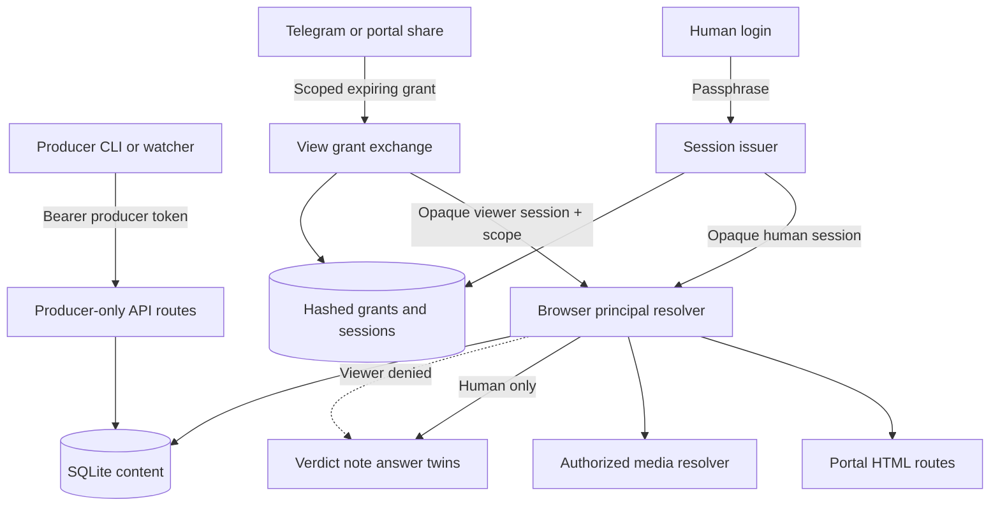
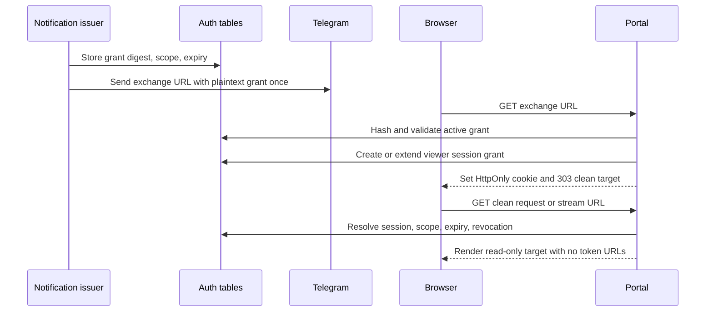
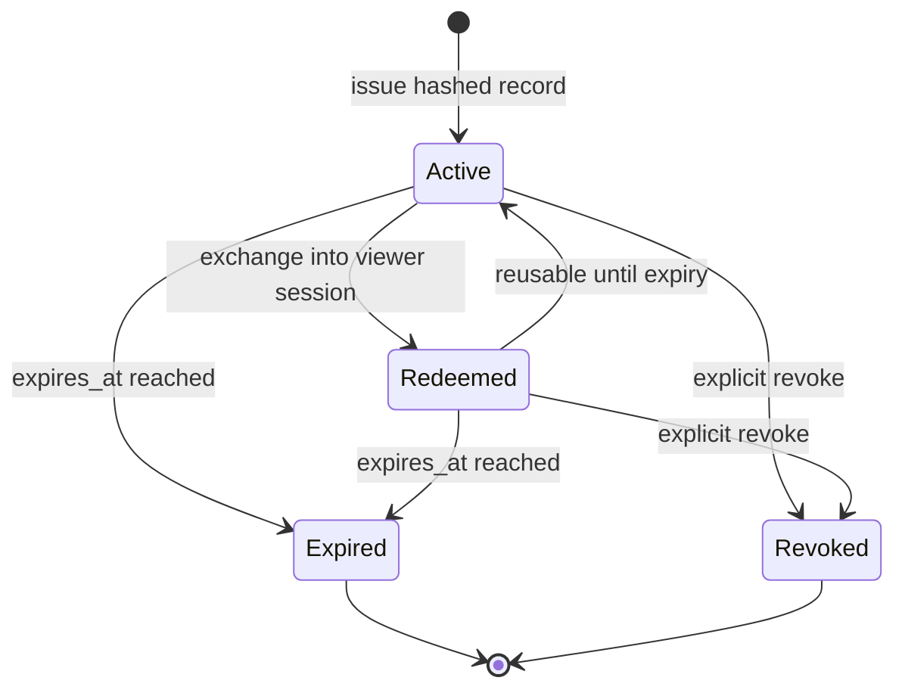

# Split Producer Credentials from View Tokens - Plan

## Goal Capsule

- **Objective:** Replace Portal's one all-powerful bearer with three explicit principals: a producer-only API credential, a full human browser session, and short-lived scoped read-only view grants.
- **Authority hierarchy:** Trello card RXr0rqqA defines the credential split; `docs/portal-spec.md` defines Portal resources and flows; this plan defines migration and implementation boundaries; security guidance informs token and session handling.
- **Execution profile:** Deep security migration across config, SQLite, API authorization, browser sessions, media access, CLI output, and Telegram notifications.
- **Stop conditions:** Stop if the landed request-context sanitizer is absent, an existing producer cannot be inventoried for rotation, the database cannot migrate and roll back transactionally, or implementation would require silently granting a view token write authority.
- **Tail ownership:** The implementation worker proves the focused and full contracts and leaves rollout evidence; the TWF conductor reviews and lands the branch.

---

## Product Contract

### Summary

Portal will stop using the producer bearer as a browser password, cookie value, and URL query parameter.
Machine producers retain a stable bearer-header workflow, while humans browse through server-side sessions and Telegram/share links carry only scoped expiring read-only grants.

### Problem Frame

The current `config.json` `token` authenticates every `/api/*` route, browser pages, media, cookie-authenticated write twins, login, CLI calls, and `?token=` links.
`gallery/server.py` embeds that producer credential in Telegram request and question URLs, `gallery/cli.py` prints it from `portal init`, and request media/templates forward it into child URLs.
A copied link therefore exposes a long-lived producer credential that can create, mutate, close, supersede, consume, and decide across the entire Portal.

The landed sanitizer merge `9822551` (source commits `d643fa3` and follow-up hardening) is a prerequisite because widening safe read access must not widen access to executable agent-controlled request context.

### Actors

- A1. **Producer:** An agent, CLI, watcher, or automation process that creates and mutates Portal resources through `/api/*` with a producer bearer.
- A2. **Human reviewer:** Batu or another trusted operator who signs in with the configured passphrase and may use browser write twins for verdicts, notes, and answers.
- A3. **Read-only viewer:** A recipient of a scoped expiring link who may view one request or stream and its authorized media but cannot call producer APIs or browser mutations.

### Requirements

#### Credential Separation

- R1. The producer credential must authenticate only bearer-header requests to producer API routes and must never be accepted from a URL, cookie, browser login form, or viewer session.
- R2. Existing CLI producers must keep working through a compatibility migration from `token`/`GALLERY_TOKEN` to `producer_token`/`GALLERY_PRODUCER_TOKEN`, with deprecation output and an explicit rotation path.
- R3. Producer rotation must issue a new secret once, retain only a digest of the previous secret for a bounded grace window, support immediate emergency revocation, and never print either secret in logs.
- R4. Existing installations must enter split mode only after a human passphrase is configured and known producers are ready to consume the renamed credential.

#### View Grants and Browser Sessions

- R5. A view grant must be scoped to exactly one request or stream, default to a one-hour server-enforced lifetime, and be independently revocable without rotating the producer credential.
- R6. View-grant and browser-session secrets must use at least 256 bits of CSPRNG entropy, be returned in plaintext only at issuance, and be stored only as SHA-256 digests because their source secrets are uniformly random.
- R7. Browser state must use opaque server-side sessions in an HttpOnly, SameSite=Lax cookie with Secure enabled whenever the configured Portal URL is HTTPS; expiry and revocation are enforced from server records, not trusted from the cookie.
- R8. Redeeming a view link must create or extend a read-only session grant and immediately redirect to the clean target path before Portal content renders; the credential must not be copied into page HTML, child media URLs, redirects, referrers, or subsequent history entries.
- R9. Signing in with the configured human passphrase must rotate the browser session identifier and create a full human session; it must not store the producer credential in the cookie or accept that credential as the password.
- R10. A valid read-only session may access only its target and authorized descendants; it must not list the Portal home page, discover unrelated resources, or gain access after grant expiry/revocation.

#### Authorization and Leakage Boundaries

- R11. `/api/*` remains producer-only, `/api/health` remains unauthenticated, browser GET/media routes accept authorized human or scoped viewer sessions, and browser POST twins require a full human session.
- R12. Missing or invalid credentials return `401` or an HTML login redirect; authenticated read-only principals receive `403` on writes; out-of-scope resources return `404` to avoid confirming unrelated resource existence.
- R13. Media authorization must resolve whether the owner is a request or post and enforce the same request/stream scope as the HTML page; no media route may bypass the central principal check.
- R14. Request and stream Telegram notifications must mint scoped view links and must never interpolate `producer_token`, legacy `token`, `GALLERY_TOKEN`, or a full human session secret.
- R15. Token-bearing exchange responses and authenticated pages must use `Cache-Control: no-store` and `Referrer-Policy: no-referrer`; application logging and test failure output must redact token-shaped values.

#### Migration, Rollout, and Safety

- R16. Additive SQLite migrations must preserve all requests, variants, verdicts, streams, posts, and messages, validate token/session table constraints, and remain no-ops on reconnect.
- R17. The current request-context sanitizer and CSP tests must remain green through both human and view-session request paths; this card must depend on the landed sanitizer rather than copying or weakening it.
- R18. Rollout must provide a bounded legacy-to-split cutover, producer inventory and rotation checkpoint, immediate view-token revocation, and a backout that preserves migrated data without silently leaving the old producer credential in links.
- R19. README and CLI help must explain which credential belongs to producers, how humans sign in, how to mint/revoke view links, and how to rotate or recover without exposing secrets in examples.

### Key Flows

- F1. **Producer publishes:** A1 loads the preferred producer config key, sends `Authorization: Bearer ...` to `/api/*`, and receives resource identifiers plus clean resource URLs with no credential attached.
- F2. **Telegram viewer opens:** The server mints an A3 grant for the request or stream, Telegram sends its exchange link, the browser redeems it to an opaque session cookie, and a 303 redirects to the clean resource URL.
- F3. **Human responds:** If the browser already has an A2 session, verdict/note/answer controls remain available; an A3-only browser sees read-only UI and receives `403` if it attempts a browser write directly.
- F4. **Producer rotates:** The operator inventories producers, rotates to a new producer token, allows a short previous-token grace period when requested, updates producers, and then removes the previous digest or revokes it immediately.
- F5. **Grant expires or is revoked:** Every page, media, and write request resolves the session and grant from SQLite; an expired/revoked grant stops authorizing immediately even if the cookie remains in the browser.

### Acceptance Examples

- AE1. Given a producer bearer, when it calls `/api/streams`, the API succeeds; when the same secret is supplied as `?token=`, a login password, or a cookie, browser authentication fails and no privileged session is issued.
- AE2. Given a request doorbell, when Telegram text is captured, the link contains a scoped view grant but not the current or previous producer token; after redemption the address bar and rendered HTML contain neither secret.
- AE3. Given a request-scoped viewer session, when it opens the request and its variants, reads succeed; when it opens `/`, another request, or an unrelated stream, access is denied without revealing the resource.
- AE4. Given a stream-scoped viewer session, when it opens the stream and report media owned by that stream, reads succeed; unrelated post/request media remains unavailable.
- AE5. Given a viewer session, when it posts a verdict, note, answer, close, supersede, consume, or any `/api/*` request, the server rejects the action and state remains unchanged.
- AE6. Given a full human session, when it submits a verdict or message twin, the write succeeds; the browser cookie contains a session secret unrelated to the producer bearer.
- AE7. Given an active grant/session, when the grant expires or is revoked, the next HTML and media request fails immediately; revoking one grant does not invalidate the producer or unrelated human sessions.
- AE8. Given a v4 database and legacy config, when the migration and preparation flow runs, all existing rows remain byte-equivalent, the CLI still authenticates through compatibility keys, split mode cannot enable without a human passphrase, and reconnect does not rerun destructive work.

### Success Criteria

- No producer secret appears in generated URLs, Telegram payloads, response HTML, redirect locations, cookie values, or committed fixtures.
- Every route has one named authorization class and tests prove positive, negative, expiry, revocation, and cross-scope cases.
- Existing producers have a documented non-breaking migration and a tested rotation/revocation procedure.
- The full Portal suite and sanitizer regressions remain green after split mode becomes the default for prepared installations.

### Scope Boundaries

- No OAuth provider, user-account system, team RBAC, public tunnel, or Cloudflare/Tailscale configuration is introduced.
- No view grant may authorize browser writes; richer reviewer-role sharing is a separate product decision.
- No sanitizer rewrite belongs here; `9822551` is consumed as a prerequisite and its behavior is regression-tested.
- No JWT or new cryptography dependency is needed; opaque server-side tokens use Python stdlib entropy and hashing.
- No deletion or rewrite of existing Portal content occurs during migration.

### Deferred to Follow-Up Work

- Per-user identities, coworker roles, audit-log UI, and public-internet exposure remain future auth work from `docs/portal-spec.md` section 9.
- Per-grant usage analytics and automated cleanup/compaction may follow after token volume is observed; expiry and revocation checks ship now.
- CSRF tokens beyond the existing same-origin/SameSite posture are deferred unless implementation review finds a browser write path that can be reached cross-site.

---

## Planning Contract

### Key Technical Decisions

- KTD1. **Use three explicit principals.** `ProducerPrincipal`, `HumanSessionPrincipal`, and `ViewerSessionPrincipal` make authorization reviewable and prevent the current boolean `web_token_ok` from silently widening privileges.
- KTD2. **Store opaque credentials server-side.** Add hashed view grants and hashed web-session secrets to SQLite; keep scopes, roles, expiry, and revocation server-side so authorization changes take effect immediately.
- KTD3. **Use resource-bound grants.** A grant has exactly one request or stream target. Stream authorization includes posts/media owned by that stream and only request descendants that the stream can resolve through canonical Portal relationships.
- KTD4. **Exchange then scrub.** Share links land on a dedicated redemption endpoint, set or extend a server session, and return a 303 to the clean target. Producer credentials are never a URL transport; the short-lived grant is absent before target content is rendered.
- KTD5. **Require human authentication for writes.** Viewer sessions render read-only surfaces. Existing browser twins remain, but their guard changes from generic web-token truthiness to an explicit human-write capability.
- KTD6. **Make migration additive and cutover explicit.** Existing `token` and `GALLERY_TOKEN` remain producer aliases during a deprecation window. A preparation/rotation command establishes the passphrase and new keys before `auth_mode=split` is enabled.
- KTD7. **Rotate without retaining the old plaintext.** Rotation stores the new producer token as the current client secret and only a SHA-256 digest plus expiry for the previous token; emergency revocation clears the digest immediately.
- KTD8. **Centralize ownership resolution.** HTML, media, redirects, and browser twins call one authorization layer; route-local token parsing and template query propagation are removed.
- KTD9. **Use explicit status semantics.** Invalid/missing authentication is `401`, authenticated-but-read-only writes are `403`, scope misses are `404`, and existing domain conflicts remain `409`.

### Assumptions

- The deployed Portal remains tailnet-only during this change; split credentials reduce blast radius but are not approval to expose the service publicly.
- The default view-grant TTL is 3600 seconds and may be reduced or extended through a bounded config value; the server always enforces the stored absolute expiry.
- Existing installs must run a preparation command or set a passphrase before split mode; fresh installs create distinct producer and human bootstrap credentials and print each secret only once to the initiating terminal.
- Legacy `token` query links stop working at split cutover. This is intentional and paired with new Telegram/view links plus a producer rotation because historically shared producer URLs must not remain valid.
- The sanitizer merge `9822551` is present in the implementation base. If it is missing, implementation stops rather than recreating security code on this card.

### High-Level Technical Design

#### Principal and authorization topology

#### Share-link redemption sequence

#### Grant and session lifecycle

### Data Shape

- `view_tokens`: public id, secret digest, exactly one request/stream scope, created/expiry timestamps, optional revoked timestamp, and last-used timestamp.
- `web_sessions`: public id, secret digest, role (`human` or `viewer`), created/absolute-expiry/last-seen timestamps, and optional revoked timestamp.
- `web_session_grants`: session id plus view-token id, allowing one browser session to follow multiple legitimate share links without placing multiple secrets in cookies.
- Producer compatibility fields remain in config: current raw `producer_token` for local client use, optional previous digest/expiry for rotation grace, passphrase hash, auth mode, and TTL settings. Config writes retain owner-only permissions.

### Sequencing

1. Verify the sanitizer dependency and add migration/auth characterization tests.
2. Land additive auth tables and configuration compatibility without changing route behavior.
3. Introduce principal resolution and producer-only API guards.
4. Switch browser/login/media/twin routes and remove URL propagation.
5. Switch CLI/Telegram issuance, add rotation/revocation commands, and update docs.
6. Run legacy-mode migration proof, split-mode E2E, producer rotation rehearsal, then enable split mode.

---

## Implementation Units

### U1. Add hashed grant and session persistence

- **Goal:** Add transactional storage for scoped view grants and revocable browser sessions without altering existing Portal rows.
- **Requirements:** R5, R6, R7, R10, R16, R17; AE7, AE8.
- **Dependencies:** Sanitizer merge `9822551` must be in the base.
- **Files:** Modify `gallery/db.py`; modify `tests/test_db_migrations.py`; create `tests/test_auth_tokens.py`.
- **Approach:** Add the next `PRAGMA user_version` migration for `view_tokens`, `web_sessions`, and `web_session_grants`; enforce role and exactly-one-scope checks; index digest lookup, expiry/revocation lookup, and session-grant joins; expose narrow create/resolve/revoke/touch helpers. Generate secrets above the DB layer and persist only their digests.
- **Execution note:** Start with migration and lifecycle tests against both a fresh database and a v4 fixture before adding route behavior.
- **Patterns to follow:** `gallery/db.py` numbered transactional migrations and schema validators; `tests/test_db_migrations.py` legacy-row snapshots, retry-after-failure, and reconnect no-op cases.
- **Test scenarios:**
  - Fresh and v4 databases reach the new version with all existing rows unchanged and foreign-key checks clean.
  - Migration rollback on a forced failure leaves `user_version` and pre-existing rows unchanged, and reconnect can retry.
  - Issuance stores no plaintext secret and resolves the correct record from the presented secret digest.
  - Expired and revoked grants fail resolution; revoking one grant leaves unrelated grants active.
  - A viewer session may accumulate two grants, but duplicate joins remain idempotent.
  - Invalid role or a token with zero/two scopes is rejected by schema validation.
- **Verification:** Fresh/legacy migration tests and focused token lifecycle tests prove persistence, rollback, expiry, and revocation.

### U2. Split configuration and producer rotation

- **Goal:** Preserve producer compatibility while renaming, preparing, rotating, and revoking the machine credential safely.
- **Requirements:** R1, R2, R3, R4, R15, R18, R19; F1, F4; AE1, AE8.
- **Dependencies:** U1.
- **Files:** Modify `gallery/config.py`; modify `gallery/cli.py`; modify `tests/test_cli.py`; extend `tests/test_auth_tokens.py`; modify `deploy/install.sh` only if fresh-install preparation belongs there after code inspection.
- **Approach:** Prefer `GALLERY_PRODUCER_TOKEN`/`producer_token`, retain `GALLERY_TOKEN`/`token` as warned aliases during migration, and never silently rotate on startup. Add preparation and rotation/revocation CLI surfaces that print a new secret once, atomically persist config, retain only an expiring previous digest when grace is requested, and refuse split cutover without a passphrase hash. Fresh init emits distinct producer and human bootstrap credentials once.
- **Patterns to follow:** `gallery/config.py` atomic JSON writes and env precedence; `gallery/cli.py` JSON/stdout versus diagnostic/stderr conventions.
- **Test scenarios:**
  - Legacy config and `GALLERY_TOKEN` still supply the producer client token with a deprecation warning and no value echo.
  - Preferred config/env keys win when both old and new names exist.
  - Preparation is idempotent and refuses split mode without a human passphrase.
  - Rotation changes the current producer token, accepts the previous token only until grace expiry, and stores no previous plaintext.
  - Emergency revoke invalidates the previous digest immediately.
  - CLI output, exceptions, and captured logs never contain current or previous secret values.
- **Verification:** Config and CLI tests prove compatibility, precedence, safe rotation, emergency revoke, and redacted output.

### U3. Introduce typed principals and enforce API boundaries

- **Goal:** Replace boolean token checks with a central principal resolver and make every route's authorization class explicit.
- **Requirements:** R1, R7, R10, R11, R12, R13, R15; AE1, AE3, AE4, AE5, AE7.
- **Dependencies:** U1, U2.
- **Files:** Create `gallery/auth.py`; modify `gallery/server.py`; extend `tests/test_auth_tokens.py`; modify `tests/test_api.py`; modify `tests/test_messages_api.py`; modify `tests/test_streams_api.py`.
- **Approach:** Parse producer bearer headers only for `/api/*`; resolve browser cookies to human/viewer principals; centralize request/stream/post/media ownership checks; return 404 for scoped-resource misses and 403 for authenticated viewer writes. Keep `/api/health` public and preserve existing 404/409 domain semantics after authorization succeeds.
- **Patterns to follow:** Existing route-level `require_api_token`, `_request_stream_closed`, and post/request ownership helpers, consolidated behind one auth module rather than duplicated.
- **Test scenarios:**
  - Current and grace-period producer bearers can call every existing API class; missing, view-session, human-session, query, and cookie credentials cannot.
  - Viewer grants cannot call read-only API GETs, mutation APIs, consume messages, close/supersede requests, or post verdicts.
  - Request scope permits only that request and its media; stream scope permits the stream and canonical post media but not unrelated resources.
  - Scope misses return 404 while authenticated viewer writes return 403 and produce no DB changes.
  - Existing closed/superseded/unknown resource responses retain their 409/404 behavior for authorized producers and humans.
- **Verification:** An endpoint authorization matrix test covers every decorator in `gallery/server.py` and fails if a new route lacks a declared policy.

### U4. Replace producer cookies and query propagation with browser sessions

- **Goal:** Provide clean-URL read-only viewing and separate passphrase-authenticated human browser writes.
- **Requirements:** R7, R8, R9, R10, R11, R12, R13, R15, R17; F2, F3, F5; AE2-AE7.
- **Dependencies:** U1, U3.
- **Files:** Modify `gallery/server.py`; modify `gallery/templates/login.html`; modify `gallery/templates/base.html`; modify `gallery/templates/request.html`; modify `gallery/templates/stream.html`; modify `gallery/static/app.js`; modify `tests/test_web_login.py`; modify `tests/test_web_streams.py`; modify `tests/test_web_messages.py`; modify `tests/test_view_requests.py`; modify `tests/test_web_context_xss.py`.
- **Approach:** Add a dedicated grant exchange route that validates the target-bound grant, rotates or extends an opaque browser session, sets secure cookie attributes, expires the legacy `gallery_token` cookie, and 303-redirects to a validated clean target. Human login verifies the passphrase hash, rotates the session id, and grants browser-write capability. Render controls from capability context but treat server enforcement as authoritative. Remove all `?token=` media, redirect, and template propagation.
- **Execution note:** Characterize current login, cookie twins, view redirects, and media loading first; then flip one route family at a time behind the principal resolver.
- **Patterns to follow:** `_safe_next_path`, cookie-authenticated browser twins, the sanitizer/CSP request render path, and the cookie/header proxy learning in `docs/solutions/2026-07-08-testclient-needs-browser-header-proxies.md`.
- **Test scenarios:**
  - Exchange sets an opaque cookie unrelated to the grant and producer tokens, returns 303, validates the target, and emits no-store/no-referrer headers.
  - Refreshing the clean target uses the session cookie; target HTML, redirects, iframe/media attributes, and response locations contain no credentials.
  - HTTP tests omit Secure only for an explicitly HTTP configured URL; HTTPS configuration sets Secure, HttpOnly, SameSite=Lax, and bounded Max-Age.
  - Viewer controls are absent/disabled and direct verdict/note/answer requests return 403 without mutation.
  - Human login rotates any prior viewer session id, preserves authorized navigation, and permits browser write twins.
  - Producer token supplied to login/query/cookie is rejected in split mode; legacy cookie is expired.
  - Expiry/revocation invalidates page and media access on the next request.
  - A view-scoped request carrying hostile context still passes through the landed sanitizer and restrictive CSP.
- **Verification:** Focused browser/auth tests prove clean URLs, cookie attributes, privilege change rotation, read-only enforcement, media continuity, and sanitizer preservation.

### U5. Mint safe share links for CLI and Telegram

- **Goal:** Replace producer-bearing notification URLs and provide explicit issuance/revocation surfaces for request and stream view links.
- **Requirements:** R5, R6, R8, R14, R15, R19; F2; AE2, AE7.
- **Dependencies:** U1-U4.
- **Files:** Modify `gallery/notify.py`; modify `gallery/server.py`; modify `gallery/client.py`; modify `gallery/cli.py`; modify `tests/test_api.py`; modify `tests/test_cli.py`; modify `tests/test_messages_api.py`.
- **Approach:** Mint target-bound grants for request doorbells and `to_human` stream questions, pass only the exchange URL to `notify.py`, and add producer-only CLI/API commands to issue and revoke manual request/stream links. Return plaintext only in the issuance response; all list/status output uses id, scope, expiry, and revocation metadata.
- **Patterns to follow:** Notification startup remains best-effort and backgrounded; request/message persistence must still succeed when Telegram delivery or token issuance reporting fails after commit.
- **Test scenarios:**
  - Request and question notifications contain the right clean target exchange link, expiry metadata where useful, and no producer/human-session secret.
  - Telegram failure never rolls back the already-persisted request/message.
  - Manual request/stream issuance rejects unknown targets and bounded-invalid TTLs.
  - Revocation is producer-only, idempotent, and immediately invalidates sessions deriving authority from the grant.
  - CLI JSON and human output never echo token material outside the one issuance response.
- **Verification:** Notification capture and CLI/API tests prove scoped issuance, redaction, failure isolation, and revocation.

### U6. Prove migration, cutover, and backout

- **Goal:** Ship an operable transition that rotates historically exposed producer credentials and leaves a tested recovery path.
- **Requirements:** R2-R4, R16-R19; F1-F5; AE1-AE8.
- **Dependencies:** U1-U5.
- **Files:** Modify `tests/test_e2e_portal.py`; modify `README.md`; modify `deploy/install.sh` if U2 established a fresh-install preparation step; add a focused rollout note under `docs/` only if README cannot carry operator detail cleanly.
- **Approach:** Add a split-auth E2E spanning producer publish, request and stream link issuance, exchange, scoped HTML/media reads, viewer write denial, human login/write, expiry/revocation, producer rotation, and legacy rejection. Document a staged cutover and a constrained backout.
- **Test scenarios:**
  - A migrated legacy install runs in compatibility mode, prepares human auth, issues safe view links, rotates producer credentials, enables split mode, and rejects historical producer URLs/cookies.
  - A fresh install starts with distinct credentials and no page or notification contains the producer token.
  - Backout keeps migrated tables/content intact, revokes grants/sessions, restricts the service to tailnet, and requires another producer rotation before legacy mode can be temporarily re-enabled.
  - A static secret scan over generated responses, Telegram payloads, logs, and committed fixtures finds no seeded producer token.
  - Full sanitizer, view, stream, message, API, CLI, migration, and E2E suites pass together.
- **Verification:** The cutover rehearsal records before/after config shape, token rotation, clean links, immediate revocation, and full-suite results without recording plaintext secrets.

---

## System-Wide Impact

- **Configuration:** Existing operators gain explicit producer, human-login, auth-mode, TTL, and rotation fields; old names remain temporary producer aliases only.
- **Data lifecycle:** Auth records are additive, independently expirable/revocable, and never cascade-delete Portal content.
- **API clients:** Request shapes stay stable; only credential naming and producer-only enforcement change. Clean resource URLs remain usable after browser exchange/login.
- **Browser UX:** Share links become read-only by default. Trusted reviewers already signed in retain write controls; otherwise the UI points to login before response actions.
- **Notifications:** Telegram carries scoped expiring grants instead of the long-lived producer secret.
- **Security posture:** The sanitizer/CSP remains the content boundary, while the new principal resolver becomes the authentication/authorization boundary.

---

## Risks and Dependencies

- **Landed sanitizer dependency:** Implementation must include merge `9822551`; expanding viewer access without it reopens stored-XSS risk under authenticated browser sessions.
- **Producer cutover risk:** External producers using `GALLERY_TOKEN` can fail after rotation. Mitigate with inventory, deprecation warnings, a short previous-digest grace period, and explicit cutover confirmation.
- **Scope-resolution risk:** Stream pages can reference decision requests and post media through more than one relationship. Centralize and test the authorization graph rather than inferring ownership from URL ids.
- **Cookie downgrade risk:** Clicking a read-only link while signed in must not replace a human session with a weaker viewer session. Redemption adds a grant or no-ops for a human principal and never downgrades role.
- **Backout risk:** Re-enabling legacy mode restores broad credential behavior. Permit it only as a documented tailnet-only emergency step after revoking sessions/grants, and rotate the producer again before returning to split mode.
- **Token disclosure risk:** Test assertion failures and debug logs can leak seeded secrets. Use deterministic sentinels in tests, redaction helpers in diagnostics, and secret-scan assertions over output artifacts.

### Rollout

1. Verify `9822551` is in the deployment base and capture the current producer inventory without copying secrets into the plan or logs.
2. Deploy additive schema/config support in compatibility mode; new notifications already use scoped view links.
3. Configure/verify the human passphrase and test a human session plus a read-only viewer session on the tailnet.
4. Move producers to preferred config/env names, rotate the producer token with the minimum grace window needed, and confirm every producer on the inventory.
5. Enable split mode, expire the legacy cookie, reject producer URL/login use, and revoke the previous digest after the grace window.
6. Monitor `401`/`403` counts, notification delivery, exchange failures, and producer errors without logging credentials.
7. Remove legacy aliases in a later cleanup only after the deprecation window and producer inventory are clear.

### Backout

- Keep the additive auth tables and migrated content; do not down-migrate or delete grants/sessions.
- Revoke all view grants and web sessions, restrict Portal to tailnet, and restore the previous application version/config alias only if split-mode route behavior is unusable.
- Treat temporary legacy mode as a security regression: generate a fresh producer token for backout, never resurrect the historically shared token, and schedule immediate split-mode re-entry.

---

## Verification Contract

| Gate | Scope | Expected outcome |
|---|---|---|
| `UV_CACHE_DIR=/private/tmp/uv-cache uv run --extra dev pytest -q tests/test_db_migrations.py tests/test_auth_tokens.py` | U1-U3 | Migration, digest lookup, expiry, revocation, role, and scope contracts pass. |
| `UV_CACHE_DIR=/private/tmp/uv-cache uv run --extra dev pytest -q tests/test_web_login.py tests/test_web_streams.py tests/test_web_messages.py tests/test_view_requests.py tests/test_web_context_xss.py` | U4 | Clean URL/session flows, read-only boundaries, media, and sanitizer/CSP pass. |
| `UV_CACHE_DIR=/private/tmp/uv-cache uv run --extra dev pytest -q tests/test_api.py tests/test_messages_api.py tests/test_cli.py` | U2, U3, U5 | Producer-only APIs, compatibility aliases, Telegram issuance, and rotation/revocation surfaces pass. |
| `UV_CACHE_DIR=/private/tmp/uv-cache uv run --extra dev pytest -q tests/test_e2e_portal.py` | U6 | End-to-end split-auth publish, share, read, human write, revoke, and rotate flow passes. |
| `UV_CACHE_DIR=/private/tmp/uv-cache uv run --extra dev pytest -q` | All | Full Portal regression suite passes. |
| `uv run ruff check .` | All | Python lint passes without ignored auth errors or secret-bearing diagnostics. |
| Secret scan over response bodies, locations, Telegram payloads, captured logs, and fixtures | U4-U6 | Seeded producer and session secrets are absent everywhere except the one explicit issuance response. |

---

## Definition of Done

- Every `gallery/server.py` route is covered by the authorization matrix and maps to producer, human, viewer, or unauthenticated access intentionally.
- Producer credentials work only in bearer headers, support a tested compatibility/rotation path, and never appear in URLs, cookies, Telegram, HTML, redirects, logs, or fixtures.
- View grants are 256-bit, hashed at rest, request/stream scoped, one-hour by default, server-expiring, independently revocable, and read-only.
- Browser sessions are opaque, hashed at rest, rotated on human login, bounded by server expiry, and use correct HttpOnly/SameSite/Secure attributes.
- Request, stream, and media access share one scope resolver; expiry/revocation takes effect on the next request.
- Human browser writes still work after passphrase login; viewer attempts return 403 with no state mutation.
- The v4-to-next migration preserves all content, validates constraints, rolls back on failure, and is a no-op on reconnect.
- Sanitizer/CSP regressions pass through the viewer path, proving the landed dependency remains active.
- Telegram and manual share links carry only scoped short-lived grants and scrub them before rendering target content.
- README documents preparation, producer migration, link issuance/revocation, rotation, rollout, and constrained backout without secret-bearing examples.
- Focused suites, E2E, full pytest, ruff, and the secret scan are green.
- Abandoned compatibility branches, debug output, sample secrets, and experimental auth code are absent from the final diff.

---

## Sources and Research

- `docs/portal-spec.md` sections 5, 8, and 9 define producer APIs, browser twins, Telegram links, streams as the sharing unit, and the prior single-token posture this card supersedes.
- `gallery/config.py`, `gallery/server.py`, `gallery/cli.py`, `gallery/notify.py`, and `gallery/templates/request.html` show the current producer token crossing config, bearer, login, cookie, URL, Telegram, redirect, and child-media boundaries.
- `docs/solutions/2026-07-08-browser-writes-need-cookie-twins.md` and `docs/solutions/2026-07-08-testclient-needs-browser-header-proxies.md` define the existing browser-write and test-client patterns to preserve under typed principals.
- Sanitizer merge `9822551` and source commit `d643fa3` establish the request-context sanitizer and CSP prerequisite.
- RFC 6750 section 2.3 and section 5 warn against bearer credentials in URI query parameters because URLs are likely to be logged: https://www.rfc-editor.org/rfc/rfc6750.html
- OWASP Session Management guidance supports meaningless high-entropy server-side session ids, HttpOnly/SameSite/Secure cookies, id rotation on privilege change, server-enforced expiry, and `Cache-Control: no-store`: https://cheatsheetseries.owasp.org/cheatsheets/Session_Management_Cheat_Sheet.html
- OWASP Secrets Management guidance supports least privilege, short lifetime, rotation, revocation, and non-logging of token secrets: https://cheatsheetseries.owasp.org/cheatsheets/Secrets_Management_Cheat_Sheet.html
- Python `secrets` documents 32 bytes of randomness as sufficient for typical tokens: https://docs.python.org/3/library/secrets.html
