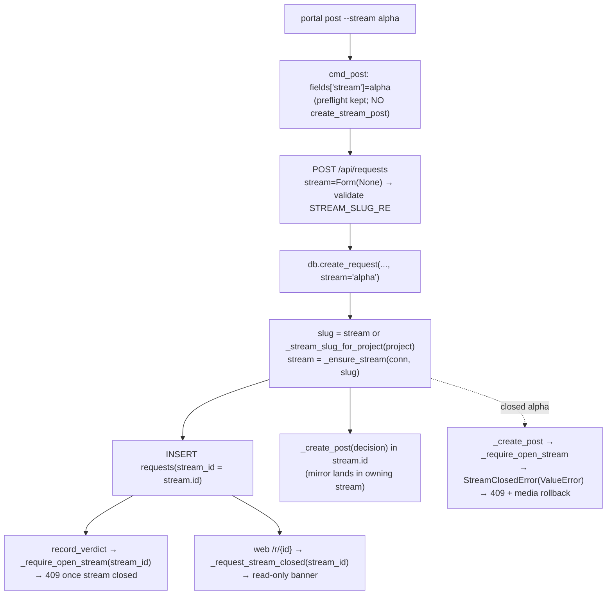

# P5a STREAM-OWNERSHIP: --stream sets authoritative requests.stream_id - Plan

## Goal Capsule

| Field | Value |
|---|---|
| Objective | When `portal post --stream <slug>` is used, make `<slug>` the request's **authoritative** `requests.stream_id` (create the stream if missing), instead of only mirroring a decision post while `stream_id` stays legacy (`inbox`/`proj-*`). Result: closing that stream makes its requests read-only (decide → 409, web page read-only) and the request page back-link points at the owning stream. Absent `--stream`, the legacy project-derived behavior is unchanged. |
| Authority | Trello card `DP0kxrKz` first (it quotes the spec's own suggested fix), then the existing seam it names — `gallery/db.py:create_request`, `gallery/server.py POST /api/requests`, `gallery/cli.py:cmd_post` — and the established `_ensure_stream` / `_stream_slug_for_project` / `_require_open_stream` patterns. `docs/portal-spec.md:334-338` is the acknowledged-bug record to update. |
| Execution profile | Small server-side change: thread one `stream` value from the CLI → `POST /api/requests` form → `db.create_request`, which resolves the authoritative stream once and lets the existing decision-post + closed-stream machinery do the rest. Remove the now-redundant client-side mirror in the CLI (it would double-post). Update tests and the spec review-log entry. No schema migration. |
| Stop conditions | Files limited to `gallery/db.py`, `gallery/server.py`, `gallery/cli.py`, `tests/**`, and `docs/portal-spec.md`. Do **not** change the stream/message/journey APIs, the verdict/lifecycle enforcement (it already produces the 409), the templates, or add a DB migration. Keep `_preflight_stream` and `_legacy_stream_slug` (both still valid / unit-tested). Commit only on the card branch — the conductor lands it. If the baseline suite is red before any edit, report and stop. |
| Completion signal | `UV_CACHE_DIR=/private/tmp/uv-cache uv run --extra dev pytest -q` is green including the new tests (authoritative `stream_id`, closed-stream decide→409 + web read-only, legacy path unchanged, CLI no-double-post), and `uv run ruff check .` is clean. `docs/portal-spec.md` review-log entry reads RESOLVED. |

---

## Product Contract

### Summary

Today `portal post --stream <slug>` **mirrors** a decision post into `<slug>` but leaves the request's authoritative `requests.stream_id` pointing at the legacy project-derived stream (`inbox` when no project, `proj-<slug>` otherwise — `gallery/db.py:742-753`). Because ownership and the mirror disagree, closing the ingestion stream `<slug>` does **not** make the request read-only (the read-only gate keys off `requests.stream_id`, which still points at the open legacy stream), and the request page's back-link points at the wrong stream. `docs/portal-spec.md:334-338` records this as a known bug with the fix already sketched.

The fix threads an explicit `stream` value from the CLI through `POST /api/requests` into `db.create_request`. `create_request` already resolves a single stream and creates both the `requests` row and its "decision" mirror post against that one stream (`gallery/db.py:774-815`). By resolving that stream from the explicit `stream` (when given) instead of the project, ownership and the mirror post agree **by construction**: the mirror lands in the owning stream, and the pre-existing closed-stream gates (`record_verdict` → `_require_open_stream` → 409 at `gallery/db.py:923-924`; `_request_stream_closed` → `stream_read_only` banner at `gallery/server.py:1551` + `gallery/templates/request.html:5,46`) start firing for stream-owned requests with no new enforcement code. The CLI's separate client-side mirror (`create_stream_post`, `gallery/cli.py:170-190`) is removed because it would now double-post into the owning stream.

### Problem Frame

- `create_request(req_id, title, project, ...)` derives its stream **only** from `project` via `_ensure_stream(_stream_slug_for_project(project))` (`gallery/db.py:774`). There is no way to pass an explicit stream, so `stream_id` can never be the `--stream` target.
- The read-only / decide-409 behavior is entirely a function of `requests.stream_id`: `record_verdict` calls `_require_open_stream(conn, request["stream_id"])` (`gallery/db.py:923-924`) and the web page calls `_request_stream_closed(r)` on `r["stream_id"]` (`gallery/server.py:1418-1425, 1551`). So pointing `stream_id` at the explicit stream is *sufficient* — the gates already exist.
- The CLI achieves "appears in the stream feed" with a **second** HTTP call (`client.create_stream_post`, `gallery/cli.py:171`) after the request is created, guarded by an `already-attached` short-circuit when `--stream` equals the legacy slug (`gallery/cli.py:167-168`) and an `attach-failed` error branch (`gallery/cli.py:181-189`). Once ownership moves server-side, `create_request` itself posts the decision into the owning stream, so this second call becomes a duplicate.
- `StreamClosedError` subclasses `ValueError` (`gallery/db.py:68`), and `_create_post` calls `_require_open_stream` (`gallery/db.py:502`); the server handler already maps that to 409 (`gallery/server.py:702-706`, plus the `StreamClosedError` handler at `:597`). So attaching to an already-closed explicit stream fails cleanly with 409 and rolls back the media dir (`shutil.rmtree(dest_dir, ...)`) — no new error handling required.
- Old rows created before this fix keep their legacy `stream_id`. No migration; the inconsistency is documented, not rewritten (per the card).

### Requirements

- **R1.** When `POST /api/requests` receives a non-empty `stream` field, the created request's `requests.stream_id` is the id of the stream with that slug, creating it if missing with the same semantics `_ensure_stream` uses today (kind `session`, title = slug).
- **R2.** When `stream` is absent/empty, behavior is byte-for-byte unchanged: `stream_id` derives from `_stream_slug_for_project(project)` (`inbox` / `proj-*`), and the decision post lands in that legacy stream.
- **R3.** The request's "decision" mirror post appears in the owning stream feed **exactly once**, created by `create_request`. No duplicate post is produced (the CLI no longer makes a second `create_stream_post` call for `portal post`).
- **R4.** Attaching to an explicit `stream` that is already closed fails request creation with HTTP 409, creates no `requests` row, and leaves no orphaned media directory.
- **R5.** An invalid `stream` slug is rejected by the API with HTTP 400 (defensive; the CLI's argparse `_stream_slug` type also rejects it before any HTTP call).
- **R6.** After a request is created with `--stream <slug>`, closing `<slug>` makes the request read-only: `POST /api/requests/{id}/verdict` returns 409, and `GET /r/{id}` renders the archived read-only banner with decide disabled.
- **R7.** The `requests.project` column and every non-`--stream` surface (listing, filtering, doorbell notification, breadcrumbs, legacy inbox) are unchanged.
- **R8.** `docs/portal-spec.md` review-log entry (currently `:334-338`, "proposed follow-up card…") is updated to RESOLVED, and records that pre-existing rows are intentionally not migrated.
- **R9.** No database schema change / no migration; `PRAGMA user_version` is untouched.

### Acceptance Examples

- **AE1.** `POST /api/requests` with `stream=alpha` (alpha does not yet exist) → 200; `db.get_request(id)["stream_id"]` equals the id of stream `alpha`; `GET /api/streams/alpha` contains one `decision` post whose body references the request id. (R1, R3)
- **AE2.** `POST /api/requests` with no `stream`, `project="navigation/project"` → `stream_id` is the `proj-navigation-project` stream (existing `_stream_slug_for_project` output), decision post is in that stream, and no `alpha` stream is touched. (R2, R7)
- **AE3.** Create stream `alpha`, close it, then `POST /api/requests` with `stream=alpha` → 409; `db.list_requests()` shows no new row; the request's media directory does not exist. (R4)
- **AE4.** `POST /api/requests` with `stream="Bad Slug"` → 400 with no row created. (R5)
- **AE5.** `POST /api/requests` with `stream=alpha` (open) → 200; then close `alpha`; then `POST /api/requests/{id}/verdict` → 409; and `GET /r/{id}?token=…` HTML contains the "Archived stream. This request is read-only." banner and offers no decide control. (R6)
- **AE6.** CLI `portal post --stream alpha --title t --kind pick-one <file>` sends `stream="alpha"` inside the multipart `fields`, calls `client.post_multipart` exactly once, never calls `client.create_stream_post`, and its stdout JSON has no `stream_post` key. (R1, R3)
- **AE7.** CLI `portal post` **without** `--stream` sends no `stream` field and never calls `create_stream_post` (existing `test_old_style_gallery_post_keeps_request_payload_and_no_stream_attach` still passes). (R2)

### Scope Boundaries

- Changed files only: `gallery/db.py`, `gallery/server.py`, `gallery/cli.py`, `tests/**`, `docs/portal-spec.md`.
- No change to verdict/lifecycle enforcement logic, the stream/message/journey endpoints, the client library's `create_stream_post` helper (still used by `portal report` and `trello_watch`), or the HTML templates — the read-only banner already exists and is exercised by pointing `stream_id` correctly.
- No DB migration and no rewrite of historical rows.
- No new dependency.

#### Deferred to Follow-Up Work

- Backfilling / migrating pre-fix rows so their `stream_id` matches an explicitly-used `--stream` (the card explicitly defers this; documented as an accepted inconsistency in R8).
- The separate ask/answer correlation follow-up recorded at `docs/portal-spec.md:339-343` — unrelated to this card.

---

## Planning Contract

### Assumptions

- **A1.** The card's "server-side preferred: accept a stream field in the create form; CLI passes it" is the chosen approach. It is preferred here because `create_request` already builds the `requests` row and its decision post against a single resolved stream in one transaction, so authoritative ownership + feed appearance become atomic and consistent, and the closed-stream 409 falls out of `_create_post`'s existing `_require_open_stream` check.
- **A2.** "Match existing stream-creation semantics" = reuse `_ensure_stream` (create-if-missing, kind `session`, title = slug). This is exactly what the legacy project path already does, so an explicit `--stream` that names a new stream is auto-created the same way (and is consistent with the CLI's `_preflight_stream` allowing a 404 to fall through to auto-create — `gallery/cli.py:100-101`).
- **A3.** Removing the CLI's client-side mirror is required, not optional: with `stream_id` now pointing at the explicit stream, `create_request` posts the decision there, so a second `create_stream_post` would create a duplicate decision post in the same feed.
- **A4.** `_preflight_stream` (`gallery/cli.py:96-105`) is **kept**: it is orthogonal to ownership (it only fast-fails a closed/known stream before uploading media) and does not conflict with server-side attachment. Keeping it is the surgical choice and preserves the pre-upload error UX; the server remains the authoritative closed-stream gate (409 with media rollback) if preflight is bypassed (e.g., a race, or a direct API caller).
- **A5.** `_legacy_stream_slug` (`gallery/cli.py:70-81`) is **kept** — it has direct unit tests (`tests/test_cli.py:22,32`) and mirrors `db._stream_slug_for_project`. Only `_stream_decision_metadata` (`gallery/cli.py:84-93`), used solely by the removed mirror branches, is deleted.
- **A6.** No external consumer parses `portal post`'s `stream_post` stdout key. `gallery/trello_watch.py` posts to streams via its own `create_stream_post` calls and never shells out to `portal post --stream` (verified: no `portal post` / `stream_post` stdout parsing in `trello_watch.py`). Dropping `stream_post` from the CLI output is an acceptable internal-tool output change, documented in tests.
- **A7.** Passing `stream` as a multipart form field means an empty string and an absent field must both mean "legacy". `Form(None)` yields `None` when absent; treat falsy (`None` or empty/whitespace) as "no explicit stream" so `db.create_request` falls back to the project path.

### Key Technical Decisions

- **KTD1. Resolve the owning stream once, in `db.create_request`.** Add a keyword-only `stream: str | None = None` parameter. At the top of the body compute `slug = stream if (stream and stream.strip()) else _stream_slug_for_project(project)` and call `_ensure_stream(conn, slug)` a single time; use the returned stream's id for **both** the `requests` INSERT (`stream_id`) and the decision `_create_post`. This is the minimal change that makes ownership and the mirror agree, and it inherits the closed-stream guard from `_create_post`'s `_require_open_stream` (`gallery/db.py:502`). Do not add a second stream lookup or a separate mirror post.
- **KTD2. Accept and validate `stream` in `POST /api/requests`.** Add `stream: str | None = Form(None)`. If non-empty, validate against `STREAM_SLUG_RE` and raise `HTTPException(400, "invalid stream slug")` on mismatch — mirroring the existing guard used for `create_stream` (`gallery/server.py:445-446`). Pass `stream=stream` to `db.create_request`. The already-present `except ValueError` → `409 if "closed"` mapping (`gallery/server.py:702-706`) and the `StreamClosedError` handler (`:597`) handle the closed-explicit-stream case with media rollback; no new try/except is needed.
- **KTD3. CLI passes `stream`, drops the client-side mirror.** In `cmd_post`: add `"stream": args.stream` to the `fields` dict handed to `client.post_multipart` (send it only when set, or send `None`/omit — match how other optional fields like `project` are passed; `Form(None)` tolerates an absent field). Delete the post-request block that calls `client.create_stream_post` and builds `stream_post` (`gallery/cli.py:162-190`), the `already-attached`/`attach-failed`/missing-id branches, and the now-unused helper `_stream_decision_metadata`. Keep `_preflight_stream` and its call (A4). The final output is just the request-create JSON (no `stream_post`).
- **KTD4. Reuse existing enforcement; add no new gate.** The decide-409 and web read-only paths already key off `requests.stream_id`; this plan changes only *which* stream that is. No edit to `record_verdict`, `_request_stream_closed`, `web_request_detail`, or the templates.
- **KTD5. No migration; document instead.** Update `docs/portal-spec.md:334-338` from "proposed follow-up card…" to a RESOLVED entry that states the fix (explicit `--stream` sets authoritative `stream_id`; legacy project-derived stream retained when `--stream` is absent) and that pre-fix rows are intentionally left as-is (accepted historical inconsistency).

### Relevant Code and Patterns

- `gallery/db.py`:
  - `create_request` (`756-820`) — target: add `stream` param, single `_ensure_stream` on the resolved slug, reuse id for the row + decision post.
  - `_stream_slug_for_project` (`742-753`), `_ensure_stream` (`407-411`), `_create_stream` (`390-404`) — legacy/auto-create semantics to preserve/reuse.
  - `_create_post` (`492-...`) → `_require_open_stream` (`483-489`, called at `502`) — the closed-stream guard the fix inherits.
  - `record_verdict` (`910-942`), closed-stream check at `923-924` — the decide-409 gate (unchanged).
  - `StreamClosedError(ValueError)` (`68`) — why the server's `except ValueError` maps closed streams to 409.
- `gallery/server.py`:
  - `create_request` handler (`618-727`); ValueError→409 mapping (`702-706`); `StreamClosedError`→409 handler (`597`); slug validation precedent `STREAM_SLUG_RE` (`45`) used at `445-446`.
  - `_request_stream_closed` (`1418-1425`), `web_request_detail` `stream_read_only` + back-link (`1551`, `1565-1568`) — read-only surfaces (unchanged; now correctly triggered).
- `gallery/templates/request.html` (`5`, `46-47`) — `can_decide` / read-only banner (unchanged).
- `gallery/cli.py`:
  - `cmd_post` (`129-191`) — target; `fields` dict (`147-156`), the mirror block (`162-190`).
  - `_preflight_stream` (`96-105`, keep), `_legacy_stream_slug` (`70-81`, keep), `_stream_decision_metadata` (`84-93`, delete), `--stream` arg with `type=_stream_slug` (`489`).
- Tests to add/update: `tests/test_api.py` (create/decide flow at `32`), `tests/test_streams_api.py` (close→409 pattern at `53-66`), `tests/test_web_streams.py` (request-page render at `106-121`), `tests/test_cli.py` (`--stream` post tests, enumerated in U4), and an audit of `tests/test_e2e_portal.py` for any `--stream` / `stream_post` assertions.
- Board lesson: run tests as `UV_CACHE_DIR=/private/tmp/uv-cache uv run --extra dev pytest -q`.

---

## High-Level Technical Design

One value (`stream`) flows through three layers; everything downstream is existing behavior:

Key invariant: `create_request` resolves the stream **once**, and that single stream id is used for the row, the decision post, and every later ownership check — so ownership, feed appearance, and read-only enforcement can never disagree.

---

## Implementation Units

### U1. `db.create_request` accepts an explicit stream

- **Goal:** Let the caller specify the authoritative stream; fall back to the project-derived legacy stream when absent.
- **Requirements:** R1, R2, R3, R9. Supports R4, R6.
- **Dependencies:** None.
- **Files:** `gallery/db.py`.
- **Approach:** Add keyword-only `stream: str | None = None` to `create_request` (`756-768`). Immediately after `with _lock:` compute `slug = stream if (stream and stream.strip()) else _stream_slug_for_project(project)` and call `stream_row = _ensure_stream(conn, slug)` (replace the current inline `_ensure_stream(conn, _stream_slug_for_project(project))` at `774`). Use `stream_row["id"]` for the `requests` INSERT `stream_id` (`786`) and for the decision `_create_post` (`807-815`) — both already reference the same `stream` variable, so this is a one-line resolution change plus the new param. Do not alter the `project` column value written to the row (R7).
- **Patterns to follow:** existing `_ensure_stream`/`_stream_slug_for_project` usage; keep the single-transaction structure and `except: rollback` intact.
- **Test scenarios:** covered by U4 server tests (AE1, AE2, AE3) — direct `db.create_request(stream=…)` unit assertions optional but cheap.
- **Verification:** `stream_id` equals the resolved stream; exactly one decision post in that stream; closed explicit stream raises `StreamClosedError`.

### U2. `POST /api/requests` accepts + validates `stream`

- **Goal:** Surface the new capability over HTTP with slug validation and the existing 409/400 mapping.
- **Requirements:** R1, R4, R5.
- **Dependencies:** U1.
- **Files:** `gallery/server.py`.
- **Approach:** Add `stream: str | None = Form(None)` to the `create_request` endpoint signature (`619-631`). After the existing `kind`/`files` validation, if `stream` is non-empty and does not match `STREAM_SLUG_RE`, raise `HTTPException(400, "invalid stream slug")` (reuse the `:445-446` pattern; treat empty/whitespace as absent per A7). Pass `stream=stream` into the `db.create_request(...)` call (`688-700`). Rely on the existing `except ValueError`→`409 if "closed"` (`702-706`) for the closed-explicit-stream case (media dir is already `rmtree`'d there). No other handler changes.
- **Patterns to follow:** existing `Form(None)` optional fields and `STREAM_SLUG_RE` validation elsewhere in the module.
- **Test scenarios:** U4 server tests AE1, AE3, AE4.
- **Verification:** valid slug attaches; closed slug → 409 + no row + no media dir; invalid slug → 400.

### U3. `cmd_post` passes `stream`, drops the client-side mirror

- **Goal:** CLI forwards `--stream` to the server and no longer double-posts.
- **Requirements:** R3, R7. Supports R1.
- **Dependencies:** U2.
- **Files:** `gallery/cli.py`.
- **Approach:** In `cmd_post` add the stream to the `fields` map passed to `client.post_multipart` (send `args.stream` when set; matching the optional-field convention — an absent/`None` field is fine for `Form(None)`). Delete the entire post-response mirror block (`gallery/cli.py:162-190`): the `create_stream_post` call, `already-attached` short-circuit, `attach-failed` branch, and missing-request-id guard. Delete the now-unused `_stream_decision_metadata` helper (`84-93`). Keep `_preflight_stream` + its call (`131-132`) and `_legacy_stream_slug`. `cmd_post` ends by `print(json.dumps(result))` with the plain request-create response (no `stream_post`).
- **Patterns to follow:** how `project`, `step`, `purpose`, `ask` are already passed as optional `fields`.
- **Test scenarios:** U4 CLI tests AE6, AE7.
- **Verification:** one `post_multipart` call carrying `stream`; zero `create_stream_post` calls; no `stream_post` in stdout; no-`--stream` path unchanged.

### U4. Tests: ownership, closed-stream read-only, legacy unchanged, CLI no-double-post

- **Goal:** Lock in the new contract and prevent regression of the legacy path.
- **Requirements:** R1–R7.
- **Dependencies:** U1, U2, U3.
- **Files:** `tests/test_api.py` (or `tests/test_streams_api.py`), `tests/test_web_streams.py`, `tests/test_cli.py`; audit `tests/test_e2e_portal.py`.
- **Approach:**
  - **Server ownership (AE1, AE2):** post a request with `stream=alpha` (non-existent) → assert `db.get_request(id)["stream_id"]` is `alpha`'s id and `GET /api/streams/alpha` has one decision post for it; post without `stream` (with a `project`) → assert `stream_id` is the `proj-*` stream and `alpha` untouched.
  - **Closed-stream 409 + web read-only (AE5, R6):** create+close `alpha`… actually order it as: post with `stream=alpha` (open) → close `alpha` → `POST /api/requests/{id}/verdict` returns 409 → `GET /r/{id}?token=…` HTML contains "Archived stream. This request is read-only." and no decide affordance. Model the 409 assertion on `tests/test_streams_api.py:53-66` and the web-render assertion on `tests/test_web_streams.py:106-121`.
  - **Closed-at-attach (AE3) + invalid slug (AE4):** create+close `alpha` → `POST /api/requests` with `stream=alpha` → 409 and no new row / no media dir; `stream="Bad Slug"` → 400.
  - **CLI (AE6, AE7):** rewrite `test_post_stream_creates_decision_post_with_request_id` (`217`) to assert `fields["stream"]=="alpha"`, `post_multipart` called once, `create_stream_post` never called, and output has no `stream_post`. Update `test_post_stream_with_before_keeps_before_out_of_candidates` (`300`) to drop the `create_stream_post` expectation. Update `test_post_missing_stream_preflight_allows_auto_create` (`422`) event order to `["get_stream", "post_multipart"]`. **Remove** the tests that assert the deleted client-side mirror: `test_post_stream_attach_failure_mentions_created_request` (`338`), `test_post_stream_missing_request_id_exits_1` (`462`), `test_post_stream_skips_duplicate_legacy_stream_attach` (`528`). **Keep** `test_post_invalid_stream_slug_rejected_before_request` (`379`), `test_post_closed_stream_rejected_before_request` (`399`, preflight retained), and `test_old_style_gallery_post_keeps_request_payload_and_no_stream_attach` (`112`).
  - **E2E audit:** grep `tests/test_e2e_portal.py` for `--stream` / `stream_post`; update any assertion that the mirror is a separate post or that `stream_post` appears in output.
- **Patterns to follow:** existing `client`/`token` fixtures (`tests/conftest.py`), `_create_request` helper in `tests/test_web_streams.py`, monkeypatch-based `post_multipart`/`create_stream_post` stubs in `tests/test_cli.py`.
- **Verification:** full suite green under the board-lesson invocation.

### U5. Spec review-log → RESOLVED

- **Goal:** Turn the acknowledged-bug entry into a resolution record.
- **Requirements:** R8.
- **Dependencies:** U1–U4 landed (so the description is accurate).
- **Files:** `docs/portal-spec.md`.
- **Approach:** Edit the `:334-338` entry from "proposed follow-up card for stream-owned decisions; …" to a dated RESOLVED entry: explicit `--stream` now sets the authoritative `requests.stream_id` (created if missing), the mirror decision post lands in the owning stream, closing that stream makes the request read-only (decide → 409); legacy project-derived `stream_id` retained when `--stream` is absent; pre-fix rows intentionally not migrated. Keep the separate ask/answer follow-up entry (`:339-343`) as-is.
- **Patterns to follow:** the dated bullet style of the surrounding review-log.
- **Verification:** entry reads RESOLVED and matches shipped behavior; no other spec section drifts.

---

## Verification Contract

- Focused: `UV_CACHE_DIR=/private/tmp/uv-cache uv run --extra dev pytest -q tests/test_cli.py tests/test_api.py tests/test_streams_api.py tests/test_web_streams.py` — green, including the new ownership / closed-stream-read-only / legacy-unchanged / no-double-post cases.
- Full suite: `UV_CACHE_DIR=/private/tmp/uv-cache uv run --extra dev pytest -q` — green, proving no regression in E2E, watch, messages, or lifecycle behavior.
- Lint: `uv run ruff check .` — clean (mind the removed `_stream_decision_metadata` and any now-unused imports in `gallery/cli.py`).
- Manual reasoning check: confirm `create_request` calls `_ensure_stream` exactly once and reuses that id for both the row and the decision post (no path that resolves two different streams), and that the closed-explicit-stream 409 comes through the existing `except ValueError` mapping.
- Doc check: `docs/portal-spec.md` review-log entry reads RESOLVED and describes the shipped behavior (not the proposal).

## Definition of Done

- `portal post --stream <slug>` sets `requests.stream_id` to `<slug>` (auto-created if missing) and lands the single decision mirror post in that stream; absent `--stream` the legacy `inbox`/`proj-*` behavior is unchanged.
- Closing an explicitly-attached stream makes its requests read-only: `POST /api/requests/{id}/verdict` → 409 and `/r/{id}` shows the archived read-only banner; the request page back-link points at the owning stream.
- Attaching to a closed stream → 409 with no row and no orphaned media; invalid slug → 400.
- The CLI makes no second `create_stream_post` call for `portal post` and emits no `stream_post` key; `_preflight_stream` and `_legacy_stream_slug` are retained.
- No schema migration; `docs/portal-spec.md` review-log entry is RESOLVED and documents the un-migrated historical rows.
- Full pytest suite and ruff are green under the board-lesson cache-dir invocation. Work is committed on the card branch; the conductor lands it.
