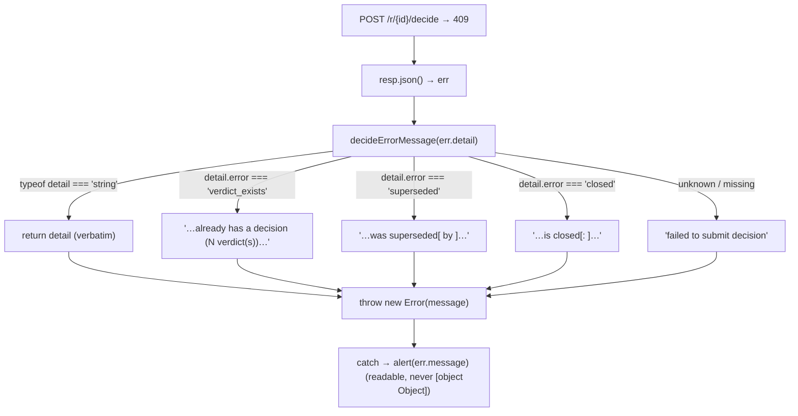

# P5f FIX: stale-tab alert renders 409 dict detail as [object Object] - Plan

## Goal Capsule

| Field | Value |
|---|---|
| Objective | When a stale browser tab submits a decision to `/r/{id}/decide` and the server responds 409 with a **dict** detail (`{error, successor}` / `{error, reason}` / `{error, verdict_count}`), the web UI must show a human-readable `alert()` message instead of `[object Object]`. Plain-string details (all other 4xx from the same path) must keep rendering verbatim. |
| Authority | Trello card `lm9LQtRu` first, then the confirmed seam it names — `gallery/static/app.js:199-200` (the decide `submit()` error path) and the 409 dict shapes emitted by `gallery/server.py:_apply_verdict` (`938-959`). The static-JS source-content test pattern (`tests/test_before_after.py:162`, `tests/test_api.py:173`) is the established verification surface. |
| Execution profile | Single-file client change: add a tiny detail→message normalizer inside the decide IIFE and call it where the `Error` is thrown. No server change (the dict shapes were set by P5b and stay). Add one source-content guard test; manually verify a live 409 in a browser. |
| Stop conditions | Files limited to `gallery/static/app.js` and `tests/**`. Do **not** touch `gallery/server.py`, the 409 dict shapes, the stream-note/answer IIFE (it only ever receives string details), the templates, or the success/reload flow. No new dependency, no build step. Commit only on the card branch — the conductor lands it. If the baseline suite is red before any edit, report and stop. |
| Completion signal | `UV_CACHE_DIR=/private/tmp/uv-cache uv run --extra dev pytest -q` is green including the new static-JS guard test (baseline 239 at b12151a → 240). A locally-served 409 (superseded / closed / verdict_exists) renders a readable alert, not `[object Object]`; a string-detail 409/400 still renders verbatim — both observations recorded in the handoff. |

---

## Product Contract

### Summary

P5b changed the decide endpoint's 409 detail from a plain string into a structured dict so callers can branch on `error`. The web UI's decide handler (`gallery/static/app.js:197-210`) still assumes `detail` is a string: it does `throw new Error(err.detail || "failed to submit decision")` and later `alert(err.message)`. `new Error(dict).message` coerces the object to `"[object Object]"`, so a stale tab that submits after the request was superseded / closed / already-decided shows the user `[object Object]` instead of an explanation.

The fix is entirely client-side: normalize `detail` to a readable string before constructing the `Error`. A string `detail` is returned unchanged (preserving every other 4xx message from this path); a recognized dict is mapped to a sentence built from its human fields (`reason` / `successor` / `verdict_count`); anything unrecognized falls back to the existing generic message. The server, the dict shapes, and the success/reload flow are untouched.

### Problem Frame

- `_apply_verdict` (`gallery/server.py:938-988`) serves both `POST /api/requests/{id}/verdict` and the browser's `POST /r/{id}/decide` (`gallery/server.py:1600-1606`). It raises 409 with a **dict** detail in exactly three cases:
  - superseded request → `{"error": "superseded", "successor": <request_id | null>}` (`:943-947`)
  - closed request → `{"error": "closed", "reason": <close_reason | null>}` (`:948-952`)
  - already-decided (has verdicts, no `redecide`) → `{"error": "verdict_exists", "verdict_count": <int>}` (`:954-959`)
- Every **other** detail from this path is a plain string: 404 `"request not found"`, 400 `"selected must be a list of integers"`, 400 view-payload errors, 400 `"selected indices not found on this request: …"`, `record_verdict`'s `str(exc)` 409/400 (`:985-988`), and `web_decide`'s 401 `"missing or invalid token"` (`:1604`).
- FastAPI serializes `HTTPException(detail=…)` as `{"detail": …}`, so in the browser `err.detail` is either a string or one of the three dicts above.
- The browser response of a 409 is handled at `gallery/static/app.js:197-210`: `resp.json().then(err => { throw new Error(err.detail || "failed to submit decision") })` → `.catch(err => alert(err.message))`. A dict `err.detail` is truthy, so it is passed to `new Error(...)`, whose `.message` becomes `"[object Object]"`.
- The stale-tab scenario is real: the tab was rendered while the request was `open`; by submit time another actor decided / closed / superseded it, so the server rejects with a dict-detail 409.

### Requirements

- **R1.** A 409 whose `detail` is `{"error": "verdict_exists", "verdict_count": N}` shows an alert naming that the request already has a decision / N verdict(s), not `[object Object]`.
- **R2.** A 409 whose `detail` is `{"error": "superseded", "successor": S}` shows an alert stating the request was superseded, and when `S` is present it names the successor request (as text — see A3); when `S` is null it omits the successor clause.
- **R3.** A 409 whose `detail` is `{"error": "closed", "reason": R}` shows an alert stating the request is closed, and when `R` is present it includes the reason; when `R` is null it omits the reason clause.
- **R4.** A response whose `detail` is a **string** (any other 4xx from this path) renders that string verbatim in the alert — unchanged from today.
- **R5.** A response with a missing/unrecognized `detail` (e.g. `detail` absent, or an unknown `error` value) falls back to the existing generic `"failed to submit decision"` message.
- **R6.** No change to the success path (`resp.ok` → `window.location.reload()`), to the stream note/answer IIFE, to the server, or to the 409 dict shapes.
- **R7.** The change is guarded by a test consistent with the repo's static-JS test convention, and manually verified against a live 409.

### Acceptance Examples

- **AE1.** Open a request in a tab; from another session record a verdict on it; submit the stale tab → server returns 409 `{"error":"verdict_exists","verdict_count":1}` → alert reads e.g. `"This request already has a decision (1 verdict). Reload to see it."` (not `[object Object]`). (R1)
- **AE2.** Stale tab submits a superseded request → 409 `{"error":"superseded","successor":"req_abc123"}` → alert names it was superseded by `req_abc123`. With `successor: null` the alert states it was superseded, no successor clause. (R2)
- **AE3.** Stale tab submits a closed request → 409 `{"error":"closed","reason":"ship it"}` → alert states the request is closed: ship it. With `reason: null` the closed message omits the reason. (R3)
- **AE4.** A 400 `"selected must be a list of integers"` (string detail) → alert shows exactly that string. (R4)
- **AE5.** A response with no `detail` field → alert shows `"failed to submit decision"`. (R5)
- **AE6.** `GET /static/app.js` source contains the normalizer and its recognized keys (`"verdict_exists"`, `"superseded"`, `"closed"`, `detail.successor`, `detail.reason`, `detail.verdict_count`) and the string pass-through (`typeof detail === "string"`). (R7)

### Scope Boundaries

- Changed files only: `gallery/static/app.js`, `tests/**`.
- No server edit; the P5b dict shapes are the contract this card renders, not something to reshape.
- No change to the second IIFE (`gallery/static/app.js:230-311`, stream note/answer). Its endpoints (`/s/{slug}/note`, `/s/{slug}/answer`) only ever raise string details (401/404/400/`"stream is closed: …"`), so it is not affected by the dict regression. Leaving it untouched is the surgical choice.
- No new notification UI (banner/toast), no auto-navigation to the successor, no auto-reload-on-stale — the card asks for a readable message, nothing more.
- No new dependency, no build step (the file is vanilla ES5-style browser JS).

#### Deferred to Follow-Up Work

- Replacing the native `alert()` with an in-page banner that renders the successor as a real clickable link. `alert()` cannot host a hyperlink, so the successor is shown as text here; a richer surface is a separate UX card, not this fix.

---

## Planning Contract

### Assumptions

- **A1.** The three dict shapes in `_apply_verdict` (`superseded` / `closed` / `verdict_exists`) are the complete set of dict details reachable from `/r/{id}/decide`. Verified by reading `_apply_verdict` (`gallery/server.py:938-988`) and `web_decide` (`:1600-1606`): every other `raise HTTPException` on this path uses a string detail. If P5b or a later card adds a new dict `error`, it falls through the normalizer's default to the generic fallback (R5) — safe, not `[object Object]`.
- **A2.** The fix belongs in the first IIFE only (the decide UI). The second IIFE already guards `resp.json()` with `.catch(() => ({}))` and only sees string details, so it needs no change (R6).
- **A3.** "successor link" in the card is rendered as **text** (the successor request id, e.g. `req_abc123`), because the message is delivered via the native `alert()`, which cannot render an anchor. A clickable link would require replacing `alert()` with DOM — out of scope (see Deferred). The successor id is a valid, navigable reference (`/r/<id>`), so text is a faithful readable rendering.
- **A4.** The normalizer lives inside the decide IIFE (most-local placement), not at module scope, since only that IIFE consumes it. This keeps the change to one closure and avoids touching the second IIFE.
- **A5.** The suite's "static JS behavior via e2e" is source-content assertion (`client.get("/static/app.js")` + substring checks), not a JS runtime. So the added test guards that the normalizer *exists in the served source*; runtime correctness is proven by the manual browser check (R7). This is the honest coverage the card's "otherwise verify by serving locally" clause anticipates.
- **A6.** `verdict_count` is always `>= 1` when the `verdict_exists` dict is emitted (the branch guard is `verdict_count > 0`), so a singular/plural phrasing on it is safe.

### Key Technical Decisions

- **KTD1. Add a pure `detail → message` normalizer in the decide IIFE.** A small function (name suggestion: `decideErrorMessage(detail)`) that: returns `detail` when `typeof detail === "string"`; when `detail` is a non-null object, `switch`es on `detail.error` over the three known values and builds a sentence from `successor` / `reason` / `verdict_count`; otherwise returns the generic `"failed to submit decision"`. Pure, no side effects, trivially testable by reading source.
- **KTD2. Call the normalizer at the single throw site.** Replace `throw new Error(err.detail || "failed to submit decision")` (`gallery/static/app.js:200`) with `throw new Error(decideErrorMessage(err.detail))`. The generic fallback moves *into* the normalizer (KTD1), so the `|| "…"` is no longer needed at the call site. `.catch(err => alert(err.message))` (`:208-210`) is unchanged and now shows a readable string.
- **KTD3. Keep messages plain and actionable.** Each dict maps to one sentence; the stale-tab cases hint at reloading (the current state has moved on). Suggested strings (final wording is the implementer's, but must satisfy R1–R3 and AE6's key checks):
  - `verdict_exists` → `"This request already has a decision (" + n + (n === 1 ? " verdict" : " verdicts") + "). Reload to see it."`
  - `superseded` → `"This request was superseded" + (successor ? " by " + successor : "") + ". Reload to continue."`
  - `closed` → `"This request is closed" + (reason ? ": " + reason : "") + "."`
- **KTD4. Do not alter the server or the second IIFE.** The dict shapes are the input contract; the fix is purely how the client renders them (R6). String pass-through (R4) is preserved by the `typeof` guard so every other 4xx message is byte-for-byte unchanged.

### Relevant Code and Patterns

- `gallery/static/app.js`:
  - Decide `submit()` (`186-211`) — throw site at `199-200`, alert at `208-210` (target).
  - Stream note/answer IIFE (`230-311`), `submitJson` error handling (`262-278`) — **not** changed (A2, string-only details).
- `gallery/server.py`:
  - `_apply_verdict` (`938-988`) — the three dict details at `946`, `951`, `958`; string details at `967`, `981`, `986-988`.
  - `web_decide` (`1600-1606`) — the browser decide route (string 401 at `1604`).
- Static-JS test convention: `tests/test_before_after.py:162-179` (`test_static_js_keeps_…`), `tests/test_api.py:173-178` — `script = client.get("/static/app.js")` then `assert "<substring>" in script.text`. The new test follows this exact shape.
- Board lesson: run tests as `UV_CACHE_DIR=/private/tmp/uv-cache uv run --extra dev pytest -q`.

---

## High-Level Technical Design

One pure function sits between the parsed error body and the `Error` constructor; the success path and every other file are untouched.

Key invariant: the normalizer is total — every possible `detail` (string, known dict, unknown dict, absent) maps to a non-empty readable string, so `alert()` can never again receive `[object Object]`.

---

## Implementation Units

### U1. Add the detail normalizer and route the decide error through it

- **Goal:** Render dict-shaped 409 details as readable alerts; keep string details verbatim.
- **Requirements:** R1–R6.
- **Dependencies:** None.
- **Files:** `gallery/static/app.js`.
- **Approach:** Inside the first IIFE (near `submit`, `186-211`), add `function decideErrorMessage(detail) { … }` per KTD1/KTD3: string → return as-is; object → `switch (detail.error)` over `"verdict_exists"` / `"superseded"` / `"closed"` building the sentence from `verdict_count` / `successor` / `reason`; default → `"failed to submit decision"`. Then change the throw at `200` to `throw new Error(decideErrorMessage(err.detail));`. Leave `resp.json()`, the `resp.ok` reload branch, `alert(err.message)`, and the entire second IIFE untouched.
- **Patterns to follow:** the file's existing vanilla-JS style — `var`, small named `function` declarations, no arrow functions, no template literals (use `+` string concatenation, consistent with `submit`/`renderSelection`).
- **Test scenarios:** covered by U2 (source-content) + the manual browser check in the Verification Contract.
- **Verification:** all four `detail` classes (string / each dict / absent) yield a readable non-`[object Object]` message.

### U2. Static-JS guard test

- **Goal:** Lock in that the served `app.js` contains the normalizer and its recognized keys, and prevent silent regression back to raw interpolation.
- **Requirements:** R7 (AE6).
- **Dependencies:** U1.
- **Files:** `tests/test_api.py` (near the existing `/static/app.js` assertion at `173`) **or** `tests/test_before_after.py` (near `test_static_js_keeps_…` at `162`) — pick the one whose surrounding fixtures fit; do not create a new test module.
- **Approach:** Add `test_static_js_renders_decide_409_dict_detail(client)` that does `script = client.get("/static/app.js")`, asserts `script.status_code == 200`, and asserts the source contains the dict-handling markers, e.g. `'"verdict_exists"'`, `'"superseded"'`, `'"closed"'`, `"detail.successor"`, `"detail.reason"`, `"detail.verdict_count"`, and the string pass-through `'typeof detail === "string"'`. Keep the substring literals in sync with the exact wording chosen in U1.
- **Patterns to follow:** `tests/test_before_after.py:162-179` — `client` fixture, `client.get("/static/app.js")`, `assert "<substring>" in script.text`.
- **Test scenarios:** AE6.
- **Verification:** the new test passes; it fails if the normalizer or its keys are removed.

---

## Verification Contract

- Focused: `UV_CACHE_DIR=/private/tmp/uv-cache uv run --extra dev pytest -q tests/test_api.py tests/test_before_after.py` — green, including the new static-JS guard test.
- Full suite: `UV_CACHE_DIR=/private/tmp/uv-cache uv run --extra dev pytest -q` — green (baseline 239 at b12151a → 240 with the one added test), proving no regression in the served asset or elsewhere.
- Manual (required by the card, since there is no JS runtime in the suite): serve the app locally, open a request tab, then from another session drive it into a terminal state (record a verdict, or `close` / `supersede` it), and submit the stale tab. Confirm the alert shows the readable sentence for each of the three dict cases and `[object Object]` never appears; confirm a string-detail 4xx (e.g. submit with no selection to hit a 400) still shows its verbatim string. Record these observations verbatim in the handoff.
- Manual reasoning check: confirm `decideErrorMessage` returns a non-empty string for a string input, each known dict, an unknown-`error` dict, and `undefined` — i.e. the function is total (no path returns the raw object).

## Definition of Done

- `gallery/static/app.js` routes the decide 409 `detail` through a total normalizer: string details render verbatim; `verdict_exists` / `superseded` / `closed` dicts render readable sentences built from `verdict_count` / `successor` / `reason`; unknown/absent details fall back to `"failed to submit decision"`. `[object Object]` is unreachable in the decide alert.
- The success/reload path, the server, the 409 dict shapes, and the stream note/answer IIFE are unchanged.
- A static-JS guard test asserts the normalizer and its keys are present in the served `app.js`.
- `UV_CACHE_DIR=/private/tmp/uv-cache uv run --extra dev pytest -q` is green; the live 409 rendering (all three dict cases + a string case) is manually verified and the observations are recorded in the handoff.
- Work is committed on the card branch (`gallery/static/app.js`, `tests/**` only); the conductor lands it.
