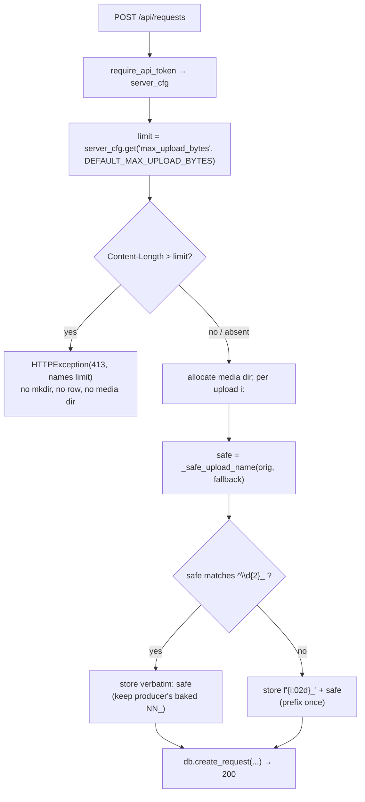

# P5e HYGIENE: upload size cap + media double-prefix guard - Plan

## Goal Capsule

| Field | Value |
|---|---|
| Objective | Two small, independent server fixes observed live 2026-07-09. **(1) Upload size cap:** `POST /api/requests` accepts unbounded bodies today; add a configurable max upload size (config default **64 MB**) that rejects oversized uploads with **HTTP 413** and a clear message naming the limit — a guardrail, not a shrink, comfortably above today's real 32 MB proxy videos. **(2) Double-prefix guard:** the server prefixes each uploaded media filename with an `NN_` ordinal; a file already named `01_…`/`02_…` gets prefixed again (`01_01_…`), silently 404-ing producer HTML that bakes media paths. Fix deterministically with **keep-as-is**: when the (sanitized) name already starts with `^\d{2}_`, do not re-prefix. |
| Authority | Trello card `Ms4kyKET` first. Then the named seams: `gallery/server.py` `create_request` handler (`POST /api/requests`, the two `f"{i:02d}_{_safe_upload_name(...)}"` prefixing sites), `gallery/config.py` (`init_config` default config dict), and `tests/**`. Existing conventions to mirror: the `MAX_*` module constants and `HTTPException(status_code=…)` guards in `gallery/server.py`, the config-key + module-default pattern in `gallery/config.py`, and the upload test helpers in `tests/test_api.py`. `docs/portal-spec.md` §"Report size limits — decided: 200 MB/post soft cap; warn, never reject" is a **constraint** (read-only; out of the card's file scope). |
| Execution profile | Surgical, additive server change. One config key + module default; one Content-Length pre-check in the request-create handler; one shared prefix helper replacing the identical inline pattern at both upload sites; new tests. No schema change, no new dependency, no change to the request-create success path for normal uploads. |
| Stop conditions | Files limited to `gallery/server.py`, `gallery/config.py`, `tests/**` — **ONLY** (per card). Do **not** edit `docs/portal-spec.md` or any producer doc (out of file scope; see Open Questions Q1). Do **not** convert the existing 200 MB post soft-cap (`POST /api/streams/{slug}/posts`) into a hard reject — that would break the documented "warn, never reject" decision and large report uploads (see A1). Do **not** restructure the in-memory variant-write loop into streaming writes (see A2). Commit on the card branch only; the conductor lands it. If the baseline suite is red before any edit, report and stop. |
| Completion signal | `UV_CACHE_DIR=/private/tmp/uv-cache uv run --extra dev pytest -q` fully green including the new tests (413-over-limit names the limit; under-limit unaffected; plain filename prefixed once; pre-prefixed filename not doubled; baked-path round-trip resolves). `uv run ruff check .` clean. |

---

## Product Contract

### Summary

Two unrelated hygiene fixes, both scoped to the server upload path and both hit live on 2026-07-09.

**(1) Upload size cap.** `create_request` (`POST /api/requests`) reads and stores every uploaded variant with no total-size bound (`data = await upload.read()` then `dest_path.write_bytes(data)` per file — `gallery/server.py:677-682`). A 32 MB proxy video only failed through the public Caddy route because the proxy timed out; the local API accepts it unbounded. Add a **configurable** ceiling (`max_upload_bytes`, config default 64 MB) enforced as an **HTTP 413** with a message that names the limit. 64 MB sits comfortably above today's real 32 MB videos, so the local big-upload path is unaffected.

**(2) Double-prefix guard.** Both upload paths name each stored file `f"{i:02d}_{_safe_upload_name(orig, fallback)}"` — the request-create loop (`gallery/server.py:679`) and `_save_post_files` (`gallery/server.py:537`). `_safe_upload_name` preserves leading digits and underscores, so a file the producer already named `02_v.mp4` is stored as `02_02_v.mp4` (when it is the 2nd upload) or `01_02_v.mp4` (when 1st). Producer HTML that bakes a media path — e.g. a picker's `--video-src=02_v.mp4` — then 404s against the renamed file. Fix with **keep-as-is**: when the sanitized name already matches `^\d{2}_`, keep it verbatim and skip the ordinal prefix; otherwise prefix as today.

### Problem Frame

- **Cap.** `create_request` has no size guard at all; the request body is bounded only by whatever the reverse proxy imposes. The sibling post endpoint already has a *soft* 200 MB cap that only appends a `warning` and never rejects (`POST_UPLOAD_SOFT_CAP_BYTES`, `gallery/server.py:37,912-913`), which `docs/portal-spec.md` records as a deliberate "warn, never reject" decision for large report bundles. So the two upload endpoints have genuinely different intended ceilings, and the card's hard 413 default (64 MB, tuned to 32 MB proxy videos) describes the *request* path.
- **Prefix.** The `NN_` ordinal exists to make stored variant filenames unique and order-stable (variants are 1-based throughout — `docs/portal-spec.md:200`). Re-prefixing an already-prefixed name both breaks the producer's baked path *and* is redundant. `_safe_upload_name` (`gallery/server.py:297-300`) strips unsafe characters and any leading `._`, so detecting the `^\d{2}_` marker on the *sanitized* name is the correct, deterministic signal (it matches the exact bytes that will be stored).
- **Manifest safety.** The request loop looks up caption/meta by the *original* filename (`manifest_map.get(orig_name, …)` — `gallery/server.py:683`), not the stored name, so keep-as-is does not disturb manifest resolution.
- **Idx vs filename.** The DB variant `idx` is positional (`enumerate(..., start=1)`), independent of the filename's baked `NN_`. Keep-as-is decouples them cleanly: a `05_v.mp4` uploaded 2nd is `idx=2` with `media_path="05_v.mp4"`, and the baked HTML references the filename, not the idx.

### Requirements

- **R1.** `POST /api/requests` rejects an upload whose request body exceeds the configured limit with **HTTP 413**, and the response detail **names the limit** (human-readable, e.g. the byte count and/or MB). No `requests` row and no media directory are left behind.
- **R2.** The limit is **configurable**: a `max_upload_bytes` config key, default **64 MB** (`64 * 1024 * 1024`), read at request time. Configs written before this change (missing the key) fall back to the same 64 MB default.
- **R3.** An upload at or under the limit is byte-for-byte unaffected — the existing create/list/get/decide flow and stored variants are unchanged.
- **R4.** A plain filename (no `^\d{2}_`) is prefixed **exactly once** with its 1-based ordinal — unchanged from today (`v1.png` → `01_v.png`).
- **R5.** A filename whose sanitized form already starts with `^\d{2}_` is stored **verbatim** (no second prefix): `02_v.mp4` → `02_v.mp4`, never `01_02_v.mp4` / `02_02_v.mp4`.
- **R6.** Baked-path round-trip: uploading a view request with `01_x.html` (HTML entry) + `02_v.mp4` stores the video under exactly `02_v.mp4`, and that media path is servable — so the HTML's baked reference to `02_v.mp4` resolves.
- **R7.** The keep-as-is rule is **documented** at the authoritative source (a comment/docstring at the prefix helper in `gallery/server.py`) and in this plan. (Producer-facing doc surface is out of the card's file scope — see Q1.)
- **R8.** No DB schema change / no migration. No new dependency. The `POST /api/streams/{slug}/posts` soft-cap behavior is unchanged (A1).

### Acceptance Examples

- **AE1.** Set `max_upload_bytes` to a small value (e.g. 100) in config, then `POST /api/requests` with a file whose multipart body exceeds it → **413**, detail contains the limit; `GET /api/requests` shows no new row; no media dir for that id. (R1)
- **AE2.** With the default config (64 MB), `POST /api/requests` with a small file → **200**, `variant_count` correct, variants stored — identical to today. (R2, R3)
- **AE3.** `POST /api/requests` with `files=[v1.png]` → the stored variant `media_path` is `01_v.png`. (R4)
- **AE4.** `POST /api/requests` with `files=[01_x.png]` → the stored variant `media_path` is `01_x.png` (not `01_01_x.png`). (R5)
- **AE5.** `POST /api/requests` with `kind=view`, `files=[01_x.html, 02_v.mp4]` → the video variant's `media_path` is `02_v.mp4`, and `GET /media/{id}/02_v.mp4?token=…` returns **200**. (R6)

### Scope Boundaries

- Changed files only: `gallery/server.py`, `gallery/config.py`, `tests/**`.
- The hard 413 cap applies to `POST /api/requests` only. `POST /api/streams/{slug}/posts` keeps its existing 200 MB soft-cap warning (A1).
- No change to verdict/lifecycle/stream/journey/message endpoints, templates, or the `before`-image path (`__before…`, never `NN_`-prefixed).
- No schema migration; `PRAGMA user_version` untouched. No new dependency.

#### Deferred to Follow-Up Work

- A producer-facing note of the `NN_` keep-as-is rule (e.g. in `docs/portal-spec.md` or a producer README) — out of the card's declared file scope (Q1). Recommend a follow-up card if a producer-visible doc surface is wanted.
- A hard 413 cap (or configurable ceiling) for `POST /api/streams/{slug}/posts` — deliberately deferred; its 200 MB "warn, never reject" contract is a documented decision (A1).
- Streaming/accumulated-bytes enforcement as a backstop for requests without a `Content-Length` header (A2).

---

## Planning Contract

### Assumptions

- **A1. The 64 MB hard 413 cap is scoped to `POST /api/requests`; the posts endpoint's 200 MB soft cap is left as-is.** The card's parenthetical "(and any other upload-accepting endpoint)" is read against two repo facts: (a) `create_request` is the only *truly unbounded* upload endpoint — the posts endpoint already bounds at 200 MB; (b) `docs/portal-spec.md` records "Report size limits — decided: 200 MB/post soft cap; warn, never reject." Converting posts to a 64 MB hard reject would contradict that decision and break legitimately-large report bundles, violating the card's own "do not break the local big-upload path." So the hard cap lands where the live bug was (requests). This is the one genuine scope fork; recorded here rather than blocked on, because this worker is not resumable. A reviewer wanting posts capped too should widen scope explicitly (Q2).
- **A2. Enforce via a `Content-Length` pre-check, not streaming accounting.** Every real client of this endpoint (the `portal` CLI's multipart post, and Caddy in front of it) sends `Content-Length`; the request body's `Content-Length` *is* the upload size. A header pre-check is deterministic, fails fast before any file is buffered into memory, and is the smallest change. Restructuring the in-memory `await upload.read()` loop into limited streaming writes is deferred (Deferred to Follow-Up Work) — it is a larger, riskier change to the storage path for a guardrail whose threat model is accidental oversized uploads through a trusted client.
- **A3. Keep-as-is (not strip-and-reprefix) is the chosen double-prefix fix.** It preserves whatever `NN_` the producer baked regardless of upload order, so a baked `05_v.mp4` reference resolves even when the file is uploaded in a different position. Strip-and-reprefix would only resolve when the upload position happens to equal the baked ordinal (upload `05_v.mp4` 2nd → `02_v.mp4` → baked `05_v.mp4` 404s), so it is fragile; the card lists both and this plan picks keep-as-is.
- **A4. Detect the prefix on the *sanitized* name** (`_safe_upload_name` output), because that is the exact byte string that gets stored and served. `_safe_upload_name` preserves digits/underscores and strips leading `._`, so `.01_x` → `01_x` is correctly recognized.
- **A5. The `^\d{2}_` rule matches the card verbatim: exactly two leading digits then `_`.** `123_x` (three digits) and `9_x` (one digit) are *not* recognized ordinals and are prefixed normally. This mirrors the two-digit `{i:02d}_` convention; noted as an edge (Open Questions Q3) but the card's regex is authoritative.
- **A6. The default limit lives in `gallery/config.py`** as a module constant (`DEFAULT_MAX_UPLOAD_BYTES`) written into `init_config`'s default dict, and is read in the handler via `server_cfg.get("max_upload_bytes", config.DEFAULT_MAX_UPLOAD_BYTES)` so pre-existing config files without the key still get the default.

### Key Technical Decisions

- **KTD1. Config key + module default (config.py).** Add `DEFAULT_MAX_UPLOAD_BYTES = 64 * 1024 * 1024` and include `"max_upload_bytes": DEFAULT_MAX_UPLOAD_BYTES` in the `init_config` default config dict (`gallery/config.py:80-87`). No new loader; `load_config` already returns the dict. Read with `.get(..., default)` so old configs are forward-compatible (R2).
- **KTD2. Content-Length pre-check in `create_request` (server.py).** Immediately after `server_cfg = require_api_token(request)` (`gallery/server.py:633`) — before allocating any media dir or reading files — read the configured limit and, if `request.headers.get("content-length")` is present and its integer value exceeds the limit, raise `HTTPException(status_code=413, detail=…)` with a message that names the limit (e.g. `f"upload exceeds max size of {limit} bytes ({limit // (1024*1024)} MB)"`). A tiny helper (e.g. `_enforce_upload_size(request, limit)`) mirrors the module's existing `_validate_slug` / `_bounded_text` helper style and keeps the handler readable. Because the check precedes any `mkdir`/write, no row or media dir can leak (R1). Malformed/absent `Content-Length` falls through to normal handling (A2).
- **KTD3. Shared keep-as-is prefix helper (server.py).** Introduce one helper — e.g. `_prefixed_media_name(index, orig_name, fallback)` — that computes `safe = _safe_upload_name(orig_name, fallback)` and returns `safe` when it matches `^\d{2}_` (keep-as-is), else `f"{index:02d}_{safe}"`. Replace the identical inline expression at both sites: the request-create loop (`gallery/server.py:679`) and `_save_post_files` (`gallery/server.py:537`). One helper fixes both occurrences of the same bug with no behavior change for plain names (R4, R5). Carry a short comment/docstring stating the rule (R7).
- **KTD4. No new gate elsewhere; reuse existing cleanup.** The request handler's existing `except`/`shutil.rmtree` cleanup and the 200-response shape are untouched. The prefix change only alters the stored filename string.

### Relevant Code and Patterns

- `gallery/config.py`:
  - `init_config` default dict (`70-89`) — add the key here; module constant near the top with the other `DEFAULT_*` (`16-18`).
- `gallery/server.py`:
  - `create_request` handler (`618-733`); token/cfg at `633`; the in-memory variant loop with the prefix site at `677-682` (`:679`); existing `except ValueError`/`IntegrityError`/`Exception` cleanup at `708-719`.
  - `_save_post_files` (`527-552`), prefix site at `537` — second occurrence of the same pattern.
  - `_safe_upload_name` (`297-300`) — sanitizer the guard builds on; preserves digits/`_`, strips leading `._`.
  - `_write_upload` (`432-441`) and `POST_UPLOAD_SOFT_CAP_BYTES` / soft-cap warning (`37`, `912-913`) — the *unchanged* posts-path ceiling (A1).
  - `MAX_TITLE_LENGTH` etc. (`39-44`) and `HTTPException(status_code=…)` guards throughout — the constant + guard style to mirror.
- Tests:
  - `tests/test_api.py` — `auth_headers`, `tiny_png_bytes`, `_upload_files`, and the create/list/get/decide flow (`1-75`) — the exact upload-test patterns to reuse.
  - `tests/conftest.py` — `data_dir` fixture returns `(tmp_path, cfg)` and calls `config.init_config(force=True)`; `client`/`token` fixtures. A test can mutate config via `config.load_config()` → set `max_upload_bytes` → `config.save_config(cfg)`; the handler reads config fresh per request.
  - `tests/test_view_requests.py` — pattern for `kind=view` requests (HTML entry) for the AE5 round-trip.
- Board lesson: run tests as `UV_CACHE_DIR=/private/tmp/uv-cache uv run --extra dev pytest -q`.

---

## High-Level Technical Design

One value (the configured limit) gates the request early; one helper normalizes every stored filename. Both are additive to the existing request-create flow.

Invariant: the 413 check runs **before** any filesystem allocation, so a rejected upload leaves no row and no media directory; the prefix helper is the **only** producer of stored variant filenames, so plain names are prefixed exactly once and baked `NN_` names are preserved exactly once.

---

## Implementation Units

### U1. Config: `max_upload_bytes` key + module default

- **Goal:** Make the upload ceiling configurable with a 64 MB default, forward-compatible with existing config files.
- **Requirements:** R2. Supports R1.
- **Dependencies:** None.
- **Files:** `gallery/config.py`.
- **Approach:** Add `DEFAULT_MAX_UPLOAD_BYTES = 64 * 1024 * 1024` near the other `DEFAULT_*` constants (`gallery/config.py:16-18`). Add `"max_upload_bytes": DEFAULT_MAX_UPLOAD_BYTES` to the default config dict in `init_config` (`80-87`). Do not add a bespoke accessor — callers read `cfg.get("max_upload_bytes", DEFAULT_MAX_UPLOAD_BYTES)`.
- **Patterns to follow:** existing `DEFAULT_HOST`/`DEFAULT_PORT` constants and the flat `init_config` dict.
- **Test scenarios:** `Test expectation: none` for a standalone unit test — the default surfaces through U2/U4 server tests (AE2). (Optional: assert `config.init_config(force=True)["max_upload_bytes"] == config.DEFAULT_MAX_UPLOAD_BYTES`.)
- **Verification:** a freshly `init_config`'d config contains `max_upload_bytes` == 64 MB; the constant is importable as `config.DEFAULT_MAX_UPLOAD_BYTES`.

### U2. Enforce the 413 upload cap on `POST /api/requests`

- **Goal:** Reject over-limit uploads with 413 naming the limit, before any file is stored.
- **Requirements:** R1, R3.
- **Dependencies:** U1.
- **Files:** `gallery/server.py`.
- **Approach:** After `server_cfg = require_api_token(request)` (`gallery/server.py:633`), resolve `limit = server_cfg.get("max_upload_bytes", config.DEFAULT_MAX_UPLOAD_BYTES)` and enforce it via a small helper `_enforce_upload_size(request, limit)`: parse `request.headers.get("content-length")`; if present and `int(...) > limit`, raise `HTTPException(status_code=413, detail=f"upload exceeds max size of {limit} bytes ({limit // (1024 * 1024)} MB)")`. Place the call before the `for _ in range(5)` media-dir allocation loop so a rejected request never creates a row or directory. Leave the rest of the handler and its cleanup untouched.
- **Patterns to follow:** the module's `HTTPException(status_code=…, detail=…)` guards and helper style (`_validate_slug`, `_bounded_text`).
- **Test scenarios** (in `tests/test_api.py`):
  - Covers AE1. Set `max_upload_bytes` to a small value (e.g. 100) via `config.load_config()`/`save_config`, `POST /api/requests` with `_upload_files()` → **413**; assert the detail string contains the limit (e.g. `"100"` or `"MB"`); assert `GET /api/requests` returns no new id and no media dir exists under `config.media_dir()`.
  - Covers AE2. Default config, small upload → **200**, `variant_count` correct (guards R3 / no regression).
  - Edge: a request with the limit set just above the body size → **200** (boundary, not off-by-one rejected).
  - Edge: missing/blank `Content-Length` header does not 413 the normal small-upload path (documents A2 behavior).
- **Verification:** over-limit → 413 with the limit named and nothing persisted; at/under-limit → unchanged 200 flow.

### U3. Keep-as-is double-prefix guard (shared helper, both upload sites)

- **Goal:** Store a producer's already-`NN_`-prefixed filename verbatim; prefix plain filenames exactly once.
- **Requirements:** R4, R5, R6, R7.
- **Dependencies:** None (independent of U1/U2).
- **Files:** `gallery/server.py`.
- **Approach:** Add `_prefixed_media_name(index, orig_name, fallback)`: `safe = _safe_upload_name(orig_name, fallback)`; if `re.match(r"\d{2}_", safe)` return `safe` (keep-as-is), else return `f"{index:02d}_{safe}"`. Replace the inline `f"{i:02d}_{_safe_upload_name(...)}"` at the request-create loop (`gallery/server.py:679`) and at `_save_post_files` (`gallery/server.py:537`) with calls to it. Add a short docstring/comment on the helper stating the rule ("filenames already carrying a two-digit `NN_` ordinal — e.g. producer HTML with baked media paths — are stored verbatim so baked references resolve; all others get the 1-based ordinal") to satisfy R7 at the authoritative source. No behavior change for plain names.
- **Patterns to follow:** existing `_safe_upload_name` helper; the two call sites' current signatures (`i`, `orig_name`/`original_name`, fallback string).
- **Test scenarios** (in `tests/test_api.py`; view case may live in `tests/test_view_requests.py`):
  - Covers AE3. `files=[v1.png]` → stored variant `media_path == "01_v.png"` (plain prefixed once; guards R4 regression).
  - Covers AE4. `files=[01_x.png]` → stored `media_path == "01_x.png"` (not doubled).
  - Covers AE5. `kind=view`, `files=[01_x.html, 02_v.mp4]` → the video variant `media_path == "02_v.mp4"`; `GET /media/{id}/02_v.mp4?token=…` → **200** (baked-path round-trip resolves).
  - Edge: a pre-prefixed file uploaded out of ordinal position (e.g. `05_v.mp4` as the 2nd file) is stored as `05_v.mp4`, `idx == 2` — filename and positional idx are decoupled.
  - Edge (documents A5): `123_x.png` (three digits) → `01_123_x.png` (not recognized as an `NN_` ordinal).
- **Verification:** plain → single prefix; `^\d{2}_` → verbatim; view round-trip media path servable.

### U4. Test wiring / helpers

- **Goal:** Ensure the new tests reuse existing fixtures/helpers and the full suite stays green.
- **Requirements:** R1–R6.
- **Dependencies:** U1, U2, U3.
- **Files:** `tests/test_api.py`, and `tests/test_view_requests.py` if the AE5 view case lands there.
- **Approach:** Reuse `auth_headers`, `tiny_png_bytes`, `_upload_files` from `tests/test_api.py` and the `client`/`token`/`data_dir` fixtures from `tests/conftest.py`. For the config-mutation cap test, load → mutate `max_upload_bytes` → `config.save_config`; the handler reads config per request. For the view round-trip, supply an HTML entry file plus an `02_v.mp4` (tiny bytes) and assert the stored video media path and its servability.
- **Patterns to follow:** the create/get flow in `tests/test_api.py:32-75` for reading back `variants[…]["media_path"]` and fetching `/media/{id}/{path}?token=`.
- **Test scenarios:** the scenarios enumerated in U2 and U3 (this unit is the shared harness for them).
- **Verification:** `UV_CACHE_DIR=/private/tmp/uv-cache uv run --extra dev pytest -q` fully green; new assertions present.

---

## Verification Contract

- Focused: `UV_CACHE_DIR=/private/tmp/uv-cache uv run --extra dev pytest -q tests/test_api.py tests/test_view_requests.py` — green, including the new 413/prefix/round-trip cases.
- Full suite: `UV_CACHE_DIR=/private/tmp/uv-cache uv run --extra dev pytest -q` — green (baseline at plan time: **324 passed**), proving no regression in streams/messages/journey/e2e paths.
- Lint: `uv run ruff check .` — clean (watch for an unused import if the helper obviates one; `re` is already imported).
- Manual reasoning check: the 413 check precedes any `mkdir`/write (no leaked row/dir); `_prefixed_media_name` is the sole producer of stored variant names at both sites; the posts-endpoint soft cap is untouched.

## Definition of Done

- `POST /api/requests` rejects bodies over the configured `max_upload_bytes` (default 64 MB) with **413** naming the limit, leaving no row and no media dir; at/under-limit uploads are unchanged.
- The limit is a config key with a 64 MB module default; configs missing the key fall back to that default.
- Uploaded filenames are prefixed exactly once: plain names get the 1-based `NN_` ordinal; names already matching `^\d{2}_` are stored verbatim (guard applied at both `gallery/server.py` prefixing sites).
- Baked-path round-trip holds: `01_x.html` + `02_v.mp4` stores the video as `02_v.mp4` and it is servable.
- The keep-as-is rule is documented at the helper in `gallery/server.py` and in this plan; the `POST /api/streams/{slug}/posts` soft cap is unchanged; no schema migration; no new dependency.
- Full pytest suite and ruff are green under the board-lesson invocation. Work is committed on the card branch; the conductor lands it.

---

## Open Questions

- **Q1 (surfaced tension, resolved for this pass).** The card says "documents the rule where producers can see it" but also restricts files to `gallery/server.py`, `gallery/config.py`, `tests/**` **ONLY**. A producer-facing doc (portal-spec / producer README) is out of that file scope. Resolution: document the rule at the code helper (R7) and in this plan; a producer-visible doc note is a flagged follow-up. A reviewer wanting the spec touched must widen the file scope.
- **Q2.** Should the hard 413 cap also cover `POST /api/streams/{slug}/posts`? Deferred per A1 (its 200 MB "warn, never reject" is a documented decision). Flagged for the reviewer to override if "any other upload-accepting endpoint" is meant literally.
- **Q3.** Filenames with non-two-digit leading numbers (`123_…`, `9_…`) are not treated as `NN_` ordinals (A5), matching the card's exact `^\d{2}_`. Confirm this literal reading is intended.
