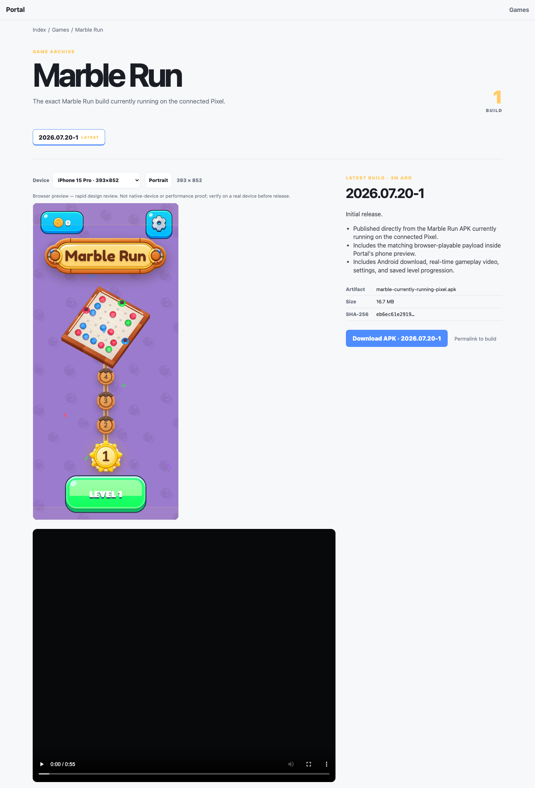
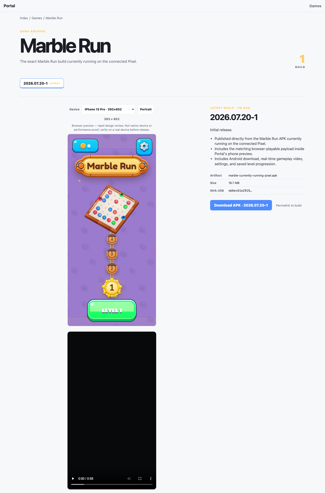
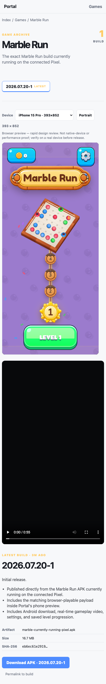
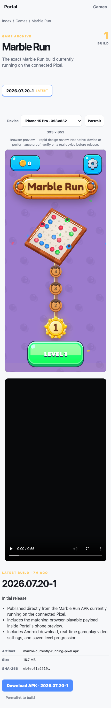

# Marble Run Phone Preview Journal

## Task 1 - Load the current browser build reliably

### Task Snapshot

Status: active

The public preview succeeds in a clean browser but can fail for an existing visitor. The task separates preview-document caching from hashed-asset caching and gives each replaced entry document a new iframe URL.

### Task Acceptance Criteria

- Preview HTML revalidates.
- Entry-file changes alter the iframe URL.
- Hashed assets remain immutable.

### Iteration 1 - Cache diagnosis

#### Planned Result

Identify a reproducible environment difference between clean-browser success and user-visible failure.

#### Why This Iteration

The live page loaded without request errors in Playwright, so the production response headers were inspected for persistent-client behavior.

#### Capture Setup

- Route: `https://portal.basegamelab.com/games/marble-run`
- Viewport: 1440×1200
- Fixture: Marble Run `2026.07.20-1`
- State: latest build, iPhone 15 Pro

#### Pre-Change Screenshots

1. 
   What to look at: The live preview frame and its placement in the left release column.
   Observation: A clean browser loads, while response inspection shows `index.html` cached immutable for one year; an existing browser can retain an earlier broken entry document.
   Acceptance check: HTML revalidation fail; revisioned iframe URL fail; hashed-asset caching pass.

#### Changes Made

Pending implementation after the failing regression test.

#### Post-Change Screenshots

Pending.

#### Decision

partial

#### Next Action

Add entry-document revalidation and a stored-file revision query to the iframe URL.

#### Spawned Tasks

- None.

### Iteration 2 - Revisioned entry document

#### Planned Result

Existing browsers request the current preview document while fingerprinted assets retain long-lived caching.

#### Why This Iteration

The one-year immutable header was correct for hashed assets but invalid for replaceable `index.html` content.

#### Capture Setup

- Route: local branch server mirroring the production Marble Run release
- Viewports: 1440×1200 and 430×1000
- Fixture: Marble Run `2026.07.20-1`
- State: latest build, iPhone 15 Pro

#### Pre-Change Screenshots

1. 
   What to look at: The preview itself can load in a clean browser, making the persistent-client cache failure invisible in a simple screenshot.
   Observation: The response headers, rather than the clean-browser rendering, prove the stale-document path.
   Acceptance check: HTML revalidation fail; revisioned iframe URL fail; asset caching pass.

#### Changes Made

Portal now appends the stored entry file's modification revision to the iframe URL. HTML preview responses use `max-age=0, must-revalidate`; fingerprinted JS, CSS, fonts, and images remain one-year immutable.

#### Post-Change Screenshots

1. 
   What to compare: The preview reaches the current Marble Run menu with no failed requests.
   Observation: The iframe loads under a revisioned URL, and a targeted test proves the split cache policy.
   Acceptance check: HTML revalidation met; revisioned iframe URL met; hashed-asset caching met.

#### Decision

passed

#### Next Action

Deploy the tested branch and verify public response headers in an existing URL path.

#### Spawned Tasks

- None.

## Task 2 - Place the phone preview deliberately

### Task Snapshot

Status: active

The real device viewport is narrower than the release media column but is left-aligned. This task centers the device-review unit without changing its simulated CSS-pixel dimensions.

### Task Acceptance Criteria

- Center the frame in its media column.
- Align controls and disclaimer with the frame.
- Avoid mobile clipping.

### Iteration 1 - Placement baseline

#### Planned Result

Record the exact geometry that makes the current page feel unbalanced.

#### Why This Iteration

The visual defect is positional, so matched desktop and mobile captures establish the baseline.

#### Capture Setup

- Route: `https://portal.basegamelab.com/games/marble-run`
- Viewports: 1440×1200 and 430×1000
- Fixture: Marble Run `2026.07.20-1`
- State: latest build, iPhone 15 Pro

#### Pre-Change Screenshots

1. 
   What to look at: The phone begins at the media column's left edge.
   Observation: The 393 px phone sits at x=88 inside an 815 px column, leaving all excess space on its right.
   Acceptance check: frame centering fail; control alignment fail; mobile clipping pass.

2. 
   What to look at: The phone and controls against the narrow page gutters.
   Observation: The frame remains left-biased and the controls use the full loose width above it.
   Acceptance check: frame centering fail; control alignment fail; mobile clipping pass.

#### Changes Made

Pending one centered-layout CSS change set.

#### Post-Change Screenshots

Pending.

#### Decision

partial

#### Next Action

Center the preview controls, disclaimer, and device frame, then repeat both captures.

#### Spawned Tasks

- None.

### Iteration 2 - Centered review unit

#### Planned Result

The controls, explanatory copy, phone frame, and gameplay video form one centered vertical review unit.

#### Why This Iteration

Centering only the iframe would leave the surrounding controls and oversized video visually disconnected.

#### Capture Setup

- Route: local branch server mirroring the production Marble Run release
- Viewports: 1440×1200 and 430×1000
- Fixture: Marble Run `2026.07.20-1`
- State: latest build, iPhone 15 Pro

#### Pre-Change Screenshots

1. 
   What to look at: The phone begins at x=88, exactly the media column's left edge.
   Observation: Uneven whitespace and a full-column video make the preview feel accidentally placed.
   Acceptance check: centering fail; aligned review unit fail; mobile clipping pass.

2. 
   What to look at: The phone begins at the page's 8 px gutter.
   Observation: The narrow layout preserves size but not deliberate alignment.
   Acceptance check: centering fail; aligned review unit fail; mobile clipping pass.

#### Changes Made

The controls and disclaimer now share the phone width and center alignment. The phone and recorded gameplay are centered at the same 393 px width, preserving actual simulated device dimensions.

#### Post-Change Screenshots

1. 
   What to compare: Equal whitespace on both sides of the phone and video.
   Observation: The phone moves from x=88 to x=299 inside the 815 px media column; controls, phone, and video share one axis.
   Acceptance check: centering met; aligned review unit met; mobile clipping met.

2. 
   What to compare: Balanced 18.5 px side gaps around the 393 px phone.
   Observation: The device and video remain fully visible and centered inside the 414 px media width.
   Acceptance check: centering met; aligned review unit met; mobile clipping met.

#### Decision

passed

#### Next Action

Deploy and repeat the same public desktop and mobile captures.

#### Spawned Tasks

- None.
