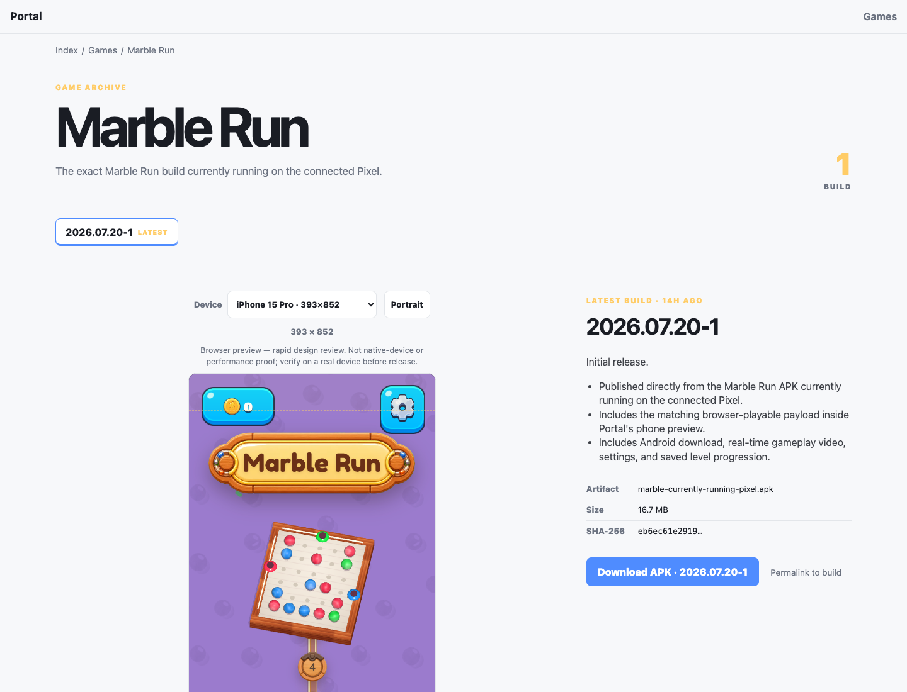
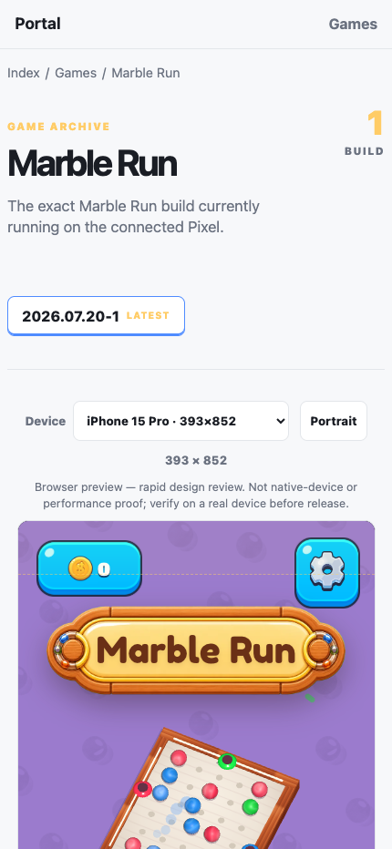
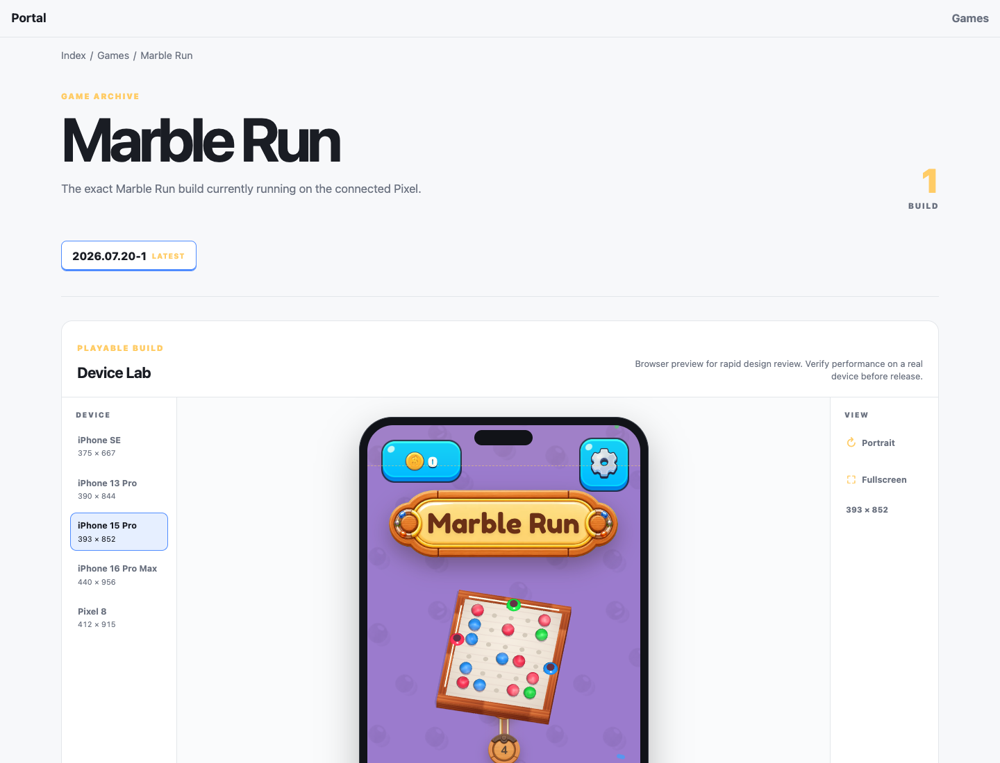
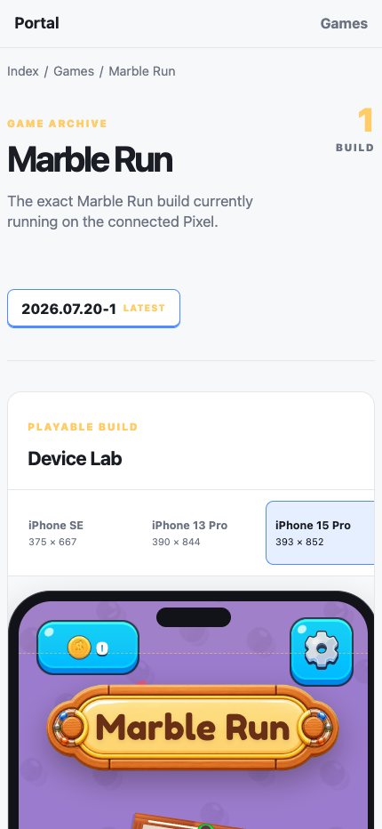
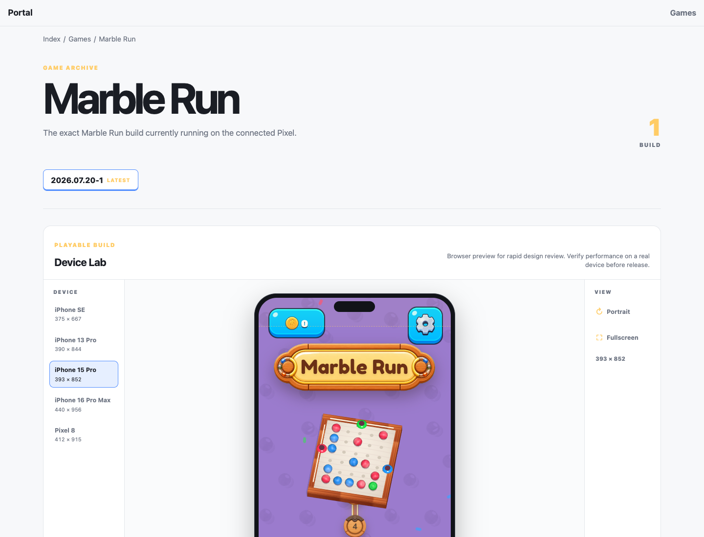
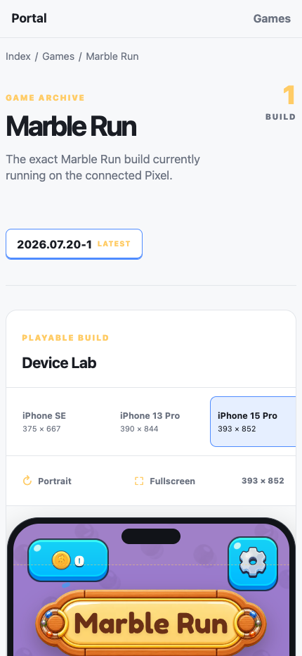

# Device Lab visual review journal

## Task 1 - Put every playable build inside the selected phone

### Task Snapshot

Status: active

The existing page proves the game is playable, but its generic dropdown and lightly rounded iframe do not read as the selected Device Lab. This task makes the active build, selected device, and live game one coherent workspace while retaining each release's evidence and download.

### Task Acceptance Criteria

- Each playable release owns one live phone-framed game.
- Only device, orientation, and fullscreen controls appear in the lab.
- Release changelog, video, and APK stay linked to the selected build.
- Desktop and mobile layouts are usable.

### Iteration 1 - Play-first workspace

#### Planned Result

Replace the dropdown-first preview with a device rail, a centered physical phone frame containing the live game, and a minimal action rail.

#### Why This Iteration

This is the smallest coherent implementation of the chosen Option A workflow.

#### Capture Setup

- Route: `/games/marble-run`
- Viewports: 1440x1100 and 430x932
- Fixture: current published Marble Run release
- State: latest build, portrait

#### Pre-Change Screenshots

1. 
   What to look at: The controls and game preview directly below the build tab.
   Observation: The device is a form dropdown, the iframe has no physical phone context, and release copy competes beside the main play surface.
   Acceptance check: Phone frame fail; minimal controls partial; release linkage pass; desktop usability pass.

2. 
   What to look at: The relationship between controls and the game viewport.
   Observation: The controls wrap above a large plain iframe and do not present a focused device-testing workspace.
   Acceptance check: Phone frame fail; minimal controls partial; release linkage pass; mobile usability partial.

#### Changes Made

Pending.

#### Post-Change Screenshots

Pending.

#### Decision

partial

#### Next Action

Implement the play-first workspace, then recapture the same states.

#### Spawned Tasks

- None.

### Iteration 2 - Reachable mobile controls and final verification

#### Planned Result

Keep orientation and fullscreen reachable before the tall game viewport on mobile, preserve exact logical viewport sizes, and verify fullscreen state feedback.

#### Why This Iteration

The first post-change mobile capture showed the action rail below the phone, forcing a long scroll before a designer could rotate or enlarge the build.

#### Capture Setup

- Route: `/games/marble-run`
- Viewports: 1440x1100 and 430x932
- Fixture: current published Marble Run release
- State: latest build, iPhone 15 Pro portrait

#### Pre-Change Screenshots

1. 
   What to look at: The three-column relationship between device rail, live phone, and controls.
   Observation: The desktop structure is clear and the game is visibly contained by the selected iPhone, but the pass still needed interaction checks.
   Acceptance check: Phone frame pass; minimal controls pass; release linkage pass; desktop usability pass.

2. 
   What to look at: The phone begins immediately after device selection while actions remain below its full height.
   Observation: The physical frame fits, but orientation and fullscreen are not reachable before entering the long viewport.
   Acceptance check: Phone frame pass; minimal controls partial; release linkage pass; mobile usability partial.

#### Changes Made

The mobile action rail now sits between device selection and the phone. The outer shell was tightened to 411 pixels while retaining the iPhone 15 Pro iframe at its real 393 x 852 CSS-pixel viewport. Fullscreen now updates its label after the browser confirms entry or exit.

#### Post-Change Screenshots

1. 
   What to compare: The old dropdown/unframed preview versus the new device rail, physical phone, and dedicated view rail.
   Observation: The live Marble Run build is the dominant workspace, device state is visible at a glance, and only the requested controls remain.
   Acceptance check: Phone frame met; minimal controls met; release linkage met; desktop usability met.

2. 
   What to compare: The location of Portrait and Fullscreen relative to the phone in the first mobile pass.
   Observation: Device choices scroll horizontally, both actions are reachable before the live phone, the 393 x 852 viewport remains exact, and the page has no horizontal overflow.
   Acceptance check: Phone frame met; minimal controls met; release linkage met; mobile usability met.

#### Decision

passed

#### Next Action

Run the shipping review and leave the feature branch ready for approval to push, merge, and deploy.

#### Spawned Tasks

- None.
